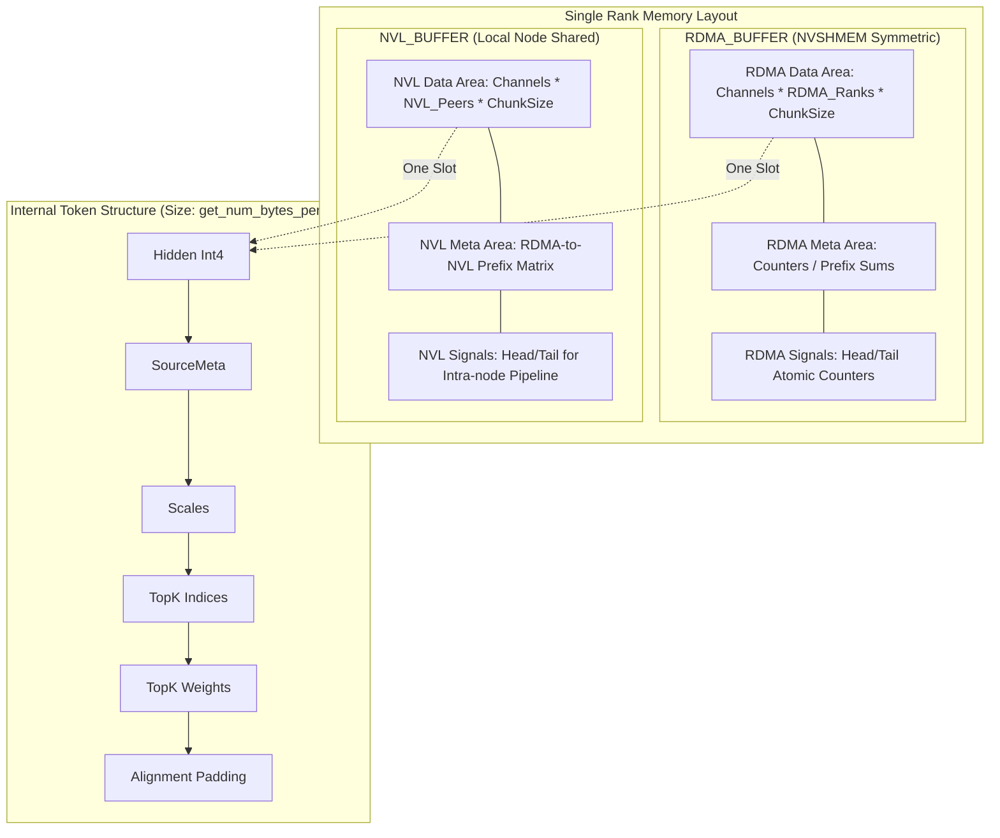

以单个 Rank 为视角的内存占用分析和逻辑排布。

### 1. 核心 Buffer 划分
在一个 Rank 的视角下，内存主要分为两大块：
1.  **RDMA Buffer (`rdma_buffer_ptr`)**: 这是一个对称内存（Symmetric Memory），通过 NVSHMEM 分配。所有 Rank 的这块内存地址在逻辑上是对齐的，用于跨节点数据交换。
2.  **NVL Buffer (`buffer_ptrs`)**: 用于节点内（Intra-node）NVLink 传输。每个 Rank 拥有一块 Buffer，并通过 `buffer_ptrs` 指针数组访问节点内其他 Peer 的内存。

---

### 2. RDMA Buffer 内部排布 (单个 Rank 视角)
`rdma_buffer` 在每个 Rank 上被划分为 `num_channels` 个通道。每个通道独立负责一部分 RDMA 传输，以并行利用网卡带宽和多 SM 的计算能力。

**内部逻辑层级：** `Channel -> RDMA_Rank -> Data/Meta`

| 偏移段 | 对应变量 | 详细描述 |
| :--- | :--- | :--- |
| **Data Segment** | `rdma_channel_data` | **存储来自其他所有 RDMA Rank 的 Token 数据**。大小为：`num_channels * kNumRDMARanks * (num_max_rdma_recv_tokens * bytes_per_token)`。 |
| **Meta Segment** | `rdma_channel_meta` | **元数据控制区**。存储每个 Channel 从每个 RDMA Rank 接收到的 Token 计数、前缀和等。每个条目包含 `NUM_MAX_NVL_PEERS * 2 + 2` 个 `int`。 |
| **Head Segment** | `rdma_channel_head` | **消费者进度 (Head)**。由本机 Forwarder 更新，通知发送方本缓冲区已处理多少，可释放。 |
| **Tail Segment** | `rdma_channel_tail` | **生产者进度 (Tail)**。远程 Rank 通过 RDMA AMO (Atomic Add) 写入，通知本 Rank 到了多少数据。 |

---

### 3. NVL Buffer 内部排布 (单个 Rank 视角)
NVL Buffer 主要用于将 RDMA 接收到的数据进一步分发给本节点内的不同 GPU（NVL Peers）。

**内部逻辑层级：** `Channel -> NVL_Rank -> Data/Control`

| 偏移段 | 对应变量 | 详细描述 |
| :--- | :--- | :--- |
| **X Data** | `nvl_channel_x` | **存放分发给目标 NVL Rank 的 Token**。每个 NVL Peer 对应一个 Slot。 |
| **Prefix Start/End** | `nvl_channel_prefix_start/end` | 记录每个 RDMA 源在当前 NVL 传输块中的起始和结束偏移，用于下游 Rank 还原 Token 顺序。 |
| **Head/Tail** | `nvl_channel_head/tail` | **流水线同步信号**。用于 Forwarder（生产者）和 Receiver（消费者）之间的流控。 |

---

### 4. 单个 Token 的内部排布 (`SourceMeta`)
每个被传输的单元（Token）在 Buffer 中不是连续的浮点数，而是一个复合结构，确保对齐到 `int4` (16 bytes)：

```cpp
[ int4 * hidden_int4 ]       // 1. 隐藏层数据 (Quantized)
[ SourceMeta ]               // 2. 源信息 (src_rdma_rank + NVL掩码)
[ float * num_scales ]       // 3. 量化尺度
[ int * num_topk_idx ]       // 4. TopK 专家索引
[ float * num_topk_weights ] // 5. TopK 权重
[ Padding ]                  // 6. 填充到 int4 对齐
```

---

### 5. 内存排布图 (Mermaid)

以下图表展示了单个 Rank 内存中的逻辑划分：



---

### 6. 关键内存计算逻辑分析

1.  **数据隔离**：
    *   通过 `SymBuffer` 类，Rank 使用 `channel_id` 和 `dst_rdma_rank` 计算偏移。这意味着每个 (Channel, TargetRank) 的组合都有专属的缓冲区，避免了多线程并发写入时的资源争抢（Contention）。
2.  **双缓冲/流水线机制**：
    *   代码中出现了 `num_max_rdma_chunked_send_tokens` 和 `recv_tokens`。
    *   `rdma_channel_head` 和 `tail` 的存在表明这块内存是一个**环形缓冲区（Circular Buffer）**。发送方（RDMA Sender）在 `tail - head < buffer_size` 时写入数据，本机的转发方（Forwarder）处理完数据后增加 `head`。
3.  **对齐与性能**：
    *   `get_num_bytes_per_token` 使用了 `align_up(..., sizeof(int4))`。这是为了利用 CUDA 的 `ld.global.nc.v4.s32` (int4) 指令进行高效内存访问。
    *   `SourceMeta` 被放置在 Hidden Data 和 Scales 之间，大小被强制检查为 `sizeof(int)` 的倍数，以维持后续字段的对齐。

### 总结
该 Rank 的内存占用是高度模块化的：
*   **RDMA 部分**的大小取决于节点总数 (`kNumRDMARanks`)。
*   **NVL 部分**的大小取决于单节点内 GPU 数量 (`NUM_MAX_NVL_PEERS`)。
*   **流水线深度**由 `num_max_..._chunked_..._tokens` 参数决定。
这种设计允许该内核在处理海量 Token 分发时，实现计算（量化转换）与通信（RDMA/NVLink）的极致重叠。