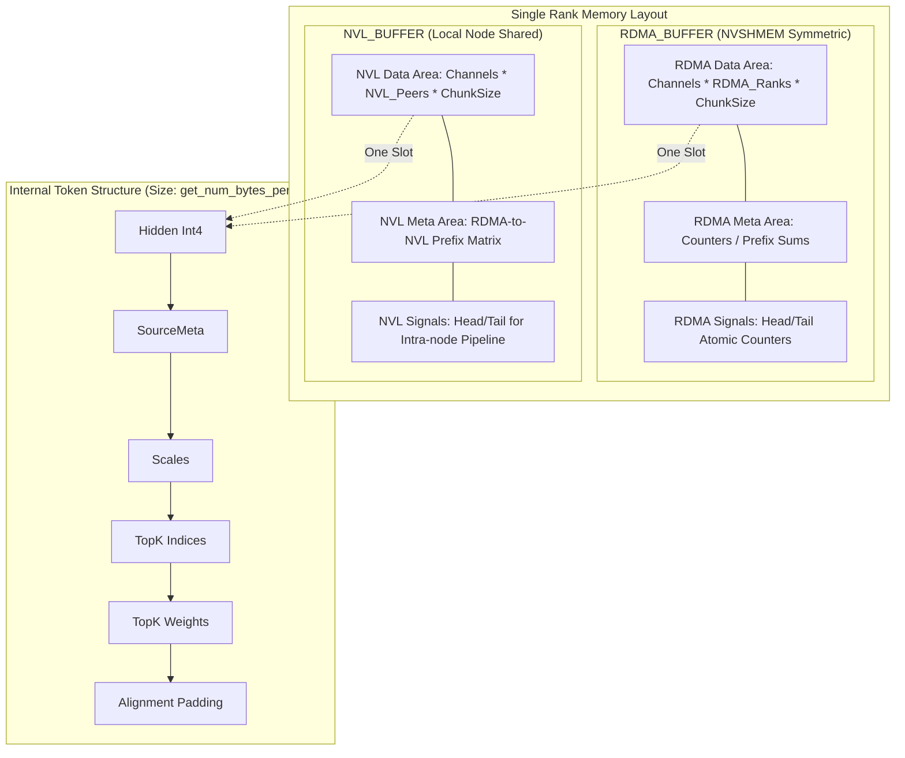
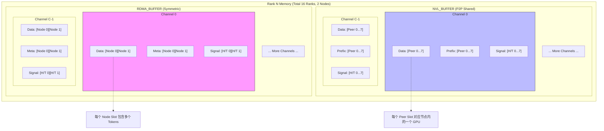
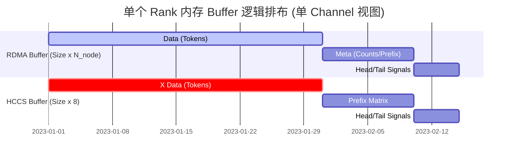

这段代码展示了一个高性能深度学习通信库（类似于 DeepSpeed-EP 或类似 MoE 架构中的通信组件）中的 `dispatch`（分发）阶段。它利用了 **NVLink (Intra-node)** 和 **RDMA (Inter-node)** 混合传输。

以下是以单个 Rank 为视角的内存占用分析和逻辑排布。

### 1. 核心 Buffer 划分概述
在一个 Rank 的视角下，内存主要分为两大块：
1.  **RDMA Buffer (`rdma_buffer_ptr`)**: 这是一个对称内存（Symmetric Memory），通过 NVSHMEM 分配。所有 Rank 的这块内存地址在逻辑上是对齐的，用于跨节点数据交换。
2.  **NVL Buffer (`buffer_ptrs`)**: 用于节点内（Intra-node）NVLink 传输。每个 Rank 拥有一块 Buffer，并通过 `buffer_ptrs` 指针数组访问节点内其他 Peer 的内存。

---

### 2. RDMA Buffer 内部排布 (单个 Rank 视角)
`rdma_buffer` 在每个 Rank 上被划分为 `num_channels` 个通道。每个通道独立负责一部分 RDMA 传输，以并行利用网卡带宽和多 SM 的计算能力。

**内部逻辑层级：** `Channel -> RDMA_Rank -> Data/Meta`

| 偏移段 | 对应变量 | 详细描述 |
| :--- | :--- | :--- |
| **Data Segment** | `rdma_channel_data` | **存储来自其他所有 RDMA Rank 的 Token 数据**。大小为：`num_channels * kNumRDMARanks * (num_max_rdma_recv_tokens * bytes_per_token)`。 |
| **Meta Segment** | `rdma_channel_meta` | **元数据控制区**。存储每个 Channel 从每个 RDMA Rank 接收到的 Token 计数、前缀和等。每个条目包含 `NUM_MAX_NVL_PEERS * 2 + 2` 个 `int`。 |
| **Head Segment** | `rdma_channel_head` | **消费者进度 (Head)**。由本机 Forwarder 更新，通知发送方本缓冲区已处理多少，可释放。 |
| **Tail Segment** | `rdma_channel_tail` | **生产者进度 (Tail)**。远程 Rank 通过 RDMA AMO (Atomic Add) 写入，通知本 Rank 到了多少数据。 |

---

### 3. NVL Buffer 内部排布 (单个 Rank 视角)
NVL Buffer 主要用于将 RDMA 接收到的数据进一步分发给本节点内的不同 GPU（NVL Peers）。

**内部逻辑层级：** `Channel -> NVL_Rank -> Data/Control`

| 偏移段 | 对应变量 | 详细描述 |
| :--- | :--- | :--- |
| **X Data** | `nvl_channel_x` | **存放分发给目标 NVL Rank 的 Token**。每个 NVL Peer 对应一个 Slot。 |
| **Prefix Start/End** | `nvl_channel_prefix_start/end` | 记录每个 RDMA 源在当前 NVL 传输块中的起始和结束偏移，用于下游 Rank 还原 Token 顺序。 |
| **Head/Tail** | `nvl_channel_head/tail` | **流水线同步信号**。用于 Forwarder（生产者）和 Receiver（消费者）之间的流控。 |

---

### 4. 单个 Token 的内部排布 (`SourceMeta`)
每个被传输的单元（Token）在 Buffer 中不是连续的浮点数，而是一个复合结构，确保对齐到 `int4` (16 bytes)：

```cpp
[ int4 * hidden_int4 ]       // 1. 隐藏层数据 (Quantized)
[ SourceMeta ]               // 2. 源信息 (src_rdma_rank + NVL掩码)
[ float * num_scales ]       // 3. 量化尺度
[ int * num_topk_idx ]       // 4. TopK 专家索引
[ float * num_topk_weights ] // 5. TopK 权重
[ Padding ]                  // 6. 填充到 int4 对齐
```

---

### 5. 内存排布图 (Mermaid)

以下图表展示了单个 Rank 内存中的逻辑划分：



---

### 6. 关键内存计算逻辑分析

1.  **数据隔离**：
    *   通过 `SymBuffer` 类，Rank 使用 `channel_id` 和 `dst_rdma_rank` 计算偏移。这意味着每个 (Channel, TargetRank) 的组合都有专属的缓冲区，避免了多线程并发写入时的资源争抢（Contention）。
2.  **双缓冲/流水线机制**：
    *   代码中出现了 `num_max_rdma_chunked_send_tokens` 和 `recv_tokens`。
    *   `rdma_channel_head` 和 `tail` 的存在表明这块内存是一个**环形缓冲区（Circular Buffer）**。发送方（RDMA Sender）在 `tail - head < buffer_size` 时写入数据，本机的转发方（Forwarder）处理完数据后增加 `head`。
3.  **对齐与性能**：
    *   `get_num_bytes_per_token` 使用了 `align_up(..., sizeof(int4))`。这是为了利用 CUDA 的 `ld.global.nc.v4.s32` (int4) 指令进行高效内存访问。
    *   `SourceMeta` 被放置在 Hidden Data 和 Scales 之间，大小被强制检查为 `sizeof(int)` 的倍数，以维持后续字段的对齐。

### 总结
该 Rank 的内存占用是高度模块化的：
*   **RDMA 部分**的大小取决于节点总数 (`kNumRDMARanks`)。
*   **NVL 部分**的大小取决于单节点内 GPU 数量 (`NUM_MAX_NVL_PEERS`)。
*   **流水线深度**由 `num_max_..._chunked_..._tokens` 参数决定。
这种设计允许该内核在处理海量 Token 分发时，实现计算（量化转换）与通信（RDMA/NVLink）的极致重叠。


在总共有 **16个 Rank**，且 **每个节点有 8 个 GPU (NVL Peers)** 的假设下：
*   **RDMA Rank (节点数)** = 16 / 8 = **2 个** (Rank 0-7 是 Node 0, Rank 8-15 是 Node 1)。
*   **NVL Rank (节点内编号)** = 0 到 7。
*   **Channel 数 ($C$)** = 由硬件 SM 数量决定（例如 `num_sms / 2`）。

在一个 Rank 的内部，Buffer 的排布是**高度结构化**的。它首先按 **Channel** 切分，每个 Channel 内部再按 **Peer (RDMA Rank 或 NVL Rank)** 切分。

---

### 1. RDMA Buffer 内部细分 (单个 Rank 视角)
RDMA Buffer 是通过 NVSHMEM 分配的，用于跨节点通信。

**逻辑结构：** `Channel[0...C-1] -> RDMA_Node[0...1]`

| 段名称 | 数量 | 内部结构 (每个 Channel) | 作用 |
| :--- | :--- | :--- | :--- |
| **Data Segment** | $C \times 2$ 个 Slot | 每个 Slot 存储 `num_max_rdma_recv_tokens` 个 Token | 存放从 2 个节点收到的原始数据 |
| **Meta Segment** | $C \times 2$ 个 Slot | 每个 Slot 存储 `NUM_MAX_NVL_PEERS * 2 + 2` 个 `int` | 存储对应节点的计数器和偏移矩阵 |
| **Head/Tail** | $C \times 2$ 个信号量 | 每个 Slot 是一个 `uint64` 原子计数器 | 用于发送方和接收方的流控同步 |

### 2. NVL Buffer 内部细分 (单个 Rank 视角)
NVL Buffer 用于节点内 8 个 GPU 之间的数据交换。

**逻辑结构：** `Channel[0...C-1] -> NVL_Peer[0...7]`

| 段名称 | 数量 | 内部结构 (每个 Channel) | 作用 |
| :--- | :--- | :--- | :--- |
| **X Data** | $C \times 8$ 个 Slot | 每个 Slot 存储 `num_max_nvl_recv_tokens` 个 Token | 存放分发给本节点 8 个 GPU 的数据 |
| **Prefix Matrix** | $C \times 8$ 个 Slot | 每个 Slot 存储 `kNumRDMARanks` 个 `int` | 记录 2 个 RDMA 来源在当前块中的起始/结束 |
| **Head/Tail** | $C \times 8$ 个信号量 | 每个 Slot 是一个 `int` 原子计数器 | 节点内 Forwarder 与 Receiver 的同步 |

---

### 3. 内存排布与 Channel 关系图 (Mermaid)

此图展示了内存是如何通过 `Channel ID` 偏移，并在每个 Channel 内根据 `Rank ID` 进一步划分的。



---

### 4. 重点：Channel 的物理意义
在代码中，`channel_id = sm_id / 2`。这意味着：
1.  **硬件映射**：每个 Channel 绑定到 GPU 上的特定 SM 组。
2.  **独立性**：每个 Channel 拥有完全隔离的 Buffer 空间。
    *   **优点**：不同的 SM 组在处理不同通道的数据时，不需要任何跨通道的锁（Lock-free），只有通道内部的生产/消费者需要同步。
    *   **计算与通信重叠**：当 Channel 0 在等待远程 RDMA 数据读取时，Channel 1 可能正在通过 NVLink 向 Peer 发送数据。

### 5. 详细段落内容对照表

| 内存段 | 寻址公式 (逻辑偏移) | 内部具体存储 |
| :--- | :--- | :--- |
| **RDMA Recv Data** | `channel_id * (2 * chunk_size)` | `[Node 0 Tokens...][Node 1 Tokens...]` |
| **RDMA Meta** | `channel_id * (2 * meta_size)` | `[Node 0 Meta...][Node 1 Meta...]` (含 Token 计数) |
| **NVL Send Data** | `channel_id * (8 * chunk_size)` | `[Peer 0 Tokens...][Peer 1 Tokens...] ... [Peer 7 Tokens...]` |
| **NVL Prefix** | `channel_id * (8 * 2)` | 每个 Peer 对应 2 个 int (Start/End)，记录 2 个 Node 的偏移 |

**总结：**
单个 Rank 内部的 Buffer 被均匀切分为 $C$ 份。在每一份（即一个 Channel）中，又根据集群拓扑进一步切分：RDMA 侧切分为 2 份（对应两个节点），NVL 侧切分为 8 份（对应节点内 8 个 GPU）。这种设计确保了在 16 个 Rank 之间进行 `dispatch` 时，每个通信路径都有专属的缓冲区，从而最大化利用网卡（IB）和 NVLink 的并发带宽。


计算单个 Rank 实际使用的 Buffer 大小，需要将 **RDMA Buffer** 和 **NVL Buffer** 分开计算。根据代码中的 `SymBuffer` 和 `AsymBuffer` 的初始化逻辑，我们可以总结出以下精确的计算公式。

### 0. 基础变量定义
在计算前，我们需要定义以下输入参数：
*   $C$: 通道数 (`num_channels`)
*   $N_{node}$: RDMA 节点数（总 Rank 数 / 8）
*   $N_{nvl}$: 节点内 GPU 数（固定为 8）
*   $T_{rdma\_chunk}$: RDMA 接收缓冲区的 Token 数 (`num_max_rdma_chunked_recv_tokens`)
*   $T_{nvl\_chunk}$: NVL 接收缓冲区的 Token 数 (`num_max_nvl_chunked_recv_tokens`)

---

### 1. 单个 Token 的大小 ($S_{token}$)
代码中使用 `get_num_bytes_per_token` 计算，并向上对齐到 16 字节（`int4`）：
$$S_{token} = \text{align\_up}(16 \cdot h_{int4} + 8 + 4 \cdot n_{scales} + 4 \cdot n_{topk\_idx} + 4 \cdot n_{topk\_weights}, 16)$$
*注：`SourceMeta` 占用 8 字节。*

---

### 2. RDMA Buffer 大小计算 ($B_{rdma}$)
RDMA Buffer 是对称内存，每个 Rank 内部为每个 Channel 分配了对应所有 RDMA 节点的空间。

| 组成部分 | 计算公式 (字节) | 说明 |
| :--- | :--- | :--- |
| **Data** | $C \cdot N_{node} \cdot (T_{rdma\_chunk} \cdot S_{token})$ | 存放从各个节点收到的 Token 数据 |
| **Meta** | $C \cdot N_{node} \cdot (18 \cdot 4)$ | 元数据，固定为 $(8 \times 2 + 2)$ 个 `int` |
| **Head** | $C \cdot N_{node} \cdot 8$ | 每个节点、每个通道一个 `uint64` Head 信号量 |
| **Tail** | $C \cdot N_{node} \cdot 8$ | 每个节点、每个通道一个 `uint64` Tail 信号量 |

**RDMA 总公式：**
$$B_{rdma} = C \cdot N_{node} \cdot \left[ (T_{rdma\_chunk} \cdot S_{token}) + 72 + 8 + 8 \right]$$

---

### 3. NVL Buffer 大小计算 ($B_{nvl}$)
NVL Buffer 用于节点内 8 个 GPU 之间的 P2P 共享。

| 组成部分 | 计算公式 (字节) | 说明 |
| :--- | :--- | :--- |
| **X Data** | $C \cdot N_{nvl} \cdot (T_{nvl\_chunk} \cdot S_{token})$ | 存放发送给 8 个 Peer 的 Token 数据 |
| **Prefix Matrix**| $C \cdot N_{nvl} \cdot (N_{node} \cdot 4 \cdot 2)$ | 记录每个 Peer 对应各 RDMA 节点的 Start/End 偏移 |
| **Head** | $C \cdot N_{nvl} \cdot 4$ | 每个 Peer、每个通道一个 `int` Head |
| **Tail** | $C \cdot N_{nvl} \cdot 4$ | 每个 Peer、每个通道一个 `int` Tail |

**NVL 总公式：**
$$B_{nvl} = C \cdot N_{nvl} \cdot \left[ (T_{nvl\_chunk} \cdot S_{token}) + (8 \cdot N_{node}) + 4 + 4 \right]$$

---

### 4. 总结：单个 Rank 总内存占用公式

$$Total\_Buffer = B_{rdma} + B_{nvl}$$

我们可以代入一个典型场景进行估算：
*   **配置**：16 Ranks ($N_{node}=2$), 8 GPUs/Node ($N_{nvl}=8$), 10 Channels ($C=10$)
*   **Chunk Size**：$T_{rdma}=1024, T_{nvl}=1024$
*   **Token Size**：假设 $S_{token} = 1024$ 字节

1.  **RDMA 侧**：$10 \cdot 2 \cdot (1024 \cdot 1024 + 88) \approx 20.002$ MB
2.  **NVL 侧**：$10 \cdot 8 \cdot (1024 \cdot 1024 + 16 + 8) \approx 80.002$ MB
3.  **总计**：约 **100 MB**

---

### 5. 内存排布总结图 (逻辑视图)



### 特别注意：
*   **内存对齐**：公式中的 $S_{token}$ 必须是 16 的倍数，否则硬件 TMA 搬运会报错。
*   **Symmetric 性质**：RDMA Buffer 是所有 Rank 等量分配的（NVSHMEM 空间）；NVL Buffer 虽然是在 `buffer_ptrs` 中，但通常为了管理方便，每个 GPU 也会分配等大的空间供 Peer 读写。
*   **双重 Buffer**：在 `get_rdma_clean_meta` 代码中出现了 `2 * num_channels`，这通常意味着在某些实现中为了极致的并行（Overlap），可能会对 RDMA 区域做双倍缓冲（Ping-Pong Buffer），如果你的 `num_channels` 已经包含了这个因子，则不需额外乘以 2。