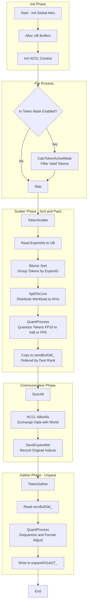

## 1. 核心功能摘要 (TL;DR)

*   **算子功能**：MoE Dispatcher (All-to-All 通信的前后处理)。
*   **核心作用**：
    1.  **Token 重排 (Scatter)**：根据 Expert ID 对输入 Token 进行排序和分组，将其打包到发送缓冲区 (`sendBuf`)。
    2.  **通信掩盖与量化**：支持在分发过程中即时进行量化（Int8, FP8, FP16 等），以减少通信带宽压力。
    3.  **集群通信**：调用 HCCL (`AlltoAllvWrite`) 将数据发送给持有对应专家的 Device。
    4.  **接收重组 (Gather)**：将接收到的 Token 写入输出缓冲区，供后续专家计算（FFN）使用。
*   **硬件特性**：利用 Ascend AI Core 的 Vector 单元进行排序（Sort）和量化计算，支持多核（AIV）并行处理。

---

## 2. 内存布局与 I/O 分析 (核心重点)

该算子高度依赖 Tiling 数据（切分策略），内存布局针对 DMA 搬运和 Vector 计算进行了对齐优化。

### 2.1 关键维度定义
*   **`BS` (Batch Size)**: 当前 Device 处理的 Token 总数 (通常是 Batch * SeqLen)。
*   **`H` (Hidden Size)**: Token 的特征维度。
*   **`K` (Top-K)**: 每个 Token 选择的专家数量。
*   **`E` (EpWorldSize)**: 专家并行的设备总数。

### 2.2 输入输出及核心变量表

| 变量名 (代码对应) | 数据类型 (`XType`) | 逻辑形状 (Shape) | 理论内存占用 | 内存布局特性 (Layout/Stride) | 备注 |
| :--- | :--- | :--- | :--- | :--- | :--- |
| **`xGT_` (Input)** | Template (FP16/BF16/FP32) | `[BS, H]` | `BS * H * sizeof(X)` | **Row-Major (连续)** Ascend 默认格式 | 原始输入 Token |
| **`expertIdsGT_`** | `int32_t` | `[BS, K]` | `BS * K * 4B` | 连续 | Token 对应的专家索引 |
| **`xActiveMaskGT_`** | `bool` | `[BS]` | `BS * 1B` | 连续 | 用于处理 Padding Token (Mask掉无效数据) |
| **`sendBufGM_`** | Byte Stream | 动态 | **大块内存** | **按目标 Rank 分块 (Grouped by Rank)** `[Rank0_Data, Rank1_Data, ...]` 每块内包含数据与元数据 | 发送缓冲区，包含对齐填充 |
| **`recvBufGM_`** | Byte Stream | 动态 | **大块内存** | **按源 Rank 分块** 结构同上 | 接收缓冲区 |
| **`expandXOutGT_`** | Template (`ExpandXOutType`) | `[TotalRecvTokens, H]` | 动态变化 | **按专家/Rank 顺序排列** | 输出给 FFN 计算的数据，可能已量化 |
| **`scalesGT_`** | `float` | `[BS/Group, 1]` 或 `[1]` | 视量化模式 | 连续 | 量化缩放因子 |

### 2.3 关键内存对齐策略
代码中频繁出现以下对齐常量，这对于性能至关重要：
*   **`UB_ALIGN = 32`**: Unified Buffer (SRAM) 的读写必须 32 字节对齐。
*   **`Align512` / `Align256`**: 通信缓冲区的数据块往往按照 512 字节或 256 字节对齐，以满足 HCCL 和 Burst DMA 的最佳性能。
*   **`DataCopyPad`**: 代码大量使用带 Padding 的拷贝，确保非对齐的 Token 维度（如 Hidden Size=1000）在搬运时补齐到 32 字节倍数。

---

## 3. 逻辑流程图 (Mermaid)

该流程展示了单个 Device 上的 AIV (AI Vector Core) 处理逻辑。

---

## 4. 详细执行流程 (Step-by-step)

### 4.1 初始化与掩码计算
*   **初始化**：从 GM (Global Memory) 获取各种 tensor 的指针。初始化 `UB` 上的临时 buffer（用于排序、统计直方图等）。
*   **Active Mask**：如果 `isTokenMaskFlag_` 为真，算子首先会将 `xActiveMask` 搬运到 UB，计算 `activeBs_` (真实有效的 BatchSize)，后续排序只针对有效 Token 进行，节省计算量。

### 4.2 Scatter (核心逻辑：排序与分发)
这是代码中最复杂的部分 (`TokenScatter` 函数)：
1.  **加载 Expert ID**：将 `expertIdsGT_` 搬运至 UB。
2.  **生成索引与排序**：
    *   代码使用了 Ascend 的向量排序指令 (`Sort<float, true>`)。
    *   构造 `(ExpertID, OriginalIndex)` 对。
    *   对 `ExpertID` 进行排序。这一步的目的是将发往同一个专家的 Token 在内存中物理聚合在一起。
3.  **计算直方图 (Histogram)**：使用 `expertFreqLT_` 统计发往每个 Rank/Expert 的 Token 数量，用于计算后续通信的 `SendCounts`。
4.  **数据搬运与量化 (`MoeScatterCopyTokens`)**：
    *   根据排序后的索引，从 `xGT_` (HBM) 随机读取 Token (Gather)。
    *   **量化**：在 UB 中调用 `QuantProcess`。支持 `QuantStatic` (静态量化), `QuantDynamicPerToken` (每 Token 动态量化), `MX_QUANT` (微软 FP8 格式) 等。
    *   **写入发送区**：将处理后的 Token 连续写入 `sendBufGM_` 对应的 Rank 偏移处。

### 4.3 通信 (HCCL)
*   **SyncAll**：确保所有 Core 完成打包。
*   **AlltoAllv**：Rank 0 的 Core 调用 `hccl_.AlltoAllvWrite`。
    *   `sendSizeGM_`: 告诉 HCCL 每个目标 Rank 发送多少字节。
    *   `sendBufGM_` -> 网络 -> `recvBufGM_`。

### 4.4 Gather (接收与后处理)
*   **读取元数据**：解析 `recvBufGM_` 头部，获取来自每个 Rank 的 Token 数量。
*   **解包与重排**：
    *   遍历接收缓冲区。
    *   如果配置了反量化或格式转换，再次调用 `QuantProcess` (此时作为接收端处理)。
    *   将数据写入 `expandXOutGT_`。此时数据的物理顺序是按照 `[Expert0_Tokens, Expert1_Tokens, ...]` 排列的，方便后续 FFN 顺序计算。

---

## 5. 潜在风险与性能瓶颈

### 5.1 内存风险
1.  **UB 空间溢出 (Tiling 依赖)**：
    *   代码使用了大量的 `Fixed Buffer`（如 `BUFFER_NUM = 2`）和基于 Tiling 参数计算的 Buffer 大小。如果 Host 端下发的 Tiling 参数（如 `bs`, `h`）计算错误，导致切分过大，会直接导致 **UB (Unified Buffer) 溢出**，引发 AICore Error。
2.  **排序长度限制**：
    *   向量排序指令通常有最大长度限制（如 Ascend 910 上限制为 4096 或类似）。代码中使用了 `sortRepeat_` 循环处理（`OneRepeatSortNum`），如果 `BS * K` 极大，排序性能会显著下降且逻辑复杂度极高。

### 5.2 性能瓶颈
1.  **非连续内存访问 (Gather overhead)**：
    *   在 Scatter 阶段，根据排序后的 Index 去 `xGT_` 读取数据是 **随机访问 (Random Access)**。对于 HBM 来说，这是性能杀手。
    *   *缓解*：代码利用了 `SplitToCore` 多核并行来掩盖延迟，但在 Hidden Size 较小时，DDR 带宽利用率依然可能较低。
2.  **量化流水线气泡**：
    *   `TokenInQue` -> `Quant` -> `TokenOutQue`。如果量化计算（尤其是动态量化的 `ReduceMax`）耗时过长，会阻塞 DMA 搬运流水线。
3.  **HCCL 通信阻塞**：
    *   代码显式调用了 `SyncAll<true>()` 和 `hccl_.Wait`。这意味着计算和通信在这里是串行的（Dispatch -> Wait -> Compute FFN）。如果是较旧的架构，无法实现 Communication-Computation Overlap（通信计算重叠）。

### 5.3 架构特定逻辑
*   **`sharedExpertRankNum`**: 代码显式区分了“共享专家”和“MoE 专家”。共享专家通常处理所有 Token 或特定 Token，不参与稀疏路由。代码中通过 `SplitToCore` 将这两类专家的处理逻辑分流，这是一处针对特定模型架构（如 DeepSeekMoE 或 Switch Transformer 变体）的优化。