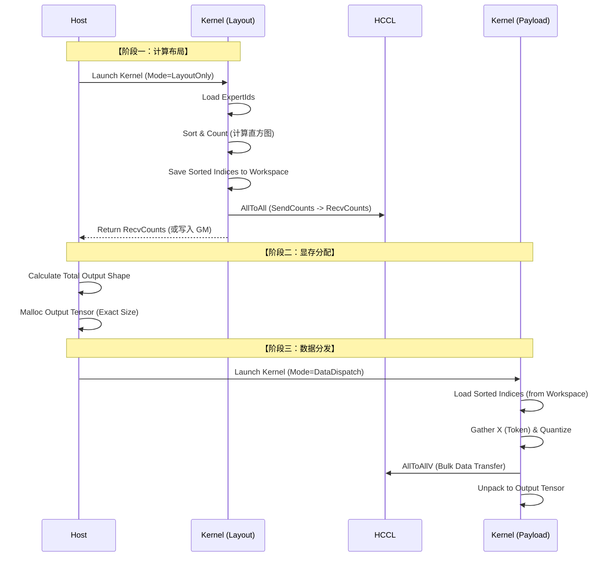

# MoE 分发算子：超大 Batch Size 动态显存适配设计文档

## 1. 背景与问题
当前算子逻辑假设输入输出的 Shape 是静态的，或者接收端缓冲区 (`recvBufGM_`) 能够覆盖最大可能的接收量。
当 `BS` 极大（例如 128K context window）时：
1.  **显存瓶颈**：无法预分配 `[Max_BS * K, Hidden]` 的接收 Buffer，因为大部分 Rank 可能只收到少量 Token，预分配会导致巨大的显存浪费或直接 OOM。
2.  **通信阻塞**：如果不知道接收端具体需要多少数据，HCCL 无法高效建立通信环路。

## 2. 核心设计思路：Compute-Flow 分离 (两阶段法)

将原本的单次 Kernel 执行拆解为两个阶段，中间插入 Host 端的内存管理逻辑：

*   **Phase 1: Layout Analysis Kernel (轻量级)**
    *   **任务**：只处理 `expert_ids`。计算路由、排序、统计每个 Rank 将要发送的 Token 数量 (`SendCounts`)。
    *   **输出**：`send_counts` (各 Rank 发送量), `sorted_indices` (排序后的索引，存入 Workspace 避免重复计算)。
    *   **通信**：执行一次极小的 `AllToAll` (仅交换 Count 信息)，让每个 Rank 知道自己将接收多少 Token (`RecvCounts`)。

*   **Host Side Logic (内存分配)**
    *   根据 Phase 1 计算出的 `RecvCounts`，精确计算输出 Tensor 所需的 Shape。
    *   **动态申请显存**：`Alloc(OutputTensor, size=TotalRecvCount * H * sizeof(T))`。

*   **Phase 2: Data Dispatch Kernel (重量级)**
    *   **任务**：利用 Phase 1 缓存的 `sorted_indices`，搬运 `X` 数据，执行量化，通过 HCCL 发送 Payload。
    *   **输出**：写入刚刚申请的 Output Tensor。

---

## 3. 详细设计流程

### 3.1 架构图



### 3.2 接口变更建议

我们需要修改模板参数或 Init 参数，增加一个 `DispatchMode`。

```cpp
enum DispatchMode {
    LAYOUT_ANALYSIS = 0, // 仅计算 Count 和 Sort
    DATA_DISPATCH = 1    // 执行实际数据搬运
};

// 在原有模板中增加 Mode 参数
template <typename XType, typename ExpandXOutType, ..., DispatchMode Mode>
class MoeDistributeDispatchA5 { ... };
```

### 3.3 关键逻辑修改点

#### A. Workspace 管理 (跨阶段数据共享)
由于将算子拆分，Phase 1 计算好的“排序结果”必须传递给 Phase 2，否则 Phase 2 需要重新读取 `expert_ids` 并重新排序，这在超大 BS 下是巨大的计算浪费。

*   **新增 Workspace 区域**：`GlobalTensor<int32_t> cachedSortedIndicesGT_`。
*   **大小**：`BS * K * sizeof(int32)`。即使 BS=1M，K=2，这也只有 8MB，完全可以接受。

#### B. Phase 1: Layout Analysis (对应代码修改)

在 `Process()` 中增加分支：

```cpp
// 伪代码逻辑
if constexpr (Mode == LAYOUT_ANALYSIS) {
    // 1. Load Expert Ids & Active Mask
    CalcTokenActiveMask(); // 复用现有逻辑

    // 2. Sort Logic (复用 TokenScatter 中的排序部分)
    // 这里的重点是：不要去搬运 X 数据，只处理 Index
    SortExpertIdsAndSaveToWorkspace(); 
    
    // 3. 统计 Send Counts
    // 复用 SetShareExpertSendSize 和 MoeScatter 中计算 size 的逻辑
    CalcSendCounts();
    
    // 4. (关键新增) 仅仅交换 Counts 信息，不发数据
    // 使用 HCCL AllToAll (N -> N, int32)
    hccl_.AlltoAll(sendCountsGM, recvCountsGM, 1, HcclDataType::HCCL_DATA_TYPE_INT32);
    
    // Phase 1 结束，此时 recvCountsGM 里存了每个源 Rank 给我发多少个 Token
}
```

#### C. Host 介入
Host 端读取 `recvCountsGM`，求和得到 `TotalTokenNum`，然后 `malloc` 最终的 `OutputTensor`。

#### D. Phase 2: Data Dispatch (对应代码修改)

```cpp
if constexpr (Mode == DATA_DISPATCH) {
    // 1. 跳过排序，直接从 Workspace 读取 Index
    LoadSortedIndicesFromWorkspace();
    
    // 2. 根据 Phase 1 计算的 SendCounts 设置 HCCL 参数
    // 注意：这里需要重新设置 sendSizeGM_ 和 sendOffsetGM_，或者复用 Phase 1 的结果
    PrepareHCCLParams(); 
    
    // 3. 执行 Scatter (Gather X -> Quant -> Pack)
    // 复用 MoeScatterCopyTokens，但是索引来源改为 Workspace
    MoeScatterCopyTokens_Cached();
    
    // 4. 执行重型通信
    hccl_.AlltoAllvWrite(...);
    
    // 5. Gather
    TokenGather();
}
```

---

## 4. 针对现有代码的具体改造方案

以下是针对你提供的 `moe_distribute_dispatch_arch35.h` 的具体修改建议。

### 4.1 修改 `TokenScatter` 函数
当前 `TokenScatter` 耦合了排序和分发。需要解耦：

**原逻辑**：
```cpp
TokenScatter() {
    LoadAndSort(); // 排序
    ShareScatter(); // 分发共享专家
    MoeScatter();   // 分发 MoE 专家
}
```

**新逻辑**：
```cpp
__aicore__ inline void MoeDistributeDispatchA5::TokenScatter(bool isLayoutPhase) {
    if (isLayoutPhase) {
        // 1. 执行排序
        PerformBitonicSort(); 
        // 2. 将排序后的 sortedIndex1LT_ (即 Token 索引) 写入 Workspace GM
        SaveSortedIndicesToGlobal();
        // 3. 计算 Send Counts 并写入 GM
        CalcAndWriteSendCounts();
    } else {
        // 1. 从 Workspace GM 读取排序后的索引到 sortedIndex1LT_
        LoadSortedIndicesFromGlobal();
        // 2. 根据索引去 X 中搬运数据并打包
        if (aivId_ < moeUsedAivNum_) {
             MoeScatterCopyTokens(); // 内部使用 sortedIndex1LT_
        }
        // ... ShareScatter 逻辑同理
    }
}
```

### 4.2 显存复用与 Tiling 优化 (支持超大 BS)

当 BS 极大（例如超过 UB 能容纳的 `sortNum`）时，现有的 `Bitonic Sort` (全量排序) 会失效。
**解决方案：Block-wise Sorting (分块排序)**

如果 BS 真的到了 "很大很大" 的地步（比如单卡 100万 Token），UB 放不下所有的 Index。
我们需要修改排序逻辑，不能做全量 Global Sort，而是做 **Local Block Sort + Scatter**。

**设计调整**：
*   **不进行全量排序**。
*   将 BS 切分为多个 `Block` (例如 8192 一个 Block)。
*   每个 Block 内部单独进行 `ExpertID` 排序、Gather、Pack。
*   **但是**，这会产生碎片化的通信包（每个 Block 都会向所有 Rank 发一点数据），降低 HCCL 效率。

**推荐方案（折中）**：
1.  **Phase 1 (Layout)**: 依然遍历所有 Block，统计直方图 (Histogram)。
    *   不需要全局排序 Index，只需要统计 `Count`。
    *   使用原子加 (Atomic Add) 或者 Reduce 操作统计全局的 `SendCounts`。
2.  **Phase 2 (Dispatch)**: 
    *   依然分 Block 处理。
    *   但是为了保证写入 `sendBuf` 是连续的，我们需要在 Phase 1 计算出每个 Rank 在 `sendBuf` 中的 **全局 Offset**。
    *   处理 Block $i$ 时：
        *   计算该 Block 中发往 Rank $R$ 的数据量 $C_{i,R}$。
        *   写入位置 = `BaseOffset_R` + `已处理的Count_R`。

**代码修改点 (`InitGlobalAttrs`)**:
```cpp
// 增加对超大 BS 的 Tiling 支持
// 如果 bskNum_ > max_ub_sort_capacity
uint32_t maxSortCap = ...; // 基于 UB 大小计算
bool useBlockProcess = bskNum_ > maxSortCap;
```

### 4.3 `Communication` 函数的拆解

当前的 `Communication` 混合了 `AlltoAllv` (数据) 和控制流。

**Phase 1 Kernel**:
```cpp
void CommunicationLayout() {
    SyncAll<true>();
    if (aivId_ == 0) {
        // 只交换 Count (int32)
        // 注意：原代码没有显式的 AllToAll (Count)，它是隐式包含在 AlltoAllv 的 Header 里的
        // 这里我们需要显式调用一个新的 HCCL 接口交换 Counts
        hccl_.AlltoAll(sendBufCountsGM, recvBufCountsGM, 1, HCCL_DATA_TYPE_INT32);
    }
    SyncAll<true>();
}
```

**Phase 2 Kernel**:
```cpp
void CommunicationPayload() {
    // 此时 recvBufCountsGM 已经就绪，Host 已经分配好了 recvBufGM
    // 直接调用 AlltoAllvWrite
    hccl_.AlltoAllvWrite<true>(sendBufGM_, sendOffsetGM_, sendSizeGM_, recvOffset_, localDataSize);
}
```

---

## 5. 总结与实施步骤

为了支持超大 BS 且显存受限，你需要实施 **Two-Pass Strategy**。

1.  **新增 `cached_indices` 输入**：在 `Init` 函数中增加一个 GM 指针，用于在两次 Kernel 调用间传递排序结果。
2.  **改造 `Init`**：解析 `DispatchMode`。
3.  **改造 `TokenScatter`**：
    *   模式 0：只排序、写 Count、写 Cache Index。
    *   模式 1：读 Cache Index、Gather Data、写 SendBuf。
4.  **Host 端代码 (C++ / Python)**：
    *   Launch Kernel (Mode 0).
    *   Sync Device.
    *   Read Counts -> Compute Shape -> Malloc.
    *   Launch Kernel (Mode 1).

这种设计确保了：
*   **显存安全**：Output Buffer 精确分配，无浪费。
*   **性能最大化**：避免了不必要的 Host-Device 数据拷贝，只拷贝极小的元数据。
*   **代码复用**：大部分 `QuantProcess` 和 `SplitToCore` 逻辑完全复用。