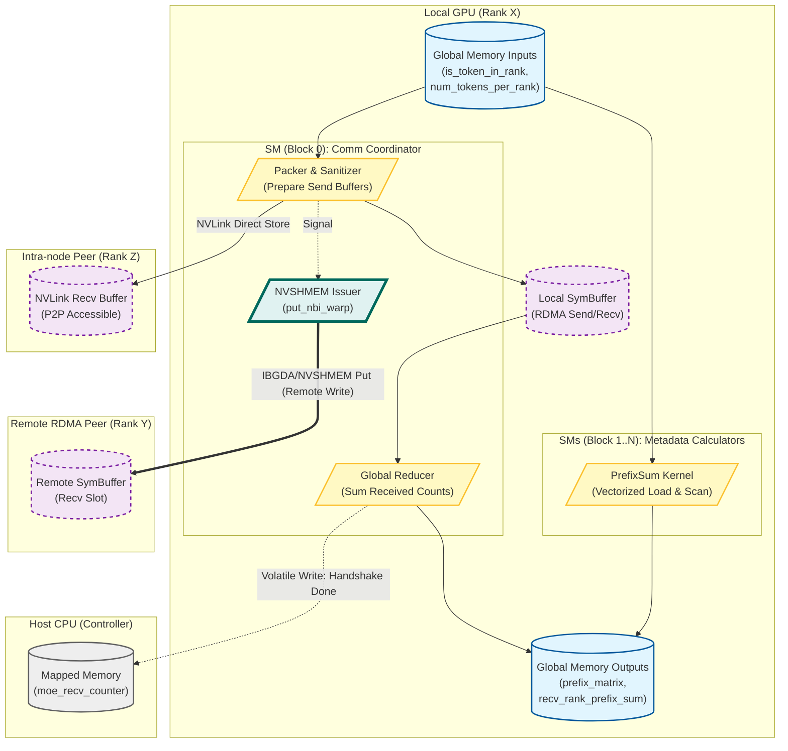

notifydispatch负责 **"控制面 (Control Plane)" 的元数据交换与握手**。它计算并交换每个 GPU 需要发送和接收多少 Token，并为后续的 Payload 搬运计算内存偏移量（Prefix Sum）。

以下是深度分析报告：

---

## 1. 核心功能摘要 (TL;DR)
**功能**：分布式 MoE 的 **Metadata Dispatch & Handshake**（元数据分发与握手）。
**作用**：
1.  **全局握手**：统计每个 Rank 发送给其他所有 Rank 的 Token 数量。
2.  **跨节点通信**：利用 **NVSHMEM (IBGDA)** 技术，通过 RDMA 直接将本节点的 Token 计数写入远端节点的接收缓冲区。
3.  **负载计算**：通过前缀和（Prefix Sum）计算，生成后续 Data Kernel 搬运数据所需的 Write Offsets。
4.  **掩盖延迟**：控制线程（Block 0）负责通信握手，计算线程（Block > 0）并行计算数据排布，最大化 overlap。

---

## 2. 内存布局与 I/O 分析 (核心重点)

此 Kernel 高度依赖特定内存布局来优化 PCIe/NVLink 带宽。

### 2.1 关键变量分析表

| 变量名 | 数据类型 | 逻辑形状 (Shape) | 理论内存占用 | 内存布局特性 (Layout/Stride) | 作用 |
| :--- | :--- | :--- | :--- | :--- | :--- |
| **`is_token_in_rank`** | `bool` (stored as `uint8`) | `[num_tokens, num_rdma_ranks, 8]` | `N * R * 8` Bytes | **Row-major**, **Aligned**.<br>最后一维固定为 `NUM_MAX_NVL_PEERS` (8)。代码通过 `reinterpret_cast<uint64_t*>` 一次读取 8 个 GPU 的 flag，利用向量化加载优化带宽。 | 输入：决定 Token 去往哪个 Rank。 |
| **`num_tokens_per_rank`** | `int32` | `[num_ranks]` | `num_ranks * 4` Bytes | 连续数组 | 输入：每个目标 Rank 的总 Token 数。 |
| **`rdma_buffer_ptr`** | `void*` (Raw) | Custom SymBuffer | 动态 (MB级) | **Symmetric Memory**.<br>分槽位设计，包含 Header 和 Payload 区域。通过 `SymBuffer` 封装进行远程直接写 (Put)。 | I/O：跨节点 RDMA 通信的共享内存池。 |
| **`buffer_ptrs`** | `void**` | `[8]` (Ptr array) | - | **P2P Accessible**.<br>包含 8 个 NVLink GPU 的缓冲指针。 | I/O：节点内 NVLink 通信的句柄。 |
| **`rdma_channel_prefix_matrix`** | `int32` | `[num_rdma_ranks, num_channels]` | `R * C * 4` Bytes | Row-major | 输出：RDMA 传输通道的 Token 累积计数（用于切分传输块）。 |
| **`gbl_channel_prefix_matrix`** | `int32` | `[num_ranks, num_channels]` | `Global_R * C * 4` Bytes | Row-major | 输出：全局每个 Rank 每个通道的前缀和。 |

### 2.2 内存访问模式深度解析

1.  **向量化读取 (`is_token_in_rank`)**:
    *   代码逻辑：`*reinterpret_cast<const uint64_t*>(is_token_in_rank + ...)`
    *   **分析**：输入 mask 被设计为 `[..., num_rdma_ranks, NUM_MAX_NVL_PEERS]`。因为 `NUM_MAX_NVL_PEERS=8`，且 `bool` 占用 1 字节，所以 8 个 bool 正好凑成一个 `uint64_t`。
    *   **优势**：一个指令即可判断当前 Token 是否需要发往某个 RDMA 节点内的任意一个 GPU，极大减少了内存事务数。

2.  **RDMA 缓冲区 (`rdma_recv_num_tokens_mixed`)**:
    *   这是一个复合缓冲区，布局极其紧凑：
        `[ ... Peer0 Data ... | ... Peer1 Data ... ]`
    *   **写入模式**：使用 `nvshmemi_ibgda_put_nbi_warp` 进行 **Warp-level non-blocking remote write**。这意味着数据在内存中必须是连续且对齐的，以满足 InfiniBand 原子传输的要求。

---

## 3. 逻辑流程图 (Mermaid)



---

## 4. 详细执行流程 (Step-by-step)

该 Kernel 将任务划分为两个并行的流：**Block 0 负责通信协调**，**其他 Block 负责计算内存偏移**。

### 第一阶段：通信握手 (Block 0 Execution)

1.  **清理与准备 (Sanitization)**:
    *   线程并行清零 `rdma_buffer_ptr` 和 `buffer_ptrs` 中的特定头部区域。这是为了防止上一轮迭代的脏数据影响本轮的原子累加或信号量检查。
    *   *System Insight*: `rdma_clean_offset` 的计算非常关键，必须保证清理的区域严格覆盖后续 header 大小。

2.  **打包发送数据 (Packing)**:
    *   将 `num_tokens_per_rank` (去往每个 Rank 的 Token 数) 复制到 `rdma_recv_num_tokens_mixed.send_buffer`。
    *   这里使用 `SymBuffer` 抽象，意味着这块内存不仅本地可见，远程节点也可以通过 NVSHMEM 地址映射直接写入。

3.  **RDMA 远程直写 (The "Put")**:
    *   **核心操作**：`nvshmemi_ibgda_put_nbi_warp`。
    *   逻辑：每个 Warp 负责向一个远端 RDMA Rank 发送本节点的数据。注意 `translate_dst_rdma_rank` 处理了低延迟模式下的 Rank 映射转换。
    *   *Latency Hiding*: 这是一个非阻塞 (NBI) 操作，发出请求后线程继续执行，直到后续的 `nvshmem_quiet` 确保完成。

4.  **节点内归约 (NVL Reduction)**:
    *   数据到达接收缓冲区后，Block 0 负责将来自不同 RDMA 节点的 Token 计数进行累加。
    *   计算 `recv_rdma_rank_prefix_sum`。
    *   **信号量释放**：通过 `st_volatile` 或原子操作更新 `moe_recv_counter_mapped`。CPU 或后续 Kernel 会轮询这个地址，一旦值非 -1，说明握手完成，可以启动 Payload 传输。

### 第二阶段：偏移量计算 (Block > 0 Execution)

每个 Block 负责一个 `dst_rdma_rank` 的元数据计算（Grid Size = `1 + num_rdma_ranks`）。

1.  **通道任务分配**:
    *   Warp 级循环处理 `num_channels`。
    *   使用 `get_channel_task_range` 确定当前通道负责处理哪些 Tokens。

2.  **向量化位扫描 (The Hot Loop)**:
    *   代码：`*reinterpret_cast<const uint64_t*>(is_token_in_rank + ...)`
    *   **核心逻辑**：
        *   从 `is_token_in_rank` 读取 64位 (即 8 个 NVLink Peers 的 bool 标记)。
        *   通过位运算和 `warp_reduce_sum` 快速统计当前 Batch 中有多少 Token 属于当前的 RDMA Rank。
    *   *Optimization*: 避免了 `if (token_goes_to_rank)` 的分支判断，完全基于 Predication 和算术运算，极大减少 Warp Divergence。

3.  **生成前缀和矩阵**:
    *   计算出的计数被写入 `rdma_channel_prefix_matrix` 和 `gbl_channel_prefix_matrix`。
    *   最后进行一次 Block 内的 `__syncthreads()` 和前缀和累加 (Prefix Sum Scan)。
    *   **目的**：这个矩阵告诉后续的 Copy Kernel：“第 i 个 Token 如果要发往 Rank J，它应该放在 Send Buffer 的 Offset K 处”。

### 5. 总结

这段代码是高性能分布式训练系统（如 DeepSpeed-MoE 或 Megatron-LM MoE）的典型代表。它展示了系统级优化的三个层次：
1.  **算法层**：通信与计算 overlap（Block 0 通信，Block N 计算）。
2.  **互联层**：直接使用 NVSHMEM/IBGDA 绕过 CPU，实现 GPU-to-GPU 的跨节点直接通信。
3.  **微架构层**：利用 `uint64_t` 向量化加载 bool 掩码，充分利用内存带宽并减少指令数。


非常感谢您的指正。确实，我在上一份报告中主要侧重了“发送端（Tx）”的逻辑，而遗漏了**“接收端（Rx）”关键元数据**的详细分析。这些变量（`recv_*_prefix_sum` 等）对于 MoE 系统来说至关重要，因为它们决定了**接收到的 Token 如何在本地内存中紧凑排布**，以便喂给后续的 Expert 计算。

以下是针对您指出的遗漏变量的补充深度分析，请结合上一份报告阅读。

---

## 2. 内存布局与 I/O 分析（补充修正版）

这部分补充了接收端（Rx）和信号同步相关的关键变量。这些变量通常较小，但对于控制流（Control Flow）和内存偏移（Offset Calculation）至关重要。

| 变量名                               | 数据类型 | 逻辑形状 (Shape)   | 理论内存占用    | 内存布局特性                      | 核心作用                                                     |
| :----------------------------------- | :------- | :----------------- | :-------------- | :-------------------------------- | :----------------------------------------------------------- |
| **`recv_rdma_rank_prefix_sum`**      | `int32`  | `[num_rdma_ranks]` | `R_rdma * 4` B  | **Exclusive Prefix Sum** (连续)   | **接收端 RDMA 偏移量**。<br>表示来自第 `i` 个 RDMA 节点的 Token 数据应该存放在本地 Receive Buffer 的哪个起始位置。 |
| **`recv_gbl_rank_prefix_sum`**       | `int32`  | `[num_ranks]`      | `R_total * 4` B | **Exclusive Prefix Sum** (连续)   | **接收端全局偏移量**。<br>所有 Token 汇聚后，来自全局第 `i` 个 Rank 的数据在最终输入给 Expert 的 Buffer 中的位置。 |
| **`moe_recv_counter_mapped`**        | `int32`  | `[1]`              | 4 Bytes         | **Host-Mapped / Volatile**        | **全局总 Token 计数器**。<br>CPU/Host 端轮询此地址。非 `-1` 表示握手完成，通知 CPU 本轮总共接收多少 Token，用于动态 Launch 后续 Kernel。 |
| **`moe_recv_rdma_counter_mapped`**   | `int32`  | `[1]`              | 4 Bytes         | **Host-Mapped / Volatile**        | **RDMA 接收总数**。<br>专门用于统计跨节点接收的总量，用于 IBGDA/NVSHMEM 的资源检查。 |
| **`moe_recv_expert_counter_mapped`** | `int32`  | `[num_experts]`    | `E * 4` Bytes   | **Aligned** (to expert_alignment) | **Expert 负载计数器**。<br>每个 Expert 分配到的 Token 数（已做对齐处理）。用于后续 GEMM 计算的维度（M轴）确定。 |
| **`moe_recv_rdma_counter_mapped`**   | `int32`  | `[1]`              | 4 Bytes         | **Host-Mapped / Volatile**        | **RDMA 接收总数**。<br>通知 Host 端总共有多少 Token 通过 RDMA 到达。 |

---

## 4. 详细执行流程（补充 Block 0 的接收侧逻辑）

Block 0 不仅负责把“我要发多少”告诉别人（Tx），更重要的是统计“**别人发给我多少，我该存哪**”（Rx）。

### 步骤 4.1：RDMA 接收统计与前缀和 (Block 0, Thread 0)

在 `nvshmem_sync` 之后，远端节点已经把它们的 `send_count` 写入了本地的 `rdma_buffer_ptr`。此时本地需要计算 RDMA 接收缓冲区布局。

*   **代码位置**：
    ```cpp
    // Reduce RDMA received tokens
    if (thread_id == 0) {
        int sum = 0;
        #pragma unroll
        for (int i = 0; i < kNumRDMARanks; ++i) {
            // 读取远端写过来的计数 (Rx Count)
            sum += rdma_recv_num_tokens_mixed.recv_buffer(i)[NUM_MAX_NVL_PEERS + num_rdma_experts];
            // 计算前缀和：第 i 个 RDMA 节点的数据写在 sum 位置
            recv_rdma_rank_prefix_sum[i] = sum;
        }
        // ... 通知 CPU ...
        *moe_recv_rdma_counter_mapped = sum;
    }
    ```
*   **物理意义**：这是一个**累积分布函数 (CDF)** 的计算过程。
    *   例如：RDMA Rank 0 发来 100个，Rank 1 发来 200个。
    *   `recv_rdma_rank_prefix_sum` 变成 `[100, 300]`。
    *   这意味着：来自 Rank 0 的数据写在 `buffer[0:100]`，来自 Rank 1 的数据写在 `buffer[100:300]`。

### 步骤 4.2：NVL 归约与全局前缀和 (Block 0, Thread 0)

数据通过 RDMA 到达节点后，还需要和节点内（NVLink）的数据进行统筹，计算最终喂给 Expert 的数据布局。

*   **代码位置**：
    ```cpp
    // Reduce the number of tokens per rank/expert
    if (thread_id == 0) {
        int sum = 0;
        #pragma unroll
        for (int i = 0; i < num_ranks; ++i) { // 遍历全局所有 Rank
            int src_rdma_rank = i / NUM_MAX_NVL_PEERS;
            int src_nvl_rank = i % NUM_MAX_NVL_PEERS;
            // 从 NVL 接收缓冲区中读取各 Rank 的贡献
            sum += nvl_recv_num_tokens_per_rank.buffer(src_nvl_rank)[src_rdma_rank];
            // 记录全局前缀和
            recv_gbl_rank_prefix_sum[i] = sum;
        }
        // ... 通知 CPU ...
        *moe_recv_counter_mapped = sum;
    }
    ```
*   **物理意义**：
    *   `recv_gbl_rank_prefix_sum` 决定了**最终排序后的 Token 缓冲区**布局。
    *   MoE 计算通常要求 Token 按 Expert 或 Source Rank 排序。这个数组告诉 Data Kernel：来自 Global Rank `i` 的所有 Token，在最终的大 Tensor 中应该从 `sum` 偏移量开始存放。

### 步骤 4.3：Expert 负载统计与对齐 (Block 0)

*   **代码位置**：
    ```cpp
    if (thread_id < num_nvl_experts) {
        // ... 统计每个 Expert 收到的总 Token 数 ...
        sum = (sum + expert_alignment - 1) / expert_alignment * expert_alignment; // 向上对齐
        // ... 写回 mapped 内存 ...
        moe_recv_expert_counter_mapped[thread_id] = sum;
    }
    ```
*   **深度分析**：
    *   **对齐 (Alignment)**：这是高性能计算的关键细节。Tensor Core (GEMM) 通常要求 M 维度是 8 或 16 的倍数（`expert_alignment`）。如果某个 Expert 收到 101 个 Token，这里会强制修正为 104 或 112，确保后续矩阵乘法效率最高。
    *   **CPU 交互**：Host 端读取这个数组后，会据此分配后续 GEMM 的显存，或者配置 CUTLASS/Cublas 的参数。

---

### 总结关键遗漏点的影响
如果您在实现 Data Kernel（实际搬运 Token 的 Kernel），如果没有正确理解这几个变量：
1.  **`recv_rdma_rank_prefix_sum` 错误**：会导致从 RDMA 接收缓冲区读取数据时**读错位置**，拿到属于其他 Rank 的数据。
2.  **`recv_gbl_rank_prefix_sum` 错误**：会导致写入最终 Buffer 时**发生内存重叠（Data Race）**，或者数据顺序错乱，导致 MoE 路由错误（Expert 处理了错误的 Token）。
3.  **`moe_recv_expert_counter_mapped` 错误**：会导致 GEMM 形状错误，引发 Illegal Memory Access 或计算结果全 0（因为没对齐）。