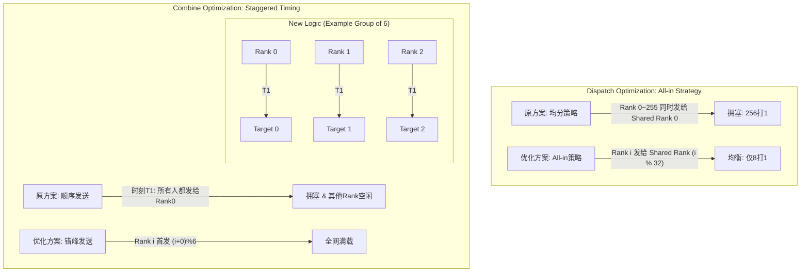
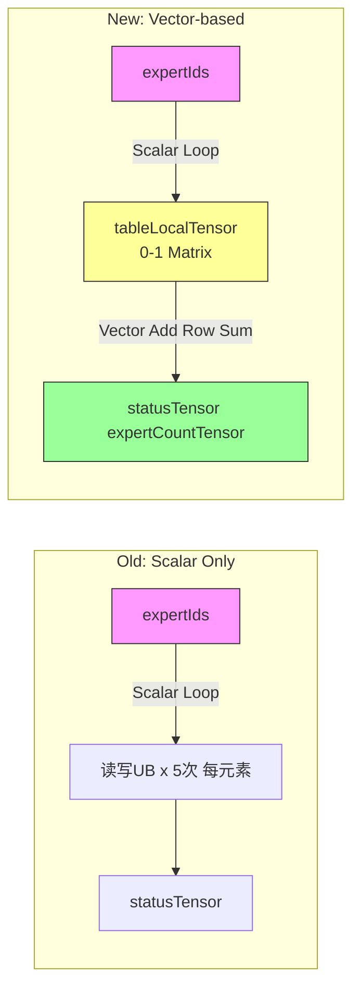
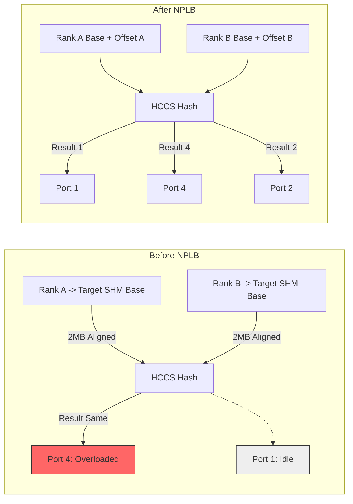
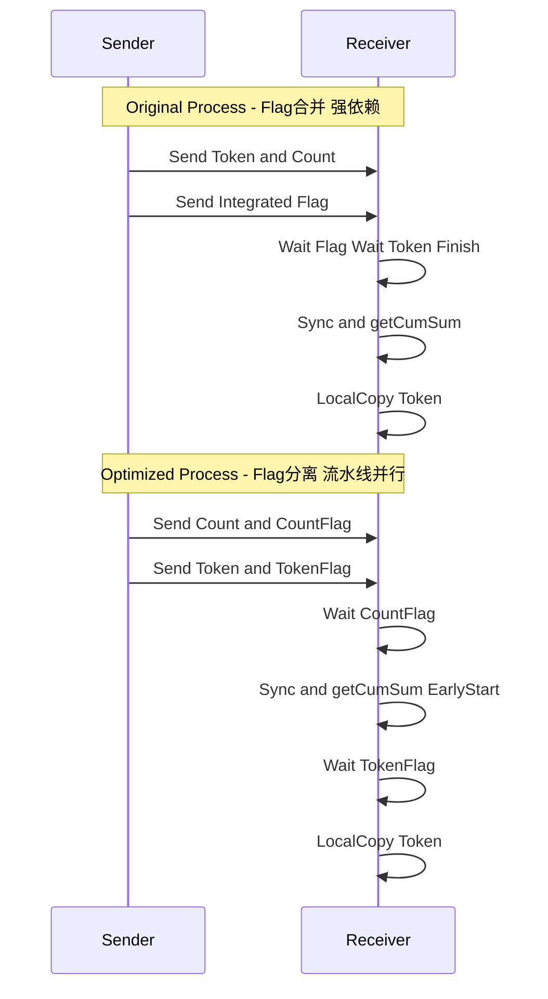

这是一个为您整理的关于昇腾910C上Dispatch和Combine算子性能优化的技术文档。文档涵盖了通信编排、地址计算、负载均衡和同步机制四个方面的优化，并附带了对应的Mermaid流程图以辅助理解。

---

# 昇腾910C Dispatch & Combine 算子性能优化技术文档

## 1. 简介
本项目针对 DeepSeekV3/R1 模型在 A3 集群（昇腾910C）上的推理性能进行优化。主要针对大规模混合专家模型（MoE）中 **Dispatch**（分发）和 **Combine**（聚合）算子的通信瓶颈、计算开销及负载均衡问题，实施了四项关键优化措施。

**背景参数：**
- **集群规模：** 288 Rank (256 路由专家 + 32 共享专家)
- **核心问题：** 严重的 Incast（多打一）拥塞、Scalar 核地址计算瓶颈、端口负载不均、核间同步等待过久。

---

## 2. 优化详情

### 2.1 通信时序编排 (Communication Scheduling)

#### 2.1.1 问题背景
在原有实现中，AIV 分核后未对通信对象和时序进行编排：
- **Dispatch 阶段：** 所有 Rank 的 AIV0 核几乎同时向共享专家 Rank 1 发送数据，导致 **256打1** 的严重拥塞，而其他共享专家带宽闲置。
- **Combine 阶段：** 所有 Rank 按照 Rank ID 从小到大的顺序发送数据，导致同一时刻只有少数 Rank 在接收数据，带宽利用率极低。

#### 2.1.2 优化方案
1.  **Dispatch 算子（All-in 策略）：**
    -   **逻辑：** 路由专家 Rank $i$ 将所有 Token 发送给 `Rank (i % 32)` 的共享专家。
    -   **效果：** 将冲突从 **256打1** 降低为 **8打1**，大幅减少拥塞。

2.  **Combine 算子（错峰轮询）：**
    -   **逻辑：** 对发送顺序进行位移。Rank $i$ 的 AIV0 核发送顺序为 `Rank (i+0)%6` $\rightarrow$ `Rank (i+1)%6` $\rightarrow$ ...
    -   **效果：** 实现了错峰发送，确保每个时刻所有 Rank 都有数据接收，填满带宽。

#### 2.1.3 逻辑示意图

---

### 2.2 Vector-based 地址计算 (Address Calculation)

#### 2.2.1 问题背景
Dispatch 算子需计算 Token 在对端 SHM 的偏移量。原方案使用 Scalar 核遍历 `expertIds` 数组：
- **复杂度：** $O(5 \cdot BS \cdot topk)$。
- **瓶颈：** Scalar 核读写 UB（Unified Buffer）次数多，计算能力弱，耗时长（BS=48时约16us）。

#### 2.2.2 优化方案
采用 **"以存代算" + Vector核加速**：
1.  **引入中间变量：** 生成 `tableLocalTensor` (Shape: $[BS, moeExpertRankNum]$)，元素为0或1。
2.  **Vector 计算：** 利用 Vector 核强大的向量加法能力，对 `tableLocalTensor` 按行累加，生成 `expertCountTensor` 和 `statusTensor`。
3.  **效果：** Scalar 复杂度降为 $O(2 \cdot BS \cdot topk)$，Vector 复杂度 $O(BS)$（可忽略），显著减少耗时。

#### 2.2.3 计算流程图

---

### 2.3 NPLB 网络端口负载均衡 (Network Port Load Balance)

#### 2.3.1 问题背景
- **现状：** HCCS 哈希算法取目的地址的 `[20:9]` 位决定出端口（7-way 交织）。
- **冲突：** 各 Rank 为 Rank $i$ 预留的 SHM 起始地址是 **2MB 对齐**的。这意味着所有目标地址的低21位完全相同。
- **后果：** 导致所有小包（如 512B）的哈希结果相同，数据全部堆积在某一个物理端口，其他端口空闲。

#### 2.3.2 优化方案
- **地址偏移：** 在 SHM 预留空间首地址增加偏移量。
- **公式：** `Offset = EPRankNum * 512B`。
- **效果：** 改变了地址的哈希输入位，使得不同 Rank 发送的数据均匀散列到 7 个物理端口上。实测端到端收益约 2.1ms (58层)。

#### 2.3.3 端口哈希示意图

---

### 2.4 Flag 分离同步优化 (Flag Separation)

#### 2.4.1 问题背景
原流程中，Token 和 Count 的传输使用同一个 Flag 标志。
- **痛点：** 接收端必须等待所有 Token 传输完成（耗时长）后，才能收到 Flag，进而开始执行 `getCumSum`（计算接收偏移量）。
- **阻塞：** `getCumSum` 实际上只依赖 Count 信息，不依赖 Token 内容，但被强行阻塞了。

#### 2.4.2 优化方案
1.  **拆分 Flag：** 将传输标志拆分为 `CountFlag` 和 `TokenFlag`。
2.  **重排流水线：** 
    -   **发送侧：** 优先发送 Count 和 `CountFlag`，然后再发送 Token 和 `TokenFlag`。
    -   **接收侧：** 收到 `CountFlag` 后立即进行核间同步和 `getCumSum` 计算，此时 Token 可能还在传输中。
3.  **效果：** 实现了 Count 传输处理与 Token 传输的**并行化**，减少了同步等待时间。

#### 2.4.3 执行流水线对比图

---

## 3. 总结
通过以上四点优化，显著提升了 Ascend 910C 上 Dispatch 和 Combine 算子的性能：
1.  **通信编排**解决了严重的Incast和带宽空闲问题。
2.  **Vector化地址计算**消除了Scalar核的计算瓶颈。
3.  **NPLB** 解决了物理层面的端口负载不均。
4.  **Flag分离** 优化了算子内部的流水线并行度。

这些优化共同作用，提升了 DeepSeekV3/R1 模型在大集群推理时的端到端有效带宽和计算效率。