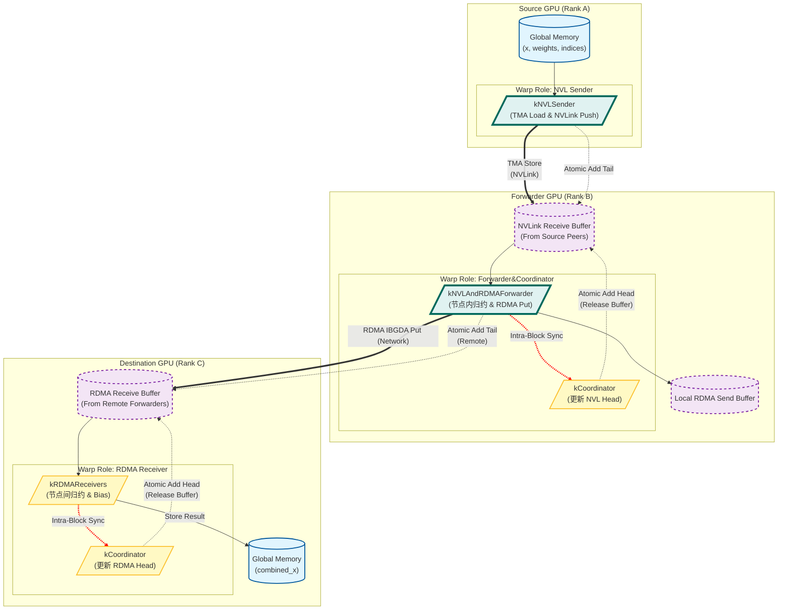

## 1. 核心功能摘要 (TL;DR)

本方案面向 **Ascend 910B 多机多卡 MoE Expert Parallel Combine 场景**，目标是：

- 高吞吐、低抖动的 Token Combine
- 支持 **跨节点（RoCE RDMA）+ 节点内（HCCS）**
- 通过 **分角色 + 分层流水线 + 双环形缓冲区** 隐藏通信延迟
- 保证 **流控正确性与确定性**

---

## 2. 内存布局与 I/O 分析 (核心重点)

该算子处理的是不规则内存访问（MoE 的特性），因为每个 Token 可能被路由到不同的 Top-K 个专家。

### 关键变量维度与布局

假设：
*   `E`: Token 总数 (Batch * SeqLen)
*   `H`: 隐藏层维度 (Hidden Size)
*   `K`: Top-K 值 (通常为 2 或 4)
*   `R_intra`: 节点内 GPU 数 (NVLink Peers, e.g., 8)
*   `R_inter`: 节点间 GPU 组数 (RDMA Ranks)

| 变量名 | 数据类型 | 逻辑形状 (Shape) | 理论内存占用 | 内存布局特性 (Stride/Align) |
| :--- | :--- | :--- | :--- | :--- |
| `x` (Input) | `bf16` | `[E, H]` | $2 \cdot E \cdot H$ Bytes | **行主序 (Row-major)**，通过 `int4` 加载，要求 $H$ 能被 8 整除 (16 Bytes 对齐)。 |
| `combined_x` (Output) | `bf16` | `[E_out, H]` | $2 \cdot E_{out} \cdot H$ Bytes | 同上，最终聚合结果。 |
| `topk_weights` | `float32` | `[E, K]` | $4 \cdot E \cdot K$ Bytes | 连续内存，每个 Token 的权重。 |
| `nvl_channel_x` | `uint8` (Buffer) | `[Slots, H * 2]` | 动态配置 | **环形缓冲区 (Circular Buffer)**。用于节点内通信，Asymmetric 访问。 |
| `rdma_channel_data` | `int8` (Buffer) | `[Slots, H * 2]` | 动态配置 | **对称缓冲区 (Symmetric Buffer)**。用于节点间 RDMA Put 操作。 |
| `smem_buffer` | `uint8` (Shared) | `[Warps, Stages, Bytes]` | 动态，约 100KB+ | **Swizzle 布局**。为 TMA 优化，包含 Barrier 和 数据 Payload。 |
| `bias_0/1` | `bf16` | `[E, H]` | $2 \cdot E \cdot H$ Bytes | 可选的 Bias，在 Combine 时直接加在结果上。 |

### 内存访问模式 (Memory Access Pattern)
1.  **Gather (Input)**: 根据 `get_addr_fn` 从不同 Rank 的缓冲区中非连续地抓取数据。
2.  **Vectorized**: 所有核心数据搬运强制转换为 `int4` (128-bit)，即一次处理 8 个 BF16 元素。
3.  **Aligned**: 这里的 `hidden` 维度必须是 16 字节对齐的（代码断言 `hidden_int4 % 32 == 0` 是为了 TMA 块大小优化，实际上至少要对齐到 `int4`）。

---

## 3. 逻辑流程图 (Mermaid)



---

## 4. 详细执行流程 (Step-by-step)

该 Kernel 是一个复杂的生产者-消费者流水线系统。

### 步骤 1: 角色分配与初始化
*   **SM 分割**：
    *   **偶数号 SM (Receiver SM)**：运行 NVLink 发送者 Warp 和最终 RDMA 接收者 Warp。
    *   **奇数号 SM (Forwarder SM)**：运行中间转发者 Warp（负责节点内归约并发出 RDMA）。
*   **缓冲区指针计算**：使用 `AsymBuffer` (非对称) 和 `SymBuffer` (对称) 包装器来管理复杂的指针偏移，区分本地内存和远程对等节点内存。
*   **TMA 设置**：在 Shared Memory 中初始化 `mbarrier` 对象，用于后续的异步传输同步。

### 步骤 2: NVLink 发送 (WarpRole::kNVLSender)
*   **任务获取**：根据 `gbl_channel_prefix_matrix` 确定当前 Rank 负责的 Token 范围。
*   **流控检测**：检查目标 NVL 环形缓冲区是否有空槽 (`head` vs `tail`)。如果满则自旋等待。
*   **数据搬运 (TMA)**：
    *   使用 `tma_load_1d` 从 Global Memory 读取 Input Token `x` 到 Shared Memory。
    *   加载 `src_meta` 和 `topk_weights`。
    *   使用 `tma_store_1d` 将 Shared Memory 的数据直接写入目标 GPU 的 Global Memory (NVLink Buffer)。
*   **更新 Tail**：通知接收方数据已就绪。

### 步骤 3: 节点内归约与转发 (WarpRole::kNVLAndRDMAForwarder)
*   **等待数据**：轮询 `nvl_channel_tail`，等待所有节点内 Peers (如 8 张卡) 的数据到达。
*   **Intra-Node Combine (`combine_token` 模版函数)**：
    *   这是一个非常核心的函数。它利用 TMA 预取流水线（2-Stage Pipeline）。
    *   它**同时**从多个 NVLink Peers 的 Buffer 中读取同一个 Token 的分片。
    *   在寄存器/Shared Memory 中将这些值相加（Partial Reduction）。
*   **写入 RDMA Buffer**：将归约后的结果写入本地的 RDMA 发送缓冲区。
*   **发起 RDMA (IBGDA)**：
    *   使用 `nvshmemi_ibgda_put_nbi_warp` 启动硬件 RDMA 传输，将数据推送到远程节点的 RDMA 接收缓冲区。
    *   使用原子操作 (`amo_nonfetch_add`) 更新远程节点的 Tail 指针。

### 步骤 4: 最终归约 (WarpRole::kRDMAReceiver)
*   **等待 RDMA 数据**：轮询 `rdma_channel_tail`。
*   **Inter-Node Combine**：
    *   再次调用 `combine_token`。
    *   这次是从多个 RDMA Peers 的缓冲区中读取数据。
    *   将读取的数据（已经是节点内归约过的）再次相加。
*   **后处理**：
    *   加载 `bias_0`, `bias_1`。
    *   应用 `topk_weights` 进行加权（如果有）。
*   **写回结果**：将最终的 `float` 累加结果转回 `bf16` (通过 `int4` 转换)，写入 `combined_x`。

### 步骤 5: 协调与同步 (WarpRole::kCoordinator)
*   这是一个“控制平面” Warp。
*   它不搬运大块数据，只负责扫描所有 Peer 的 `head` 指针，计算全局最小 `head`，并通过 `nvshmemi_ibgda_amo_nonfetch_add` 或直接内存写入来更新全局的进度指示器，防止缓冲区溢出或死锁。

## 5. 关键代码片段解析

```cpp
// 典型的 TMA 流水线模式
for (int shifted = 0, iter = 0; shifted < hidden_int4; shifted += 32, iter += 1) {
    // 1. 预取下一阶段数据到 Shared Memory
    if (shifted + 32 < hidden_int4) {
        tma_load_1d(..., next_stage_smem, ...); 
    }
    
    // 2. 等待当前阶段数据就绪
    mbarrier_wait(current_stage_barrier);
    
    // 3. 计算 (从 SMEM 读，累加)
    float values[8] = {0};
    // ... sum loop ...

    // 4. 发出 Store 指令 (TMA store 或直接 ST)
    tma_store_1d(..., combined_row + shifted, ...);
}
```
这段代码展示了 Hopper 架构上最先进的编程范式：**计算与内存访问完全解耦**。CPU (Control Logic) 发出 TMA 指令后立刻让出，GPU 硬件负责搬运，Barrier 负责同步，极大地提高了带宽利用率。