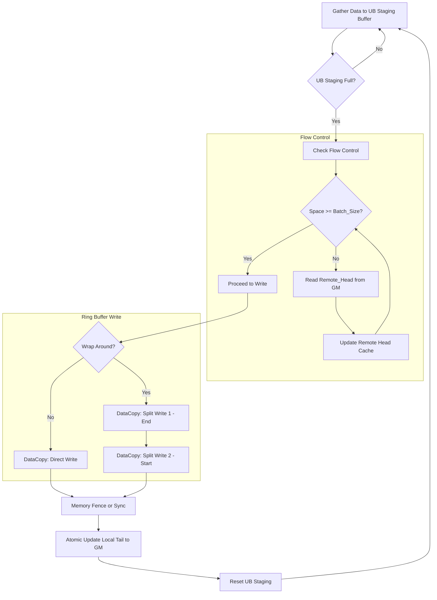

这是一份针对 **昇腾 910B (Ascend 910B)** 架构的详细设计文档。

文档基于你的 **方案 2**（即在 Sender 阶段进行 Gather-Pack），旨在解决由于 GEMM 输出布局限制导致的内存碎片问题，通过利用昇腾 AI Core 的片上内存（UB）进行聚合，最大化 HBM 带宽利用率。

---

# Ascend 910B MoE Combine-Sender 算子详细设计文档

## 1. 概述 (Overview)

### 1.1 背景
在 MoE 模型训练/推理中，`Combine` 阶段需要将各个专家（Experts）计算后的 Token 聚合，并通过通信（HCCS/RDMA）发送回原始所在的 Rank。
由于昇腾 GEMM 算子输出限制，输入数据 `x` 在内存中的排布呈现 **"Expert-Major, Rank-Minor"** 的两级层级结构，而通信算子要求 **"Rank-Major"** 的连续内存布局。

### 1.2 目标
设计一个高性能的 Ascend C Kernel，完成以下任务：
1.  **Gather (收集)**：根据元数据表，从 `x` 中非连续地读取属于特定目标 Rank 的数据片段。
2.  **Compact (紧凑化)**：在片上统一缓冲区 (UB) 中拼接这些片段，消除内存空洞。
3.  **Send-Ready Write (写入)**：将拼接好的大块数据连续写入通信缓冲区 `Tx_Buffer`。

---

## 2. 数据结构与内存视图 (Data Layout)

假设数据类型为 `BF16` (2 Bytes)，Hidden Size 为 `H`。

### 2.1 输入张量 `x` (GM)
*   **形状**: `[Total_Tokens, H]`
*   **物理布局**: 逻辑上分为 $E$ 个 Expert 块。在每个 Expert 块内，数据按目标 Rank ID 排序。
    ```text
    [ Expert 0 ] -> {Rank 0 Tokens} {Rank 1 Tokens} ... {Rank R Tokens}
    [ Expert 1 ] -> {Rank 0 Tokens} {Rank 1 Tokens} ... {Rank R Tokens}
    ...
    ```
    *注：这就是你面临的“碎片化”来源。Rank 0 的数据散落在 Expert 0, 1, ... E 的特定位置。*

### 2.2 元数据表 (Auxiliary Inputs)
为了定位每个片段，Host 端或前序算子需准备两张表（int32），形状均为 `[Num_Local_Experts, Num_Ranks]`：
1.  **`Offset_Table`**: 记录每个 Expert 中，属于某 Rank 的起始 Token 索引（相对于 `x` 起始位置的全局偏移，或相对于该 Expert 的偏移，建议存**全局 Token 偏移**以减少计算）。
2.  **`Length_Table`**: 记录每个 Expert 中，属于某 Rank 的 Token **数量**。

### 2.3 输出缓冲区 `Tx_Buffer` (GM)
*   **形状**: `[Num_Ranks, Max_Send_Tokens, H]` (逻辑上)
*   **物理布局**: 严格按 Rank 连续存储，直接用于 HCCS Send。
    ```text
    [ Buffer for Rank 0 (连续) ] [ Buffer for Rank 1 (连续) ] ...
    ```

---

## 3. 并行策略与架构映射 (Parallelism)

利用 910B 的多核并发能力，采用 **按目标 Rank 划分 (Rank-based Parallelism)** 的策略。

### 3.1 Block Dim 映射
*   **任务划分**: 每个目标 Rank ($R_i$) 作为一个独立的任务。
*   **核心映射**:
    *   如果 `Num_Ranks` $\le$ `Block_Dim` (AI Core 数量，通常 20-30+): 每个 Block 处理一个或多个 Rank。
    *   如果 `Num_Ranks` 很大: 使用循环平铺 (Tiling)。
    *   *推荐*: `BlockIdx` 对应 `Dest_Rank_ID`。如果 Rank 数少于核数，可将一个 Rank 的数据进一步切分（但这会增加同步复杂度，考虑到通信通常是按 Rank 发起的，建议一个 Core 负责一个完整 Rank 的 Buffer 填充）。

### 3.2 内存层级规划
*   **GM (Global Memory)**: 存放原始 `x`，`Offset/Length` 表，以及最终的 `Tx_Buffer`。
*   **UB (Unified Buffer)**: 核心中转站。
    *   `Read_Buffer`: 用于处理非对齐读取的小块临时区。
    *   `Staging_Buffer`: 用于聚合数据的大块缓冲区（建议 64KB - 128KB）。

---

## 4. 核心逻辑流程 (Kernel Design)

以下逻辑描述单个 AI Core 处理 **Target Rank $K$** 的过程。

### 4.1 初始化
1.  **获取 Core ID**: 确定当前 Core 负责的目标 `Rank_K`。
2.  **初始化指针**:
    *   `x_gm_ptr`: 指向输入 `x` 基址。
    *   `tx_gm_ptr`: 指向输出缓冲区中 `Rank_K` 的起始位置。
    *   `meta_ptr`: 指向元数据表。

### 4.2 流水线设计 (Gather-Batch-Write)

为了掩盖 GM 访问延迟，我们维护一个在 UB 中的 **Staging Buffer**。

#### 伪代码 (Ascend C 风格逻辑)

```cpp
// 常量定义
constexpr int32_t ALIGN_SIZE = 32; // 32 Bytes 对齐
constexpr int32_t H_BYTES = Hidden_Size * sizeof(half); // BF16

// UB 空间分配
LocalTensor<half> staging_ub; // 大块聚合区，例如 64KB
LocalTensor<half> read_temp_ub; // 小块读取区，处理对齐
int32_t staging_offset = 0;   // 当前 staging 区已存字节数

// 遍历本地所有 Expert
for (int exp_idx = 0; exp_idx < Num_Local_Experts; ++exp_idx) {
    
    // 1. 获取当前 Expert 中属于 Rank_K 的元数据
    int32_t token_cnt = Length_Table[exp_idx][Rank_K];
    if (token_cnt == 0) continue;
    
    int32_t start_token_idx = Offset_Table[exp_idx][Rank_K];
    int64_t data_bytes = token_cnt * H_BYTES;
    int64_t gm_byte_offset = start_token_idx * H_BYTES;

    // 2. 处理非对齐读取 (Unaligned Read Handling)
    // 昇腾 DataCopy 通常要求地址 32B/512B 对齐
    int32_t align_rem = gm_byte_offset % ALIGN_SIZE;
    int64_t aligned_gm_offset = gm_byte_offset - align_rem;
    int32_t read_len = AlignUp(data_bytes + align_rem, ALIGN_SIZE);
    
    // 2.1 从 GM 读到 read_temp_ub (包含头尾多余数据)
    DataCopy(read_temp_ub, x_gm_ptr + aligned_gm_offset, read_len);
    
    // 2.2 数据清洗：从 read_temp_ub 拷贝有效数据到 staging_ub
    // 这一步在 UB 内部进行，速度极快
    // 将 [align_rem, align_rem + data_bytes] 的数据 append 到 staging_ub
    vector_memcpy(staging_ub + staging_offset, read_temp_ub + align_rem, data_bytes);
    
    staging_offset += data_bytes;

    // 3. 检查是否需要 Flush (Batching)
    // 如果 staging_ub 快满了，或者这是最后一个 Expert
    if (staging_offset >= STAGING_THRESHOLD || exp_idx == Num_Local_Experts - 1) {
        
        // 3.1 对齐 Write
        // 写入 GM 也最好对齐。如果 staging_offset 不是 32B 的倍数，
        // 对于中间块：只写对齐部分，剩余留到下一次。
        // 对于最后一块：直接 Padding 写。
        
        int32_t write_len = IsLast ? AlignUp(staging_offset, 32) : AlignDown(staging_offset, 32);
        
        if (write_len > 0) {
            DataCopy(tx_gm_ptr, staging_ub, write_len);
            
            // 更新全局指针
            tx_gm_ptr += write_len;
            
            // 搬运剩余未写出的尾部数据到 staging 头部 (Ring Buffer 逻辑)
            int32_t remain = staging_offset - write_len;
            if (remain > 0) {
                vector_memcpy(staging_ub, staging_ub + write_len, remain);
            }
            staging_offset = remain;
        }
    }
}
// 确保最后一点数据落盘
SetAtomicAdd(...); // 可选：更新 Sync Flag 通知 Host
```

---

## 5. 关键技术难点与解决方案

### 5.1 地址对齐 (Alignment)
*   **问题**: `Offset_Table` 给出的偏移量是按 Token 计算的，转换成字节地址后，大概率不是 32 字节对齐的（除非 Hidden Size 很大且凑巧）。而 `DataCopy` (MTE2) 强依赖对齐。
*   **解法**: 采用 **"Over-read + UB-Crop"** 策略。
    *   **Over-read**: 总是向下取整到最近的 32B 边界开始读，并向上取整读取长度。
    *   **UB-Crop**: 数据进入 UB 后，利用 Vector Unit 极高的带宽，通过指针偏移剔除头部和尾部的无效字节（Padding），将有效 Payload 紧密 packed 到 Staging Buffer。

### 5.2 极小块处理 (Tiny Chunk Problem)
*   **问题**: 如果某个 Expert 分给 Rank K 的 Token 只有 1 个（例如 2KB 数据），频繁发起 32B 的 GM Read 会导致总线利用率极低。
*   **解法**:
    *   **Software Pipelining**: 尽量开启双缓冲（Double Buffering）。虽然 Gather 操作本身很难做预取，但在 "UB -> GM" 写出阶段，可以利用 Queue 将 MTE3 操作异步化，计算单元继续准备下一批数据。
    *   **Batching**: 这就是方案 2 的核心优势。我们不是读一个写一个，而是读几十个小块，凑成一个 64KB 的大块写一次。MTE3 (Write) 的效率是 100% 的。

### 5.3 UB 内存管理
假设 UB 大小为 192KB（910B通常更大，具体视型号而定）：
*   `Staging_Buffer`: 128KB (Ping-Pong `64KB * 2` 可选)
*   `Read_Temp_Buffer`: 32KB (足以容纳最大的单个 Expert 片段)
*   `Metadata_Buffer`: 存放该 Core 对应 Rank 的 `Offset` 列，避免重复访问 GM。

---

## 6. 性能优化 Checklist

1.  **Loop Tiling**: 确保每个 Core 的负载均衡。如果 Hidden Size 很大，单个 Token 拷贝耗时久，可以考虑按 `Hidden` 维度再切分（通常不需要，MoE 中 Hidden 一般 2k-4k，Token 数是瓶颈）。
2.  **Vector Instruction**: 在 UB 内进行 `memcpy` 时，确保使用 Ascend C 的 `MBUF` 或 `Vector` 指令，不要用标量循环。
3.  **Burst Length**: 调整 `Staging_Buffer` 的大小，使得每次刷回 GM 的 Burst Length 尽可能大（推荐 256B 以上，最优 4KB+）。
4.  **Metadata Pre-fetching**: Kernel 开始时，先将当前 Rank 对应的 `Length_Table` 这一列全部读入 UB，避免在循环中每次都去 GM 查表。

## 7. 接口定义 (API)

```cpp
extern "C" __global__ __aicore__ void moe_combine_sender(
    GM_ADDR x,              // Input tensor [Tokens, Hidden]
    GM_ADDR tx_buffer,      // Output tensor [Ranks, Buffer_Size]
    GM_ADDR offset_table,   // Meta [Local_Experts, Ranks]
    GM_ADDR length_table,   // Meta [Local_Experts, Ranks]
    int32_t num_local_experts,
    int32_t num_ranks,
    int32_t hidden_size,
    int32_t max_send_len    // 每个 Rank 的 Buffer 容量限制
) {
    // Kernel Implementation
}
```

## 8. 总结
此设计通过引入 **UB Staging Buffer**，将原本离散的随机 GM 写操作（对带宽极其不友好），转化为了 **"带偏移的随机读 + 连续的块写"**。由于读操作的粒度（单个 Expert 对单个 Rank 的数据量）通常大于单个 Token，且写操作被完全聚合，这能够最大程度逼近昇腾 910B 的有效内存带宽上限。


## 补充设计
这是一个非常关键的补充。加入**环形缓冲区 (Ring Buffer)** 管理和**流控 (Flow Control)** 后，Sender Kernel 的复杂度会上升，从单纯的“搬运工”变成了“生产者”。

在昇腾 910B 上实现这一点，核心难点在于：**如何高效地在 AI Core 上进行 GM 状态轮询（自旋）而不阻塞流水线，以及如何处理环形缓冲区的回绕（Wrap-around）写入。**

以下是针对 **HCCS 环形缓冲区 + 流控** 的详细设计增补文档。

---

# Ascend 910B MoE Combine-Sender 增强设计：流控与环形缓冲区

## 1. 新增数据结构与状态变量

### 1.1 环形缓冲区控制块 (Control Block)
我们需要在 GM 中维护每个 Rank 通信通道的状态。假设这些指针是 `uint64_t` 或 `int64_t` 类型（字节偏移量）。

*   **`Tx_Buffer_Base`**: HCCS 发送缓冲区的起始物理地址。
*   **`Buffer_Size`**: 环形缓冲区总容量 (Bytes)。
*   **`Sync_Flags` (GM)**:
    *   `Remote_Head_Ptr`: **[只读]** 存放目标消费者（Receiver）已经取走的偏移量。由接收端更新，发送端轮询。
    *   `Local_Tail_Ptr`: **[可写]** 存放发送端当前写入完成的偏移量。由发送端更新，接收端读取。

### 1.2 本地寄存器状态 (Scalar State)
在 AI Core 的标量寄存器中维护：
*   `local_tail_cache`: 当前已经写入数据的尾部位置（绝对递增值，不取模）。
*   `remote_head_cache`: 缓存的远端头部位置，减少访问 GM 次数。

---

## 2. 增强后的逻辑流程图

我们将原有的 **[3. Flush (Batching)]** 步骤细化为 **[流控检测] -> [环形写入] -> [状态更新]**。



---

## 3. 详细实施步骤 (Ascend C 实现细节)

### 3.1 步骤一：流控检测 (Spin-Wait)

**策略**：
*   **惰性读取**：先用寄存器里的 `remote_head_cache` 算一下空间够不够。如果够，完全不访问 GM。
*   **自旋等待**：只有空间不足时，才去 GM 读取最新的 `Remote_Head`。

```cpp
// 假设当前 UB 中积累了 pending_bytes 字节准备写入
int64_t needed_space = pending_bytes;

// 1. 快速检查 (Fast Path)
int64_t used_space = local_tail_cache - remote_head_cache;
int64_t free_space = BUFFER_SIZE - used_space;

// 2. 自旋等待 (Slow Path)
if (free_space < needed_space) {
    // 设置超时机制防止死锁 (可选)
    while (true) {
        // 从 GM 刷新 remote_head (使用 volatile 语义或 GLobalTensor)
        // 注意：Ascend C 中建议使用 GlobalTensor 的 GetValue
        remote_head_cache = RemoteHeadTensor.GetValue(0); 
        
        used_space = local_tail_cache - remote_head_cache;
        free_space = BUFFER_SIZE - used_space;
        
        if (free_space >= needed_space) {
            break;
        }
        // 插入 NOP 或短暂休眠指令，避免过度抢占总线
        // __asm__ volatile("nop"); 
    }
}
```

### 3.2 步骤二：环形缓冲区写入 (Wrap-around Handling)

**策略**：
*   使用 **绝对偏移量 (Absolute Offset)** 维护 Tail，计算写入地址时取模。
*   如果写入跨越了缓冲区边界，拆分成两次 `DataCopy`。

```cpp
// 计算当前在环形缓冲区中的物理写入偏移 (0 ~ BUFFER_SIZE-1)
int64_t physical_write_offset = local_tail_cache % BUFFER_SIZE;
int64_t space_at_end = BUFFER_SIZE - physical_write_offset;

if (pending_bytes <= space_at_end) {
    // Case A: 不需要回绕，一次写入
    // Dest: Tx_Base + physical_write_offset
    DataCopy(tx_gm_ptr + physical_write_offset, staging_ub, pending_bytes);
} else {
    // Case B: 需要回绕，拆分两次
    // Part 1: 填满尾部
    DataCopy(tx_gm_ptr + physical_write_offset, staging_ub, space_at_end);
    
    // Part 2: 剩余写到头部
    // Dest: Tx_Base + 0
    // Src: staging_ub + space_at_end (注意 UB 指针偏移)
    DataCopy(tx_gm_ptr, staging_ub[space_at_end], pending_bytes - space_at_end);
}

// 重要：此时还不能更新全局 Tail，必须保证数据落盘
SetFlag(PIPE_MTE3, PIPE_S, EVENT_ID); // 发出同步事件
WaitFlag(PIPE_MTE3, PIPE_S, EVENT_ID); // 等待 MTE3 写完
```

### 3.3 步骤三：更新 Tail 指针 (Commit)

**策略**：
*   **原子更新**：虽然这是一个单生产者模型，直接写 GM 即可，但为了保证对消费者的可见性，必须确保内存序。
*   **通信触发**：更新 Tail 指针的操作本身可能触发 HCCS 硬件的门铃（Doorbell），或者仅仅是更新内存让接收端轮询。

```cpp
// 更新本地缓存
local_tail_cache += pending_bytes;

// 将新的 Tail 写入 GM，通知接收端
// LocalTailTensor 是一个 GlobalTensor
LocalTailTensor.SetValue(0, local_tail_cache);

// 如果是 RDMA/HCCS 门铃机制，可能还需要写特定的寄存器地址
// WriteDoorbell(local_tail_cache); 
```

---

## 4. 针对昇腾 910B 的关键优化点

### 4.1 避免 False Sharing (伪共享)
由于你在每个 Block/Core 处理不同的 Rank，对应的 `Head/Tail` 指针也是分开的。
*   **设计要求**：`Sync_Flags` 区域在 GM 中分配时，每个 Rank 的控制结构体最好 **128 Bytes 对齐** (Cache Line 隔离)。
*   如果不隔离，Core A 更新 Rank 0 的 Tail 时，可能会导致 Core B 缓存的 Rank 1 的 Head 失效，引发严重的总线颠簸。

### 4.2 批量更新 vs 实时更新
*   **问题**：每攒够 64KB (UB Staging Size) 就更新一次 Tail 吗？
*   **建议**：是的。
    *   HCCS 带宽很高，接收端消化速度很快。
    *   发送端更新 Tail 越及时，接收端越能尽早处理，流水线流动性越好。
    *   64KB 的粒度对于 HCCS 来说足够大了，不会造成过多的通信控制开销。

### 4.3 预取 Head 指针 (Latency Hiding)
为了掩盖读取 GM 中 `Remote_Head` 的延迟（可能几百个周期），可以采用**双缓冲状态检查**：
*   在开始将数据从 GM Gather 到 UB *之前*，就先发一个指令去预读 `Remote_Head`。
*   当数据在 UB 组装完毕准备 Flush 时，`Remote_Head` 的值可能已经回到寄存器了，此时直接比较，无需等待。

---

## 5. 完整伪代码 (Ascend C Kernel Loop)

```cpp
// Kernel Loop
while (has_data_to_send) {
    // ... [Gather data from Experts to UB Staging] ...
    // 假设当前 UB 里攒了 batch_len 长度的数据
    
    // --- Phase 1: Flow Control ---
    int64_t used = local_tail_cache - remote_head_cache;
    if (BUFFER_SIZE - used < batch_len) {
        // 空间不够，刷新 Head
        while (true) {
             remote_head_cache = RemoteHeadTensor.GetValue(0);
             if (BUFFER_SIZE - (local_tail_cache - remote_head_cache) >= batch_len) 
                 break;
             // 可选: PipeBarrier(PIPE_ALL); 防止死循环占用过高
        }
    }

    // --- Phase 2: Ring Buffer Write ---
    int64_t write_idx = local_tail_cache % BUFFER_SIZE;
    if (write_idx + batch_len <= BUFFER_SIZE) {
        DataCopy(tx_gm_ptr + write_idx, staging_ub, batch_len);
    } else {
        int64_t seg1 = BUFFER_SIZE - write_idx;
        int64_t seg2 = batch_len - seg1;
        DataCopy(tx_gm_ptr + write_idx, staging_ub, seg1);
        DataCopy(tx_gm_ptr, staging_ub[seg1], seg2);
    }

    // --- Phase 3: Synchronization & Commit ---
    // 确保 MTE3 数据写完
    SetFlag(PIPE_MTE3, PIPE_S, 0);
    WaitFlag(PIPE_MTE3, PIPE_S, 0);

    // 更新 Tail
    local_tail_cache += batch_len;
    LocalTailTensor.SetValue(0, local_tail_cache);
    
    // 清空 UB 偏移，准备下一轮
    staging_offset = 0;
}
```

## 6. 总结
这个增强设计将 **计算（Gather/Compact）** 与 **I/O 控制（Flow Control/Ring Buffer）** 紧密结合。
*   **正确性**：通过绝对偏移量取模和拆分写，解决了回绕问题。
*   **安全性**：通过 Head/Tail 检查解决了溢出问题。
*   **性能**：通过 UB 聚合大块写入和惰性状态更新，最小化了对 HCCS 带宽的控制信令占用。


在昇腾 910B 上实现这一功能，我**强烈建议选择方案 2（在 Sender 阶段基于前缀和/偏移量表进行 Gather 拷贝）**，但需要针对昇腾的架构特点（UB、GM、MTE搬运机制）做特定的优化设计。

直接重排（方案1）在昇腾架构上通常是下策，因为它浪费了宝贵的 HBM 带宽。

以下是详细的深度分析和具体的实施建议：

### 核心结论：为什么选方案 2？

在高性能计算中，**“数据移动就是瓶颈”**。

*   **方案 1 (原地重排)**：
    *   数据路径：`GM(乱序 x)` $\to$ `UB` $\to$ `GM(有序 x)` $\to$ `UB` $\to$ `GM(通信 Buffer)`。
    *   代价：多了一轮完整的 HBM 读写。对于大模型推理/训练，这几毫秒的 overhead 可能是致命的。
    *   昇腾 910B 的 AI Core 虽然强大，但如果把时间花在单纯的数据搬运（DataCopy）上而不进行计算，是非常不划算的。

*   **方案 2 (逻辑 Gather + 写入通信 Buffer)**：
    *   数据路径：`GM(乱序 x)` $\to$ `UB` $\to$ `GM(通信 Buffer)`。
    *   原理：通信前的数据准备（Marshalling）本来就需要一次拷贝（把数据搬到 RDMA/HCCS 可见的连续内存区域）。我们可以在这次**必不可少**的拷贝过程中，顺便完成“逻辑上的重排”。
    *   代价：仅仅是地址计算稍微复杂一点，计算单元（Scalar/Vector Core）的开销远小于内存带宽的开销。

---

### 昇腾 910B 实施方案详解

由于昇腾的编程范式（TIK C++ / Ascend C）强依赖于 **GM (Global Memory) $\leftrightarrow$ UB (Unified Buffer)** 的搬运，方案 2 的核心在于利用 **UB 作为中转站** 来消除碎片。

#### 1. 输入数据的逻辑视图
你的输入 `x` 现在的排布是：
`[Expert 0 (Rank 0, Rank 1...)] -> [Expert 1 (Rank 0, Rank 1...)]`

你需要发送给 `Rank k` 的数据实际上分散在 `Expert 0, Expert 1, ... Expert N` 的各个内存片段中。

#### 2. 元数据准备 (Metadata)
你确实需要你提到的 **`[num_local_experts, num_ranks]` 的前缀和/偏移量表**。
*   **来源**：这个信息在 Dispatch 阶段应该已经有了（或者很容易统计）。
*   **格式**：建议构建一个 `Offset_Table[Expert_ID][Rank_ID]` 和 `Length_Table[Expert_ID][Rank_ID]`。
*   **存储**：这个表很小，可以直接放在 Scalar Buffer 或者常驻 UB。

#### 3. Sender Kernel 设计 (核心逻辑)
假设当前 AI Core 负责处理发送给 **Rank k** 的数据。

**伪代码逻辑 (Ascend C 风格):**

```cpp
// 假设当前 Block/Core 负责 Rank k 的发送任务
int dest_rank = k;
int64_t current_send_buf_offset = 0;

// 循环遍历所有的本地专家 (Expert 0 -> Expert N)
for (int e = 0; e < num_local_experts; ++e) {
    // 1. 获取当前 Expert e 中属于 Rank k 的数据片段信息
    int64_t chunk_offset = Offset_Table[e][dest_rank];
    int32_t chunk_len = Length_Table[e][dest_rank]; // 字节数
    
    if (chunk_len == 0) continue;

    // 2. 将碎片数据从 GM(x) 搬运到 UB
    // 注意：如果 chunk_len 很小，这里需要考虑对齐和 padding，或者做 Loop tiling
    // SetGlobalBuffer 绑定 x 的基地址 + chunk_offset
    DataCopy(ub_fragment, x_gm + chunk_offset, chunk_len);

    // 3. 将 UB 中的数据写入到发送 Buffer (连续写入)
    // 这里的 send_buffer 是专门用于 HCCS/RDMA 通信的内存
    DataCopy(send_buffer_gm + current_send_buf_offset, ub_fragment, chunk_len);

    // 4. 更新发送 Buffer 的偏移量
    current_send_buf_offset += chunk_len;
    
    // 优化点：可以在 UB 里攒够一定大小（比如 32B/64KB）再一次性刷回 GM，
    // 以提高 MTE3 (UB->GM) 的带宽利用率。
}

// 此时，send_buffer_gm 中已经是 Rank k 所需的全部数据，且是连续的
// 可以触发 HCCS Send
HccsSend(send_buffer_gm, ...);
```

### 关键挑战与优化策略

在昇腾上实现方案 2，必须解决 **“碎片化搬运 (Strided Access)”** 的效率问题。

#### 挑战：MTE2 (GM->UB) 的对齐限制
昇腾的 `DataCopy` 指令通常要求地址是 32 Byte 或 512 Byte 对齐，长度也有要求。如果某个专家分给某个 Rank 的 token 数量很少（比如只有 1 个 token，BF16 只有 2 Bytes），直接 Copy 会报错或效率极低。

#### 优化策略 1：UB 聚合 (UB Batching) —— 推荐
不要每读一个 Expert 的数据就写回 GM。
1.  在 UB 中开辟一块较大的 `Staging_Buffer`。
2.  循环读取多个 Expert 的数据片段到 `Staging_Buffer` 中，紧密拼接。
3.  只有当 `Staging_Buffer` 满（或者处理完所有 Expert）时，才触发一次大的 `MTE3 (UB->GM)` 写操作。
4.  **读取侧优化**：对于读取侧的非对齐问题，可以向上取整读取（Read Aligned），在 UB 内通过指针偏移只取有效数据。

#### 优化策略 2：多流水线并发 (Double/Triple Buffering)
利用昇腾的 Queue 机制，将 Read (GM->UB) 和 Write (UB->GM) 并行化。
*   当 MTE2 正在搬运 `Expert i` 的数据时，MTE3 正在将 `Expert i-1` 聚合好的数据写出。

#### 优化策略 3：Block 映射策略
由于昇腾 910B 有多个 AI Core（例如 30+ 个），你可以按照 Rank 并行：
*   如果 `Rank` 数量较多，分配 `Core i` 负责 `Rank i` 的数据聚合。
*   这样每个 Core 都是独立的流式写入，互不锁。

### 总结

1.  **不要原地重排**：会浪费约 50% 的内存带宽。
2.  **采用方案 2**：在将数据从计算输出拷贝到通信 Buffer 的过程中，通过逻辑索引完成聚合。
3.  **技术关键点**：
    *   **Prefix Matrix 是必须的**：在 Host 端或之前的 Kernel 中计算好。
    *   **利用 UB 消除碎片**：从 GM 读取小块 $\to$ UB 拼接成大块 $\to$ 写入通信 Buffer。这是昇腾编程的精髓。
    *   **处理对齐**：读取时若未对齐，多读一点到 UB，然后只拷贝有效部分。

这种实现方式不仅解决了排序问题，实际上也完成了 **DeepEP 中 `WarpRole::kNVLSender`** 的功能（即把离散数据搬运到发送缓冲区），是一举两得的高性能做法。