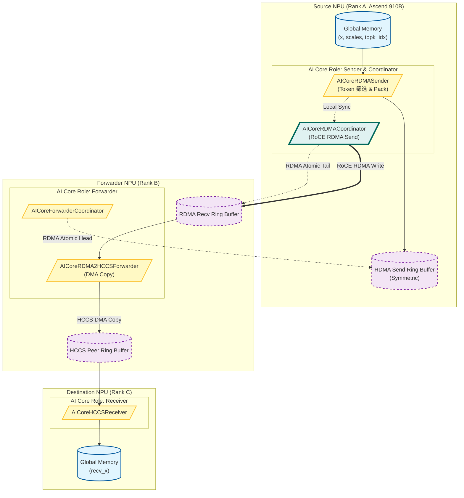
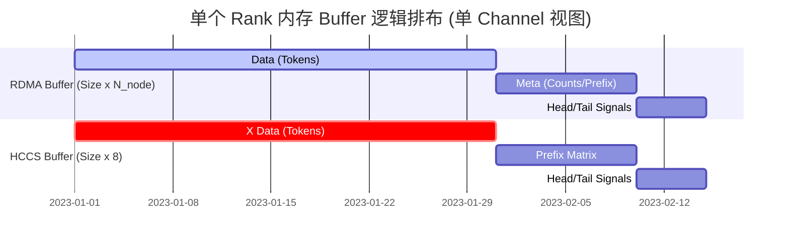

代码仓中cam_moe_distribute_dispatch_a2_layered.h是一个能够在双机910B服务器运行的一个moe通信的dispatch实现，但是因为显存原因，它只能在双机16卡上运行。现在，我要重新实现一个版本，能够支持无限大的batchsize和在更多机器上运行，下面是我的设计文档：

# Ascend 910B Normal Dispatch 设计文档

## 1. 设计目标

本方案面向 **Ascend 910B 多机多卡 MoE Expert Parallel Dispatch 场景**，目标是：

- 高吞吐、低抖动的 Token Dispatch
- 支持 **跨节点（RoCE RDMA）+ 节点内（HCCS）**
- 通过 **分角色 + 分层流水线 + 双环形缓冲区** 隐藏通信延迟
- 保证 **流控正确性与确定性**

---

## 2. 整体流程

Dispatch 设计为一个 **三段式流水线**：

```
Source NPU
   ↓（RoCE RDMA）
Forwarder NPU
   ↓（HCCS）
Destination NPU
```

- **Source NPU**：负责 Token 筛选、打包与 RDMA 发送
- **Forwarder NPU**：负责 RDMA → HCCS 转发与流控
- **Destination NPU**：负责最终数据落盘（recv_x）

---

## 3. Normal Dispatch 流程图（Ascend 910B）



---

## 4. 核心逻辑架构：分层流水线

Dispatch 内核采用 **分角色 + 分阶段流水** 的方式，将计算与通信彻底解耦。

### 4.1 角色划分（AI Core 视角）

| 角色                     | 职责                 |
| ------------------------ | -------------------- |
| AICoreRDMASender             | Token 筛选、数据打包 |
| AICoreRDMACoordinator    | 触发 RoCE RDMA 发送  |
| AICoreRDMA2HCCSForwarder | RDMA → HCCS 转发     |
| AICoreForwarderCoordinator     | 反向 Credit 回收     |
| AICoreHCCSReceiver       | 最终写入 recv_x      |

> 每个角色的核数初期先定为（后续根据实测的流水情况调整）：
> RDMASender：aivNum/4 -1
> RDMACoordinator：4
> AICoreRDMA2HCCSForwarder：aivNum/4 -1
> AICoreForwarderCoordinator：aivNum/4 -1
> AICoreHCCSReceiver：aivNum/4 -1

---

## 5. 各角色核心逻辑

### 5.1 AICoreRDMASender（数据准备）

**职责**

- 首先明确多qp场景rdma channel数量=RDMASender=RDMA2HCCSForwarder，一个channel可能是一对多的
- 多qp 可以一个aicore对应一个sender，qp数量远小于aicore数量时需要并行 多个aicore对应一个sender一个channel
- 遍历分配的 Token（**按照** **token_idx % SenderNum 分核**）
- 判断 Token 目标 RdmaRank
- **Slot 分配与写锁**：
  
  - **多个aicore对应一个channel模式下，由于多个 AICore 可能同时想发往同一个节点，代码使用** **rdma_send_channel_lock**（每个channel需要有rdma_rank_num个）。
  - **多核并发乱序写入rdma_buff**（携带src_token_id,后续receiver排序，若为一个核对应一个channel，则无需排序）<!--  老方案需要多核同步：多个aicore对应一个channel模式下，需要滑动窗口，使用rdma_send_channel_window（一个 32 位的 bitmask）来追踪当前发送窗口的状态。 -->
  - ​**Sender 拿到自己的** **rdma_tail_idx** **后，将数据（Hidden States, Scales, Metadata）拷贝到**本地的对称 RDMA 发送区。​
- Pack 数据到对应的 RDMA Ring Buffer

**核心流程**

```
for token in assigned_tokens:
    if token_dst_rank == my_rank:
        wait_until(rdma_tail - rdma_head < capacity)
        pack_token(token, rdma_buffer[rdma_tail])
        rdma_tail++
```

---

### 5.2 AICoreRDMACoordinator（RDMA 发送）

**职责**

- 批量触发 RoCE RDMA Write
- 更新远端 Tail 指针

**Chunk 化发送**

```
if local_tail - last_sent >= RDMA_CHUNK:
    roce_write(rdma_buffer[last_sent : local_tail])
    rdma_atomic_add(remote_tail, local_tail - last_sent)
    last_sent = local_tail
```

---

### 5.3 AICoreRDMA2HCCSForwarder（转发）

**职责**

- 轮询 RDMA Tail
- 使用 DMA 将数据写入 HCCS Ring Buffer

```
while rdma_head < rdma_tail:
    wait_hccs_space()
    dma_async(rdma_buf[rdma_head], hccs_buf[hccs_tail])
    rdma_head++
    hccs_tail++
```

---

### 5.4 AICoreForwarderCoordinator（Credit 回收）

**职责**

- 批量回收 RDMA buffer 空间
- 降低原子操作频率

```
if rdma_head - last_reported >= CREDIT_BATCH:
    rdma_atomic_add(remote_head, CREDIT_BATCH)
    last_reported += CREDIT_BATCH
```

---

### 5.5 AICoreHCCSReceiver（最终写入）

**职责**

- 从 HCCS Ring Buffer 读取数据
- 获取notifydispatch传入的`[num_ranks, num_local_experts]`的偏移，计算出本token放入的位置
- 写入最终 recv_x

```
while hccs_head < hccs_tail:
    dma_async(hccs_buf[hccs_head], recv_x[offset])
    hccs_head++
```

---

## 6、 环形缓冲区 (Ring Buffer) 的使用细节

使用 **两级环形缓冲区** 来实现流控和延迟隐藏。

对于rdma_buffer ，先基于channel_num划分，每个channel一块buffer（包含send和recv），每个channel的buffer再划分为rdma_rank_num个。



### 6.1. 第一级环形缓冲区：跨节点 RDMA Buffer

此缓冲区连接 **Source NPU** 和 **Forwarder NPU**。

- **定义与布局**：
- rdma_channel_data: 对称缓冲区（Symmetric Buffer），所有 Rank 分配大小一致。
  
  - **大小**：num_max_rdma_chunked_recv_tokens * num_bytes_per_token。
  - **Head (读指针)**：存储在 rdma_channel_head。表示 Forwarder 已经处理到了哪里。源端通过 RDMA 读取或接收原子更新来获取此值。
  - **Tail (写指针)**：存储在 rdma_channel_tail。表示 Source 已经发送到了哪里。Forwarder 通过接收 RDMA 原子更新来感知此值。
- **同步机制 (流控)**：
  
  - **发送端阻塞 (Sender Backpressure)**：
    在 kRDMASender 中：
    
    ```
    // 检查缓冲区是否已满
    while (rdma_tail_idx - cached_rdma_channel_head >= num_max_rdma_chunked_recv_tokens) {
        // 重新加载 head 指针（由 ForwarderCoordinator 远程更新）
        cached_rdma_channel_head = ...
    }
    ```
  - **接收端轮询 (Receiver Polling)**：
    在 kRDMASenderCoordinator 中，当发送数据后，显式更新远程的 Tail：
    
    ```
    shmemi_ibgda_amo_nonfetch_add(rdma_channel_tail.buffer(rdma_rank), ...);
    ```
    
    kRDMAAndHCCSForwarder 会轮询这个 Tail 来看是否有数据可读。
- **Credits 返回**：
  kForwarderCoordinator 负责将 Credits（空闲空间）返还给发送端。它不会每消费一个 Token 就通知一次，而是攒够一定数量（num_max_rdma_chunked_send_tokens）后，才发送一次远程原子加，以减少网络小包开销。

### 6.2. 第二级环形缓冲区：节点内 HCCS Buffer

此缓冲区连接 **Forwarder NPU** 和 **Destination NPU**。

- **定义与布局**：
- hccs_channel_x: 非对称缓冲区（AsymBuffer），利用 HCCS 的直接内存访问能力。
  
  - **大小**：num_max_hccs_chunked_recv_tokens * num_bytes_per_token。
  - **Head**：存储在接收端（Destination），Forwarder 通过 HCCS 远程读取。
  - **Tail**：存储在接收端（Destination），Forwarder 通过 HCCS 远程更新。
- **同步机制**：
  
  - **Forwarder 写入 (Producer)**：
    在 kRDMAAndHCCSForwarder 中：
    
    ```c++
    // 检查 HCCS 缓冲区是否有空位
    const int num_used_slots = cached_hccs_channel_tail - cached_hccs_channel_head;
    if (num_max_hccs_chunked_recv_tokens - num_used_slots >= num_max_hccs_chunked_send_tokens) {
        // 有空间，开始写入数据
    }
    ```
    
    写完后，更新 hccs_channel_tail：
    
    ```
    st_release_sys_global(hccs_channel_tail.buffer(), cached_hccs_channel_tail);
    ```
  - **Receiver 读取 (Consumer)**：
    在 kHCCSReceivers 中：
    
    ```
    // 等待 Tail 更新（即等待数据）
    if (cached_channel_head_idx != cached_channel_tail_idx) {
         // 开始消费
    }
    ```
    
    消费完后，更新 hccs_channel_head：
    
    ```
    st_relaxed_sys_global(hccs_channel_head.buffer(), cached_channel_head_idx);
    ```

---

## 7. 方案细节点（Ascend 910B）

### 7.1 RDMA 与 HCCS Chunk 解耦

| 通道 | 目标                 |
| ---- | -------------------- |
| RDMA | 大 Chunk（带宽优先） |
| HCCS | 小 Chunk（延迟优先） |

---

### 7.2 确定性流控

- Head / Tail 单调递增
- 禁止覆盖未消费数据
- 便于问题定位与稳定性验证

---

### 7.3 Token 预分桶

- Dispatch 前通过 prefix_sum 完成 Token 分桶
- 避免 AI Core 内部复杂分支

---
