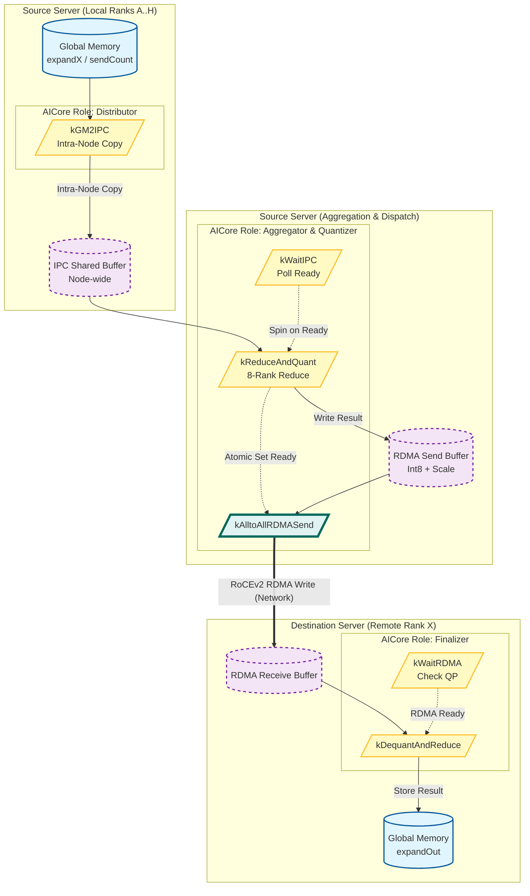

这是一个针对 **华为 Ascend AI 处理器 (NPU/CANN)** 开发的高性能 **MoE (Mixture of Experts) 分布式聚合算子**。

该代码实现了一种**分层 (Layered) 通信策略**，用于在多机多卡训练中合并（Combine/Reduce）各个专家（Expert）处理后的结果。它不仅仅是一个简单的求和，而是结合了 **IPC (机内通信)** 和 **RDMA (机间通信)**，并支持 **动态量化 (Dynamic Quantization)** 以减少通信带宽。

以下是深度分析报告：

---

## 1. 核心功能摘要 (TL;DR)
*   **算子名称**: `MoeDistributeCombineV2Layered`
*   **核心功能**: 实现了 MoE 模型的 **All-to-All Combine (加权聚合)** 操作。它将分布在不同 Rank 上的专家计算结果，根据路由索引聚合回原始 Token 的位置。
*   **性能优化策略**: 采用 **分层通信 (Hierarchical Communication)**：
    1.  **机内 (Intra-Server)**: 利用共享内存/IPC 将同一服务器内 8 卡的数据预聚合（Reduce-Scatter 风格），减少跨机小包通信。
    2.  **机间 (Inter-Server)**: 使用 RDMA 进行聚合后数据的全交换 (All-to-All)。
    3.  **量化**: 支持在传输过程中将 `fp16/bf16` 动态量化为 `int8`，显著降低通信量。
*   **应用场景**: 大规模 MoE 模型训练/推理（如 DeepSeek-V3/R1, GPT-4 MoE 架构），特别是在通信带宽受限的集群中。

---

## 2. 内存布局与 I/O 分析 (核心重点)

代码显式管理了 **HBM (Global Memory, GM)** 和 **L1 Buffer (Unified Buffer, UB)**。内存布局高度定制化，依赖 `hccl` 获取的 Window 地址。

### 2.1 关键变量与形状

假设：
*   `BS`: Batch Size (Local)
*   `H`: Hidden Size
*   `K`: Top-K (每个 Token 选择的专家数)
*   `E`: Expert Number (Total)
*   `W`: World Size (Total Ranks)

| 变量名 | 数据类型 | 逻辑形状 (Shape) | 理论内存占用估算 | 内存布局特性 (Layout) | 备注 |
| :--- | :--- | :--- | :--- | :--- | :--- |
| **`expandX`** (Input) | `ExpandXType` (fp16/bf16) | `[Tokens, H]`   `Tokens ≈ BS * K` | `BS*K*H * 2B` | 连续内存 | 经过 Expert 处理后的数据，按 Expert ID 排序或分块。 |
| **`sendCount`** (Meta) | `int32` | `[E, W]` 或 `[W, E_local]` | 取决于专家数 | 连续 | 描述有多少 Token 需要发送给特定 Rank 的特定 Expert。 |
| **`Window (In/Out)`** (Buffer) | `uint8` (Raw) | 固定大块内存 | `winSize` (GB级) | **分区分片** | HCCL 管理的通信缓冲，包含 IPC 区、RDMA 区、状态区。 |
| **`shareMemGlobal_`** (IPC) | `ExpandXType` | `[Target_Ranks, Slice_Size]` | `IPC_DATA_SIZE` (~1.9GB) | **按目标 Rank 分片** | 机内共享内存，用于存放发往同一目标服务器的数据。 |
| **`localOutWindow_`** (RDMA Buf) | `ExpandXTransType` (int8/fp16) | `[Target_Server, Data]` | `RDMA_DATA_SIZE` (800MB) | **连续 + Padding** | 存放聚合且量化后的数据，准备通过 RDMA 发送。 |
| **`expandOut`** (Output) | `ExpandXType` | `[BS, H]` | `BS*H * 2B` | 连续内存 | 最终聚合回 Token 维度的输出。 |

### 2.2 内存对齐与特殊处理
*   **UB_ALIGN**: `32 Bytes`。Ascend UB 读写必须满足 32 字节对齐。
*   **Token 结构 (Packet Layout)**:
    在 `SumToWindow` 阶段，为了支持量化，数据包的内存排布并非纯 Tensor，而是：
    `[ Data (H * sizeof(T)) | Scale (32 Bytes / 16 * fp16) ]`
    即每个 Token 的数据后面紧跟其量化系数 (Scale)，这是一个非常底层的 **Interleaved Layout**，用于随数据携带量化参数。
*   **Shared Memory Trick**: 通过 `hccl_.GetWindowsInAddr` 获取其他卡的物理地址，实现类似 CUDA IPC 的直接内存访问。

---

## 3. 逻辑流程图 (Mermaid)

该算子使用了 **多核流水线并行 (Task Parallelism)**：部分 AICore 处理计算，部分处理 RDMA 发送。

---

## 4. 详细执行流程 (Step-by-step)

### 4.1 初始化与 Tiling
1.  **Get Context**: 从 `hccl_` 上下文获取窗口基地址 (`windowInGM_`, `windowOutGM_`)。
2.  **Buffer Init**: 初始化 Unified Buffer (UB) 和 `TBuf`。
3.  **Core Split**: 根据 `worldSize` 和 `aivNum` (AI Vector Core 数量) 计算当前核负责处理哪些 Rank 的数据。

### 4.2 阶段一：GM2IPC (数据分发至共享区)
*   **目的**: 将当前卡上要发往不同 Server 的数据，拷贝到本机的一个固定共享内存地址，供本机其他卡读取。
*   **操作**:
    *   读取 `sendCount` 确定每个 Expert 的数据量。
    *   **Data Copy**: 将 `expandXGlobal_` 搬运到 `dstshareMemGlobal_` (即 `shareAddreRank`)。
    *   **Scale Handling**: 如果有 Scale (量化系数)，也一并搬运。
    *   **Flag Sync**: 写 `shareFlagGlobal_` 通知本机其他卡数据已就绪。

### 4.3 阶段二：SumToWindow (机内聚合与量化)
*   **核心逻辑**: 32 个核流水线作业。每个核负责一部分目标 Server 的数据聚合。
*   **Loop**:
    1.  **Read**: 从本机 8 张卡的 IPC 区域读取发往同一目标的数据。
    2.  **Accumulate**: 在 UB 中使用 `Axpy` 或 `Add` 进行 FP32 累加。
    3.  **Quantization (关键)**:
        *   计算最大值 (`BlockReduceMax`) 得到 Scale。
        *   使用 `Brcb` (Broadcast) 填充 Scale。
        *   除以 Scale 并 `Cast` 转换为 Int8。
        *   数据排布变为 `[Int8 Data, FP16 Scale]`。
    4.  **Write**: 写入 `localOutWindow_` (RDMA Buffer)。

### 4.4 阶段三：AlltoAllServerDispatch (RDMA 发送)
*   **角色**: 这一步通常由部分特定的 Core (如 Core 0-7) 或专门的通信任务执行。
*   **操作**:
    *   轮询 `checkRdmaLocal` 标志位，等待 `SumToWindow` 完成数据准备。
    *   调用 **`AIVRDMAPostSend`**：这是华为特有的指令，直接在 AICore 上提交 RDMA Write 请求 (RoCEv2)，绕过 CPU。
    *   将数据从本机的 `localOutWindow_` 直接写入远端机的 Window。

### 4.5 阶段四：SumToServer (最终聚合)
*   **操作**:
    *   **Wait**: 等待所有远端 Server 的数据通过 RDMA 到达。
    *   **Loop**: 遍历接收到的数据块。
    *   **Dequantize**: 读取 Int8 数据和 Scale，执行 `data_fp = data_int8 * scale`。
    *   **Final Sum**: 将所有来源的数据累加到 `sumFloatLocal`。
    *   **Output**: 将最终结果写入 `expandOutGlobal_`。

---

## 5. 潜在风险与性能瓶颈

### 5.1 内存风险 (Memory Risks)
1.  **Manual Pointer Arithmetic (手动指针运算)**:
    *   代码中大量使用 `offset = base + idx * size` 的方式计算物理地址 (GM_ADDR)。
    *   **风险**: `IPC_DATA_OFFSET`, `RDMA_DATA_SIZE` 等宏定义必须与 HCCL 实际上分配的内存严格一致，否则会导致 **OOB (越界)** 读写，甚至破坏其他进程的内存。
2.  **UB 溢出**:
    *   `TBuf` 大小是固定的 (`185KB`)。
    *   **风险**: 如果 `axisH` (Hidden Size) 过大，导致单行数据 + 辅助 Buffer 超过 UB 限制，算子会崩溃或数据错误。代码中虽然有 Tiling，但需确保 Tiling 逻辑正确处理了 UB 上限。
3.  **Race Condition (竞态)**:
    *   使用了大量的 `GlobalTensor` 作为标志位 (`shareFlagGlobal_`, `magicGlobal_`) 配合 `volatile` 读写。
    *   **风险**: 这种自旋锁 (Spinlock) 机制如果缺少适当的 Memory Barrier (`PipeBarrier<PIPE_ALL>`) 或 Cache Invalidate (`DataCacheCleanAndInvalid`)，可能导致读取到旧数据（脏读）。代码中虽然加了 `dcci`，但逻辑非常复杂，极易出错。

### 5.2 性能瓶颈 (Performance Bottlenecks)
1.  **AICore 忙等待 (Busy Wait)**:
    *   `WaitIPC` 和 `WaitDispatch` 中存在 `while(true)` 循环，持续轮询内存标志位。
    *   **瓶颈**: 这会占用 AICore 的算力，虽然在此期间该 Core 无法做计算，但如果调度不当，会浪费功耗并阻塞流水线。
2.  **非对齐访问与 Padding**:
    *   代码中多次出现 `RoundUp(..., UB_ALIGN)`。
    *   **瓶颈**: 如果 Shape (如 `axisH`) 不能被 32 字节整除，会有大量的 Padding 搬运浪费带宽。特别是在 `int8` 模式下，Scale 的插入破坏了数据的连续性，导致内存访问可能不连续（Strided Access），降低 MTE (Memory Transfer Engine) 效率。
3.  **量化开销**:
    *   `BlockReduceMax` -> `Div` -> `Cast` 这一套动态量化流程计算量不小。
    *   **瓶颈**: 如果通信带宽不是绝对瓶颈（例如机内通信），量化计算的延迟可能会超过直接传输 FP16 的时间，导致**负优化**。
4.  **Bank Conflict**:
    *   在 UB 中使用 `ReinterpretCast` 复用内存。如果读写模式导致同一个 Bank 被频繁访问，会产生冲突。

### 5.3 架构特异性
*   **硬编码参数**: `SERVER_RANK_SIZE = 8`。这意味着代码强耦合于 8 卡服务器架构，如果迁移到 4 卡或 16 卡节点，代码逻辑会失效。
*   **AIVRDMAPostSend**: 这是极底层的硬件接口，直接操作网卡队列 (QP)。任何驱动层面的变动都可能导致此代码失效。