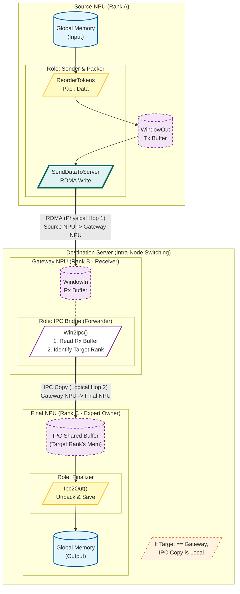

这是一个非常硬核的 Ascend C (CANN) 算子实现文件，针对的是 **MoE (Mixture of Experts)** 模型中的 **Dispatch (分发)** 环节。

这个实现采用了 **Layered (分层)** 策略，专门针对大规模分布式集群优化。它没有使用传统的全互联（All-to-All），而是利用服务器架构特点，将通信拆分为 **Inter-Server (RDMA)** 和 **Intra-Server (IPC/Shared Memory)** 两层，以减少跨机连接数并利用片内高带宽。

以下是深度分析报告：

---

## 1. 核心功能摘要 (TL;DR)
该代码实现了 MoE 模型的 **Token Dispatch (V2 Layered)** 算子。
*   **功能**：将输入的 Token 根据 `expertIds`（路由索引）分发到对应的专家（Expert）所在的设备上。
*   **架构**：**分层通信 (Layered Communication)**。
    1.  **节点间**：通过 AICore 直接驱动 RDMA (AIV Direct RDMA) 将 Token 发送到目标服务器。
    2.  **节点内**：通过 IPC (进程间通信/共享内存) 将不同服务器发来的数据汇聚，再搬运到最终的 Output HBM。
*   **特点**：任务并行模式。不同的 AICore 核（AIV）被分配了不同的角色（发送者、元数据计算者、IPC搬运者、最终写入者），这是非常高级的异构编程模式。

---

## 2. 内存布局与 I/O 分析 (核心重点)

此算子最复杂的部分在于为了适配 RDMA 传输和保序性，构建了一个特殊的 **`TokenStruct`** 结构。数据不再是紧凑的 Tensor，而是被打包成一个个“数据包”。

### 2.1 输入输出 Tensor

| 变量名 | 逻辑形状 (Shape) | 数据类型 | 说明 |
| :--- | :--- | :--- | :--- |
| `x` (Input) | `[BS, H]` | `XType` (FP16/BF16/FP32) | 原始 Token 数据。BS=BatchSize, H=HiddenSize。 |
| `expertIds` | `[BS, K]` | `int32` | 每个 Token 选择的 Top-K 专家 ID。 |
| `expandXOut` (Output) | `[TotalTokens, H]` | `ExpandXOutType` | 分发后的 Token 数据，按专家顺序排列。 |
| `expertTokenNums` | `[MoEExpertNum]` | `int64` | 统计每个专家接收到的 Token 数量。 |

### 2.2 核心中间结构：`TokenStruct` (在 RDMA 和 IPC 中传输的单元)

为了保证 RDMA 写入的原子性和保序性，代码定义了一个复杂的内存包结构。

**结构布局图示：**
```text
| Flag (32B) | Token Data (H*dtype) | ExpIdx (AlignK*u32) | Weight (AlignK*u32) | Scale (32B) |
^            ^                      ^                     ^                     ^
Header       Payload                Routing Info          Quant Info            Quant Scale
```

**详细内存特征表：**

| 字段 (Offset) | 大小 (Size) | 对齐 (Align) | 详细分析 |
| :--- | :--- | :--- | :--- |
| **`Flag`** | 32 Bytes | 32B / 4KB | **关键机制**：放在最前面。因为 RDMA 写操作通过 PCIe 落地到内存时，只有第一个分片能保证顺序。接收端通过轮询这个 Flag (例如 `0x0f0f0f0f`) 来确认整个 Struct 是否已完全到达。 |
| `TokenData` | `H * sizeof(XType)` | 32B | 实际的 Token 向量数据。 |
| `ExpIdx` | `AlignK * 4B` | 32B | 同样跟随 Token 传输，用于接收端再次确认路由。`AlignK` 是 K 值对齐到 `BITS32_PER_BLOCK`。 |
| `Weight` | `AlignK * 4B` | 32B | 路由权重。 |
| `Scale` | 32 Bytes | 32B | 仅在量化场景使用，存储 Dequant Scale。 |

*   **Gap (Padding)**: 代码中计算了 `tokenGapInStruct_` 等变量，说明字段之间存在 padding，以满足 AICore 的 `UB_32B_ALIGN` 和 RDMA 的地址对齐要求。
*   **Buffer Management**: 使用了 Ping-Pong Buffer (`bufferId_`) 机制，`WindowIn/Out` 被切分为两块，重叠计算与通信。

---

## 3. 逻辑流程图 (Mermaid)

该算子采用**多核任务并行 (Task Parallelism)**，不同的 `aivId` (核 ID) 执行不同分支。



---

## 4. 详细执行流程 (Step-by-step)

### Phase 1: 数据重排与打包 (ReorderTokens)
*   **执行者**：所有核。
*   **动作**：
    1.  从 `xGM` 读取原始 Token。
    2.  在 UB (Unified Buffer) 中组装 `TokenStruct`。
        *   如果是量化模式 (`DynamicQuant`)，在此处进行 `Max/Min` 统计和量化计算。
    3.  填充 `Flag` 位（初始设为待发送状态）。
    4.  将打包好的数据写入 `windowOutGM_` (作为 RDMA 的发送源地址)。
    5.  更新 `tokenAddrFlagStruct`，标记每个 Token 需要发往哪些 Server。

### Phase 2: 分发与通信 (Dispatch)
这里代码出现了明显的分支逻辑：

*   **角色 A：RDMA Sender (`aivId < serverNum`)**
    *   负责将本 Device 产生的数据，发送到其他 Server 的对应 Device。
    *   **核心逻辑**：`AIVRDMAPostSend`。这是一个直接操作硬件队列 (Queue Pair) 的函数。它构造 WQE (Work Queue Element) 并敲击 Doorbell，触发网卡进行 RDMA Write。
    *   它不仅发送数据，还发送 Flag (`sendStatusTensor_`) 以通知接收方“我发完了”。

*   **角色 B：IPC Bridge (`Win2Ipc`)**
    *   负责处理**接收到**的数据。
    *   它轮询 `WindowIn` (RDMA 接收缓冲区) 中的 Flag。
    *   一旦检测到 Flag 变更为 `SHOULD_SEND_FLAG_VALUE`，说明外地数据已到达。
    *   **关键动作**：将数据从 `WindowIn` 搬运到 `shareAddrs` (IPC 共享内存区域)。这使得同一 Server 内的其他卡可以访问这些数据。

*   **角色 C：Metadata Calculator (`CreateInner/OuterReduceInfo`)**
    *   计算复杂的 Token 计数和偏移量 (`CombineReduceInfo`)。这是为了确定输出 Tensor `expandXOut` 中每个 Token 的确切写入位置，保证确定性。

### Phase 3: 汇聚与输出 (Ipc2Out)
*   **同步点**：`SetIpcFlag` / `WaitIpcFlag`。确保所有核完成 IPC 数据搬运。
*   **执行者**：所有核（根据切分逻辑）。
*   **动作**：
    1.  根据 `CreateOuterReduceInfo` 计算出的全局 Offset。
    2.  从 `shareAddrs` (共享内存) 中读取属于自己负责的 Expert 的数据。
    3.  解包 `TokenStruct`（提取 Token, Weight, Scale）。
    4.  将数据写入最终的 `expandXOut` Global Memory。
    5.  `aivId == 0` 的核负责写入统计信息 `expertTokenNumsOut`。

---

## 5. 潜在风险与性能瓶颈

### 5.1 内存风险
1.  **Shared Memory 竞争**：
    *   `shareAddrs` 是多个 Device 可见的。代码通过 `serverNum`, `rankId` 精心计算了偏移量 (`IPC_DATA_OFFSET + targetOffset`) 来避免冲突。
    *   **风险**：如果 `CreateInnerReduceInfo` 中的 Offset 计算逻辑与 `Win2Ipc` 中的写入逻辑不严格一致，会导致数据覆盖或错位。
2.  **RDMA 裸写风险**：
    *   `AIVRDMAPostSend` 是极其底层的操作。如果 `qp_info` 配置错误，或者目标地址 `dstRdmaAddr` 计算溢出，可能导致静默数据破坏或死机。
    *   **Flag 机制脆弱性**：依赖 `0x0f0f0f0f` 这种 Magic Number 做同步。如果 Payload 数据本身恰好包含这个值，且发生乱序，理论上存在误判风险（虽然概率极低，且代码通过 Flag 前置+保序写规避了大部分）。

### 5.2 性能瓶颈
1.  **Padding 开销 (带宽浪费)**：
    *   `TokenStruct` 为了对齐，引入了显著的 Padding。
    *   例如：`Flag` 占 32B，`Scale` 占 32B。如果 `HiddenSize` 很小，有效载荷占比低，RDMA 和内存带宽利用率会下降。
2.  **原子等待 (Spin Lock)**：
    *   `GetArrivedTokenInfo` 和 `WaitIpcFlag` 包含 `while` 循环轮询内存。
    *   **瓶颈**：如果网络出现拥塞或丢包（虽然 RDMA 是可靠传输，但可能有流控延迟），AICore 会空转，浪费算力且阻塞流水线。
3.  **负载不均衡**：
    *   代码逻辑中 `aivId < serverNum` 的核做 RDMA Send，其他核做 IPC。如果 Server 数量很少（如 2 台），只有 2 个核在发 RDMA，可能喂不饱网卡带宽；反之如果 Server 很多，计算核变少。这里存在 Sender/Worker 比例固定的灵活性问题。
4.  **Bank Conflict**:
    *   在 `QuantProcess` 中使用了 LocalTensor (UB)。如果 `axisH_` 与 UB 的 Bank 宽度不成倍数关系，可能存在访存冲突。

### 总结
这是一段**极高水平**的系统级代码。它绕过了传统的通信库开销，直接在计算核上调度网络和内存流量。其设计的核心在于**掩盖延迟**（通过 Pipeline）和**减少跨机流量**（通过分层聚合）。理解它的关键在于看懂 `TokenStruct` 如何在不同层级的内存（GM -> RDMA Window -> IPC Shared Mem -> GM）之间流转。