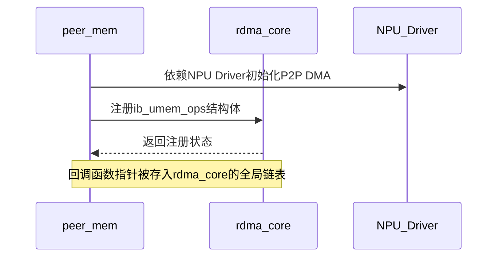
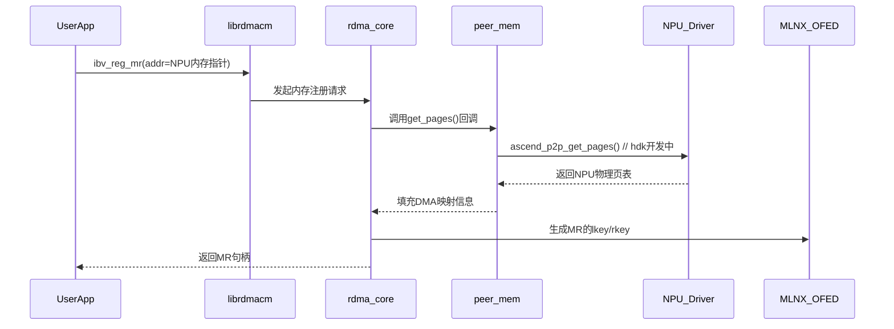
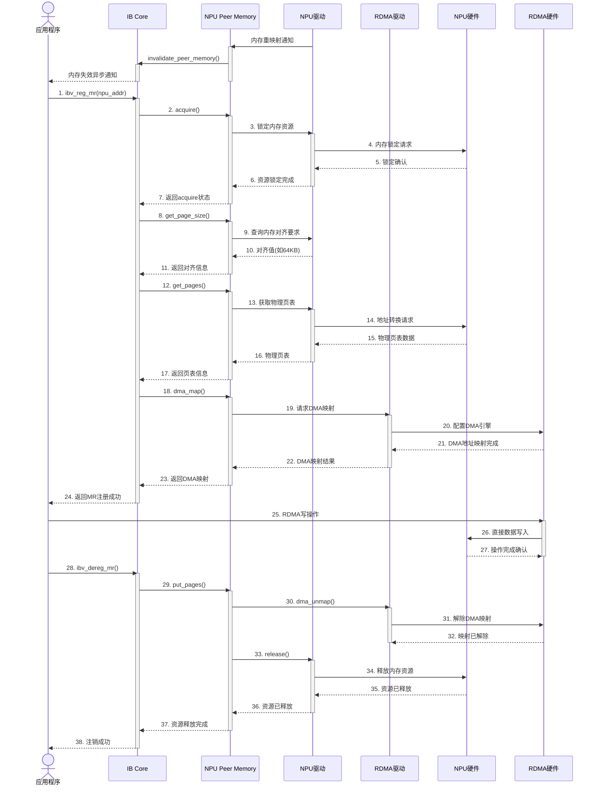
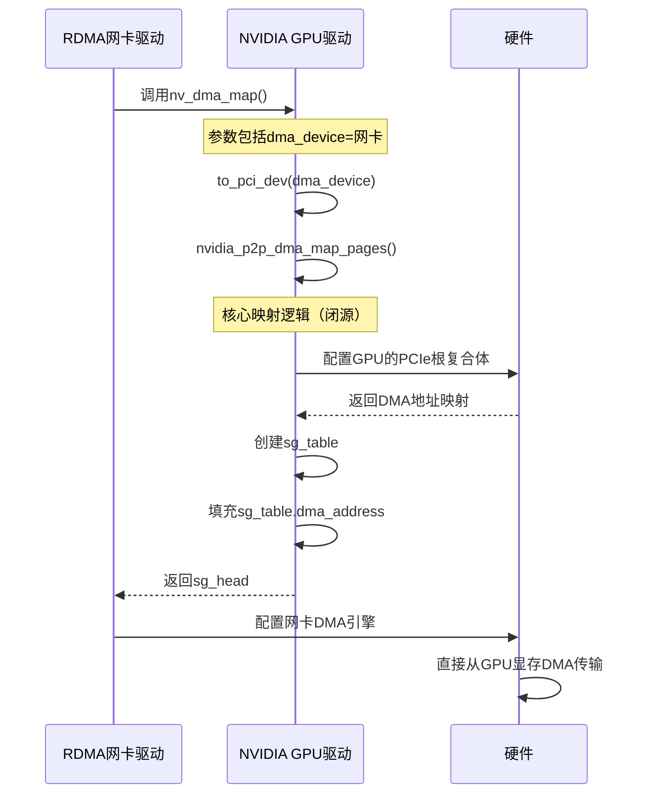

## 注册流程与交互时序图​​
(1) 模块初始化阶段​​



(2) 内存注册阶段（用户调用ibv_reg_mr时）​







## 代码流程解析

以下是针对您提供的 `nv_dma_map` 代码的深度解析，重点说明关键概念和工作流程：


```
static int nv_dma_map(struct sg_table *sg_head, void *context,
                      struct device *dma_device, int dmasync,
                      int *nmap)
{
    // [核心变量声明部分]
    struct nv_mem_context *nv_mem_context = (struct nv_mem_context *)context;
    struct nvidia_p2p_page_table *page_table = nv_mem_context->page_table;

    // 确保GPU页大小为64KB（GPUDirect RDMA的要求）
    if (page_table->page_size != NVIDIA_P2P_PAGE_SIZE_64KB) {
        return -EINVAL;
    }

#if NV_DMA_MAPPING
    {
        // 关键转换：获取PCI设备对象
        struct pci_dev *pdev = to_pci_dev(dma_device);
        
        // 调用核心映射函数
        ret = nvidia_p2p_dma_map_pages(pdev, page_table, &dma_mapping);
        
        // 后续处理：创建sg_table并填充DMA地址
        // ...
    }
#else
    // 备选路径（直接使用物理地址）
#endif
}
```

------

### 🔧 核心概念解析

#### 1. **`dma_device` 是什么？**

- **类型**：`struct device *` (Linux设备模型基础结构)
- **来源**：由调用此函数的**RDMA网卡驱动**传入
- **身份**：
  - 代表将要执行DMA操作的**目标设备**
  - 在GPUDirect RDMA场景中通常是 **RDMA网卡**（如Mellanox ConnectX）
- **作用**：
  - 提供执行DMA操作的硬件上下文
  - 确定DMA寻址空间特性（如地址宽度、IOMMU配置）
  - 通过`dma_ops`关联DMA API实现

------

#### 2. **`to_pci_dev()` 的作用**

```
struct pci_dev *pdev = to_pci_dev(dma_device);
```

- **目的**：通用设备到PCI设备的类型转换

- **实现原理**：

  ```
  // Linux内核源码示例
  struct pci_dev *to_pci_dev(struct device *dev) {
      return container_of(dev, struct pci_dev, dev);
  }
  ```

- **必要性**：

  - `nvidia_p2p_dma_map_pages` 需要PCI设备(`pci_dev`)
  - RDMA网卡本质是PCI(e)设备，但内核接口使用通用`device`
  - **转换失败** = 网卡不是PCI设备（应报错）

------

#### 3. **`nvidia_p2p_dma_map_pages` 归属方**

**结论：这是由 NVIDIA GPU驱动 提供的功能**，不是网卡驱动的能力。

关键证据：

1. **参数依赖**：

   ```
   nvidia_p2p_dma_map_pages(pdev, page_table, &dma_mapping);
                            ↑          ↑
                      RDMA网卡设备      GPU显存页表
   ```

   - `page_table` 来自`nv_mem_context->page_table`，由GPU驱动填充

2. **作用本质**：

   - 将**GPU显存物理页**映射到**RDMA网卡的DMA地址空间**
   - 输出 `dma_mapping->dma_addresses[]` = 网卡可识别的DMA地址


   ```
   graph LR
       A[GPU显存物理页] --> B(nvidia_p2p_dma_map_pages)
       B --> C[DMA地址数组]
       C --> D[RDMA网卡DMA引擎]
   ```

   GPU显存物理页nvidia_p2p_dma_map_pagesDMA地址数组RDMA网卡DMA引擎

3. **实现位置**：

   - NVIDIA专有驱动(`nvidia.ko`)内部实现
   - RDMA驱动通过`EXPORT_SYMBOL`调用此接口
   - 开源驱动中仅有函数声明（`nv-p2p.h`）

### 完整工作流程



硬件NVIDIA GPU驱动RDMA网卡驱动硬件NVIDIA GPU驱动RDMA网卡驱动参数包括dma_device=网卡核心映射逻辑（闭源）调用nv_dma_map()to_pci_dev(dma_device)nvidia_p2p_dma_map_pages()配置GPU的PCIe根复合体返回DMA地址映射创建sg_table填充sg_table.dma_address返回sg_head配置网卡DMA引擎直接从GPU显存DMA传输

------

### 🔄 两种路径对比

#### 启用 `NV_DMA_MAPPING` 的路径（推荐）

1. 通过

    

   ```
   nvidia_p2p_dma_map_pages
   ```

    

   获取映射

   - GPU驱动处理IOMMU/地址转换复杂性
   - 返回预处理的DMA地址数组

2. 创建

   ```
   sg_table
   ```

   

   并填充：

   ```
   sg->dma_address = dma_mapping->dma_addresses[i];
   ```

#### 备选路径（`#else`）

```
sg->dma_address = page_table->pages[i]->physical_address;
```

- **直接使用GPU物理地址**（仅适用于无IOMMU环境）

- **风险**：

  物理地址≠总线地址（在IOMMU开启时无效）

  - 某些系统需要地址偏移修正

------

### ⚠️ 关键注意事项

1. **页大小强制要求**：

   - 必须64KB对齐（`NVIDIA_P2P_PAGE_SIZE_64KB`）
   - 影响GPU显存分配策略

2. **版本兼容性检查**：

   c

   复制

   ```
   if (!NVIDIA_P2P_DMA_MAPPING_VERSION_COMPATIBLE)
   ```

   - 防止不同版本驱动间的结构体不匹配

3. **错误处理**：

   - 映射失败时调用 `nvidia_p2p_dma_unmap_pages` 清理
   - 确保资源不泄漏（尤其在热插拔场景）

------

### 💎 总结归纳

|        **关键元素**        |  **来源/归属**   |               **作用**                |
| :------------------------: | :--------------: | :-----------------------------------: |
|        `dma_device`        | RDMA网卡驱动传入 |         标识DMA操作的目标设备         |
|       `to_pci_dev()`       |    Linux内核     |      通用设备→PCI设备的类型转换       |
| `nvidia_p2p_dma_map_pages` |  NVIDIA GPU驱动  | GPU显存→RDMA网卡DMA地址的核心转换引擎 |
|         `sg_table`         |    本函数创建    |     RDMA驱动用于配置DMA的数据结构     |

**架构本质**：
RDMA驱动通过此代码获得 ​**​GPU驱动的直接支持​**​，实现设备间的零拷贝数据传输。这体现了NVIDIA GPUDirect技术的核心设计理念——​**​让设备驱动直接协作，绕过操作系统通用层​**​。
