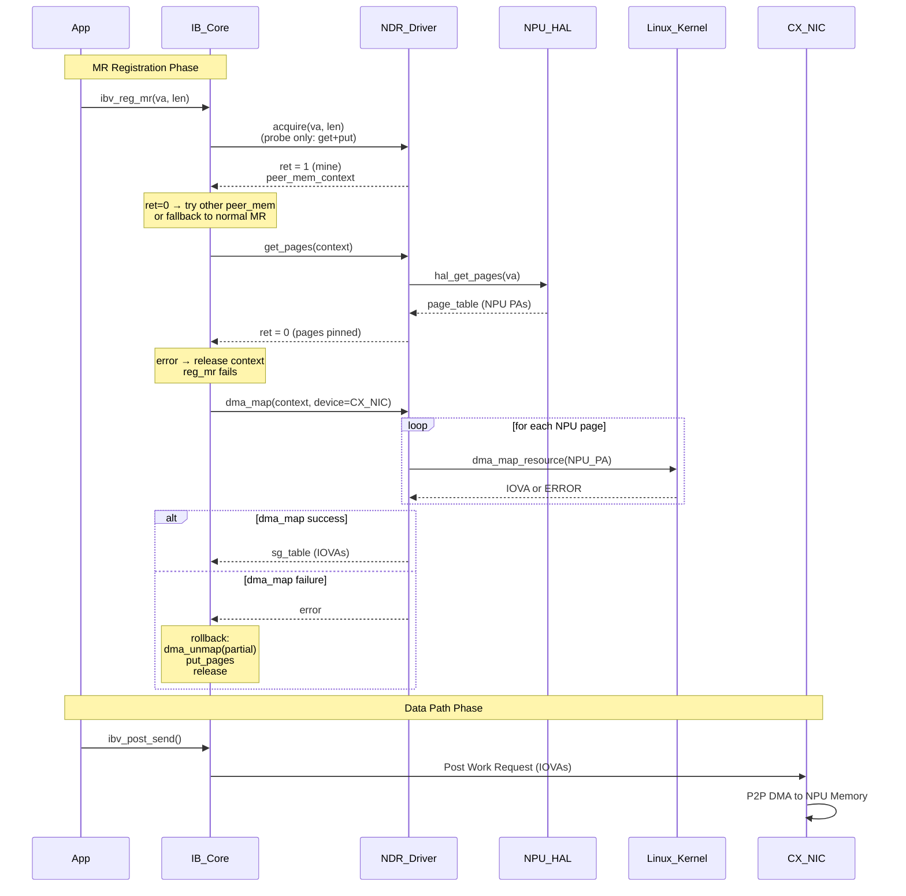
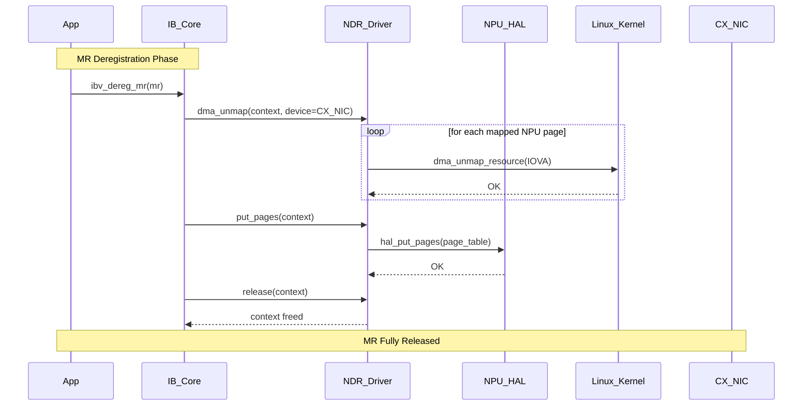

```mermaid
sequenceDiagram
    participant App
    participant IB_Core
    participant NDR_Driver
    participant NPU_HAL
    participant Linux_Kernel
    participant CX_NIC

    Note over App,IB_Core: MR Registration Phase

    App->>IB_Core: ibv_reg_mr(va, len)

    IB_Core->>NDR_Driver: acquire(va, len)<br>(probe only: get+put)
    NDR_Driver-->>IB_Core: ret = 1 (mine)<br>peer_mem_context
    Note over IB_Core: ret=0 → try other peer_mem<br>or fallback to normal MR

    IB_Core->>NDR_Driver: get_pages(context)
    NDR_Driver->>NPU_HAL: hal_get_pages(va)
    NPU_HAL-->>NDR_Driver: page_table (NPU PAs)
    NDR_Driver-->>IB_Core: ret = 0 (pages pinned)
    Note over IB_Core: error → release context<br>reg_mr fails

    IB_Core->>NDR_Driver: dma_map(context, device=CX_NIC)

    loop for each NPU page
        NDR_Driver->>Linux_Kernel: dma_map_resource(NPU_PA)
        Linux_Kernel-->>NDR_Driver: IOVA or ERROR
    end

    alt dma_map success
        NDR_Driver-->>IB_Core: sg_table (IOVAs)
    else dma_map failure
        NDR_Driver-->>IB_Core: error
        Note over IB_Core: rollback:<br> dma_unmap(partial)<br> put_pages<br> release
    end

    Note over App,CX_NIC: Data Path Phase

    App->>IB_Core: ibv_post_send()
    IB_Core->>CX_NIC: Post Work Request (IOVAs)
    CX_NIC->>CX_NIC: P2P DMA to NPU Memory


```

```mermaid
sequenceDiagram
    participant App
    participant IB_Core
    participant NDR_Driver
    participant NPU_HAL
    participant Linux_Kernel
    participant CX_NIC

    Note over App,IB_Core: MR Deregistration Phase

    App->>IB_Core: ibv_dereg_mr(mr)

    IB_Core->>NDR_Driver: dma_unmap(context, device=CX_NIC)

    loop for each mapped NPU page
        NDR_Driver->>Linux_Kernel: dma_unmap_resource(IOVA)
        Linux_Kernel-->>NDR_Driver: OK
    end

    IB_Core->>NDR_Driver: put_pages(context)
    NDR_Driver->>NPU_HAL: hal_put_pages(page_table)
    NPU_HAL-->>NDR_Driver: OK

    IB_Core->>NDR_Driver: release(context)
    NDR_Driver-->>IB_Core: context freed

    Note over App,CX_NIC: MR Fully Released
```
