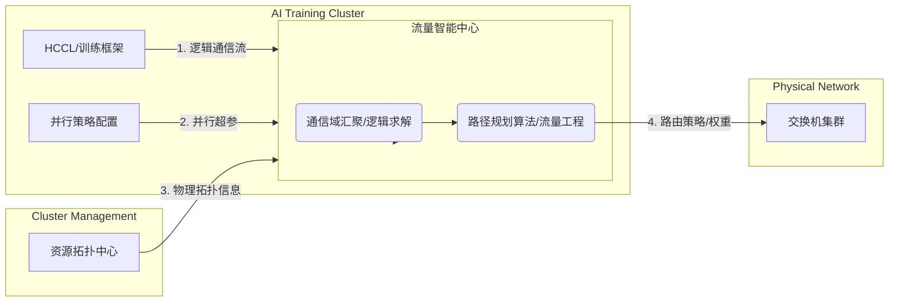

这是一份针对**整个 NetMind 项目**（应用网络协同系统）的输入输出汇总。

在面试中，你可以用**“三层漏斗模型”**（数据输入 -> 核心计算 -> 策略输出）来描述这个项目。

---

# NetMind 项目系统级输入输出汇总

## 1. 系统全景流程图 (System Overview)

---

## 2. 核心输入 (Inputs)

NetMind 的核心能力在于将“逻辑需求”映射到“物理网络”，因此输入主要分为**业务逻辑**和**物理设施**两类。

### A. 业务逻辑侧 (来自训练框架 HCCL)

这是告诉 NetMind **“流量从哪里来，要到哪里去，有多少”**。

1.  **通信域信息 (`CommLinkageInfo`)**:
    *   **Rank 分布**: 哪些 NPU 属于同一个通信组（Comm Group）。
    *   **通信算子 (Op Type)**: `AllReduce`, `AllGather`, `Send/Recv` 等。这决定了流量的基本模式。
    *   **邻接关系 (`AdjInfo`)**: 具体的 Rank-to-Rank 连接关系。
    *   **通信量级**: 每次迭代传输的数据量（如 100MB），用于计算带宽权重。

2.  **并行策略参数 (`ParallelParameter`)**:
    *   这是高阶语义信息，用于推断流量模型。
    *   **并行度**: `TP_Size` (张量并行), `DP_Size` (数据并行), `PP_Size` (流水线并行)。
    *   **作用**: 帮助系统区分哪些流量走机内（TP），哪些走交换机（DP/PP），以及推断默认算法（如 DP 默认走 Ring）。

### B. 物理设施侧 (来自集群管理系统)

这是告诉 NetMind **“路在哪里，路有多宽”**。

1.  **NPU 拓扑映射 (`NpuTopoMapping`)**:
    *   **NPU 2 Device IP**: 逻辑 Rank 到物理 IP 的映射。
    *   **Device 2 Leaf**: 哪台服务器插在哪个 Leaf 交换机（ToR）上。
    *   **网络层级**: Leaf -> Spine 的连接关系。

2.  **带宽能力**:
    *   **NPU 带宽**: 网卡物理速率（如 400Gbps）。
    *   **收敛比/上行带宽**: 交换机上行口（SW-to-OXC）的实际可用带宽。
    *   **作用**: 代码中的 `ApplyBandwidthScaling` 使用此信息进行流量归一化，防止策略超出物理链路承载能力。

---

## 3. 中间处理 (The Black Box)

在得到输出前，项目内部完成了关键的**逻辑-物理转换**：

1.  **Rank 2 Device**: 将 Rank ID 转换为服务器 IP。
2.  **Device 2 Leaf**: 将服务器 IP 聚合为交换机节点（Leaf Group）。
3.  **TDM 切分**: 区分 DP 和 PP 流量，识别不同的时间片（Stage Index）。
4.  **流量归一化**: 将无限的逻辑需求压缩到有限的物理带宽内。

---

## 4. 核心输出 (Outputs)

NetMind 计算完后，产生两层输出。第一层是代码里直接体现的，第二层是项目最终落地到交换机上的。

### A. 算法层输出 (代码直接产物)

**TaskFineDemand (精细化流量需求矩阵)**
*   **格式**: `[Src_Leaf, Dst_Leaf, Weight/Bandwidth]`
*   **含义**: 
    *   “Leaf A 到 Leaf B 有巨大的流量需求（权重 100）”
    *   “Leaf A 到 Leaf C 流量较小（权重 10）”
*   **用途**: 这是**路径规划算法**的输入。算法会根据这个矩阵，为大流安排互不冲突的路径，为小流做常规转发。

### B. 执行层输出 (下发给交换机)

1.  **特定路径规划策略 (Policy-Based Routing / Traffic Engineering)**:
    *   告诉交换机：**“凡是来自 NPU_Group_1 去往 NPU_Group_2 的流量，强制走 Link_X, Link_Y, Link_Z 这条路径。”**
    *   实现技术可能是：ACL 重定向、调整 ECMP 的 Hash 因子。（之前听技术专家说还可以由MPLS 标签、SRv6 路径列表，细节不了解）

2.  **全网负载分担策略**:
    *   通过精确计算的路径，确保整网的链路利用率均衡（Load Balance），消除热点（Hotspot）。

---

## 5. 面试话术总结

**面试官：请总结一下你这个项目的输入输出？**

> **回答：**
> “这个项目本质上是一个**面向 AI 流量的应用感知网络控制器**。它的工作流程可以总结为‘两进一出’：
>
> **输入端**结合了**业务逻辑**和**物理拓扑**：
> 1.  从 **AI 训练框架 (HCCL)** 侧，我们获取**逻辑通信流**。包括 Rank 组网信息、算子类型（AllReduce/AllGather）以及并行策略（TP/DP/PP）。这让我们知道‘谁要和谁通信’。
> 2.  从 **集群管理** 侧，我们获取**物理拓扑映射**。包括 NPU IP 到 Leaf 交换机的归属关系、链路带宽水位等。这让我们知道‘流量实际上跑在哪些物理链路上’。
>
> **核心处理**：
> 系统内部通过 `LogicTopoSolver` 模块，将逻辑层的 Rank-to-Rank 需求，聚合映射为网络层的 Leaf-to-Leaf 流量矩阵，并进行带宽归一化和时序拆分（区分 DP/PP）。
>
> **输出端**面向**交换机**：
> 最终输出的是**全局负载分担策略**。具体表现为计算好的流量需求矩阵（TaskFineDemand），经过算法转化为路由策略或 ECMP 权重配置下发给交换机，从而实现 AI 训练大流在物理网络上的无拥塞传输。”