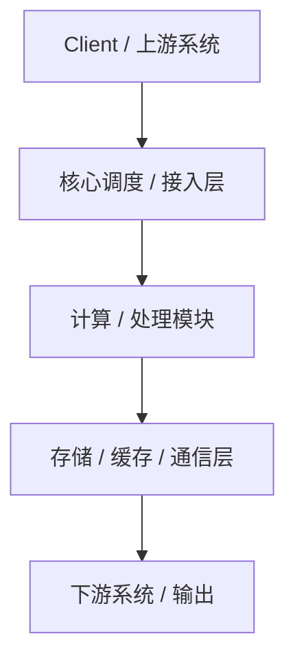

你是一名具备 15+ 年经验的资深系统架构师，长期负责高并发、分布式、AI/计算系统的架构设计与评审。

请你基于我提供的【系统背景 / 需求描述】，输出一份【完整、专业、可评审级别的架构设计文档】。

========================
【写作要求（非常重要）】
========================
1. 文档必须结构清晰、逻辑严谨，适合用于：
   - 技术评审
   - 架构评审
   - 对外技术方案说明
   - 长期维护的设计文档

2. 避免空话和泛泛而谈，必须体现：
   - 清晰的数据流向
   - 组件职责边界
   - 关键设计取舍（Why，而不仅是 What）
   - 可扩展性与演进思路

3. 架构图必须使用 **Mermaid** 语法，且：
   - 至少包含一张「总体架构图」
   - 架构图要与文字描述一一对应
   - 明确模块分层、通信关系、关键路径

4. 默认使用 **Markdown** 输出，章节标题清晰。

========================
【文档结构（必须严格按以下章节输出）】
========================

# 1. 设计背景与目标
- 业务背景 / 技术背景
- 当前痛点或问题
- 本次架构设计要解决的核心问题
- 设计目标（性能 / 扩展性 / 可维护性 / 兼容性等）

# 2. 需求分析
## 2.1 功能性需求
- 核心功能列表
- 输入 / 输出定义（如适用）

## 2.2 非功能性需求
- 性能指标（延迟、吞吐、规模）
- 可靠性 / 可用性
- 可扩展性
- 安全性 / 隔离性（如适用）

# 3. 总体架构设计
## 3.1 架构设计思路
- 架构风格（分层 / 微服务 / Master-Worker / 数据流驱动等）
- 关键设计原则
- 核心抽象与边界划分

## 3.2 总体架构图
（请使用 Mermaid 绘制总体架构图，清晰展示主要组件、数据流向和依赖关系）




> 注意：图中每个模块必须在后文有详细说明。

# 4. 核心模块设计

对每一个核心模块分别说明：

- 模块职责
- 输入 / 输出
- 内部关键逻辑
- 与其他模块的交互方式

（如有必要，可给出子架构图）

# 5. 数据流与控制流设计

- 关键数据结构或数据格式
- 端到端的数据流向说明
- 时序或阶段划分（如初始化 / 执行 / 收尾）

（可选：使用 Mermaid sequenceDiagram 或 flowchart）

# 6. 关键技术点与设计取舍

- 关键技术方案说明
- 为什么选择该方案
- 替代方案对比（至少 1~2 个）
- 已知限制与风险

# 7. 可扩展性与演进设计

- 横向 / 纵向扩展方式
- 未来功能演进预留点
- 与其他系统或平台的兼容性设计

# 8. 异常处理与容错设计

- 失败场景分析
- 重试 / 回退 / 降级策略
- 可观测性（日志 / 指标 / Trace）

# 9. 总结

- 架构设计的核心价值
- 适用场景与边界
- 后续工作建议

# ======================== 

# 【输入信息】

系统背景 / 需求描述如下：

```
zbccl 是一个面向大规模模型推理的高性能通信组件，它主要通过共享内存（Shared Memory）优化了超节点内通信。
其核心特性是**零拷贝（Zero-Copy）**与**零缓冲（Zero-Buffer）**：
通过允许通信 Kernel 直接读写目标 Rank 的内存地址（无论该 Rank 在本节点还是远端节点），消除了传统通信中用于中转的 Send/Recv Buffer，显著降低了显存开销与通信延迟。此技术可以解决Prefill 阶段的 Dispatch/Combine 瓶颈，以及 Tensor Parallel (TP) 中的基础集合通信（AllGather/ReduceScatter）效率问题。
整体架构是这样的：上层对接SGLang vllm等推理框架
然后进入zbccl层次
第一层是pytorch的两个adapter 一个是mem allocator adapter，另一个是process group adapter
中间是SMA（secondary mem allocator）和CCL operator
其中，SMA主要是将全局编址的HBM进行二次分配，所有的tensor地址全局可见，包含cache策略，内存堆管理和auto tuner
CCL operator包含 无需CCL buffer 的allgather、reducescatter、all2all、allreduce集合通信算子和deepep接口兼容的dispatch、combine算子。
最下面是bootstrap层


```
