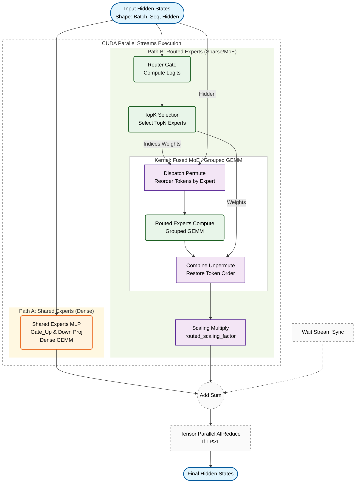

DeepSeek V3 的“共享专家”（Shared Expert）是其核心架构 **DeepSeekMoE**（DeepSeek Mixture-of-Experts）中的一个关键设计。

这是一个非常巧妙的机制，我非常清楚它的细节。简单来说，它将传统的“所有专家都参与路由”改为了**“部分专家固定被选中（共享）+ 部分专家动态路由”**的模式。

以下是针对你三个问题的详细解答：

### 1. DeepSeek V3 的共享专家具体是什么？
在 DeepSeek V3（以及 R1）的架构中，每一层的专家被分为了两类：
*   **共享专家 (Shared Expert)**：**固定被激活**。无论输入是什么 token，这个专家都会参与计算。
    *   *数量*：在 DeepSeek V3 中，每一层通常有 **1 个** 共享专家（在 V2 版本中是 2 个，V3 优化为 1 个）。
*   **路由专家 (Routed Experts)**：**动态选择**。根据输入的 token 特征，从众多的专家中选出最匹配的几个。
    *   *数量*：V3 中每一层有 **256 个** 路由专家，每个 token 会从中选出 **8 个** 激活。

**总结：** 每个 token 在经过一层时，会同时使用 **1 个共享专家 + 8 个路由专家**（共 9 个专家）进行计算。

### 2. 设计目的是什么？
共享专家的设计主要是为了解决传统 MoE（混合专家模型）中的**“知识冗余”**（Knowledge Redundancy）问题。

*   **捕捉通用知识（Common Knowledge）**：
    语言中有很多通用的成分，比如语法结构、常用的介词搭配、基础逻辑等。这些知识在几乎所有的 token 处理中都需要用到。
*   **避免重复学习**：
    如果没有共享专家，这部分“通用知识”就需要被迫分散复制到每一个路由专家（Routed Expert）的参数里。这导致了参数的浪费（冗余）。
*   **让专家更“专”**：
    通过设立一个“共享专家”专门负责这些通用的脏活累活，其他的“路由专家”就可以从通用知识中解脱出来，**专注于学习极度细分的领域知识**（如写代码、解高数题、特定文化背景等）。

**比喻：**
想象一个医院。
*   **没有共享专家时**：每个专科医生（心脏科、骨科）都得既会量血压、测体温（通用技能），又会做专科手术（专业技能）。这很浪费医生精力。
*   **有共享专家时**：设立一个“分诊/全科护士台”（共享专家），所有人进门先由他们处理基础检查（通用技能）。心脏科医生（路由专家）只负责做心脏手术。这样效率更高，医生也能钻研得更深。

### 3. 代码解析与流程图

基于SGLang 源码（`DeepseekV2MoE` 类），特别是 `forward_normal_dual_stream` 和 `forward_deepep` 方法，我为你梳理了 DeepSeekMoE 在 SGLang 推理引擎中的精确数据流。

这段代码的核心逻辑在于利用 **CUDA Streams 实现“共享专家”与“路由专家”的并行计算**，从而掩盖延迟。

#### 核心架构流程图 (Mermaid)



---

#### 流程图深度解析 (基于源码)

这张图完全对应你提供的 `DeepseekV2MoE` 代码逻辑，特别是 `forward_normal_dual_stream` 函数。

#### 1. 输入分流 (Parallel Streams)
代码中显式使用了 `self.alt_stream`（辅助流）。
*   **主流 (Current Stream)**: 负责执行 `shared_experts`。因为这是一个标准的 Dense GEMM，计算密度大且规则。
*   **辅助流 (Alt Stream)**: 负责执行路由逻辑（Gate -> TopK -> Experts）。
*   **源码对应**:
    ```python
    # Path A
    shared_output = self._forward_shared_experts(...) 
    
    # Path B (in alt_stream)
    with torch.cuda.stream(self.alt_stream):
        router_logits = self.gate(...)
        topk_output = self.topk(...)
        final_hidden_states = self.experts(...)
    ```

#### 2. 路径 A：共享专家 (Shared Experts)
这是图中左侧的橙色路径。
*   它本质上就是一个标准的 MLP 层。
*   它不进行 Token 筛选，所有 Token 全量计算。
*   **源码对应**: `self.shared_experts` 是一个 `DeepseekV2MLP` 实例。

#### 3. 路径 B：路由专家 (Routed Experts)
这是图中右侧的绿色路径，也是 MoE 的核心。
*   **Router/Gate**: 计算每个 Token 对每个专家的打分。
*   **Top-K**: 选出分数最高的 `num_experts_per_tok` 个专家。
*   **Dispatch/Permute**: SGLang底层会将 Token 按照专家 ID 进行重排，以便进行批量矩阵乘法（Grouped GEMM）。
*   **Expert Computation**: 执行实际的专家层计算。
*   **Combine/Un-permute**: 将计算结果还原回原来的 Token 顺序，并根据 Gate 的权重（Weights）进行加权。
*   **Scaling**: DeepSeek 特有的 `routed_scaling_factor`，用于稳定训练和推理数值。
    *   **源码对应**: `final_hidden_states *= self.routed_scaling_factor` (如果在 Kernel 内未融合的话)。

#### 4. 汇聚与同步 (Synchronization & Add)
这是图中底部的 "Add" 节点。
*   在两个流计算完毕后，必须进行同步 (`wait_stream`)。
*   **加法操作**: `final_hidden_states += shared_output`。
*   这正是 DeepSeekMoE **"Shared + Routed"** 架构的数学体现。

#### 5. 张量并行 (Tensor Parallelism)
如果 `tp_size > 1`，最后会有一个 `all_reduce` 操作，确保不同 GPU 上的部分结果被加和。


### 4. 后面的模型还有吗？
**有的，并且是核心架构。**

*   **DeepSeek R1**：
    目前大火的 **DeepSeek R1**（包括 R1-Zero）的底层模型正是 **DeepSeek V3-Base**。因此，R1 **完全继承**了这一套 DeepSeekMoE 架构，依然包含共享专家机制。R1 的强大推理能力，正是建立在 V3 这种高效、分工明确的底座之上的。

*   **未来展望 (V4 等)**：
    虽然 DeepSeek 官方尚未正式发布 V4 的完整白皮书，但从架构演进的逻辑来看，DeepSeekMoE（细粒度专家+共享专家）是 DeepSeek 区别于 Llama (Dense) 和 Mixtral (标准 MoE) 的护城河技术。
    *   这项技术极大地降低了显存占用和训练成本，同时保持了高性能。
    *   目前的行业趋势显示，这种“Common + Specialized”的分离设计非常成功，大概率会保留并在后续模型中继续优化（例如调整共享专家的数量或比例）。

**一句话总结：** 共享专家是为了把“通识”和“专精”分开，让模型更聪明、更省资源。这个设计非常成功，目前的 R1 就在用，短期内大概率不会被抛弃。
