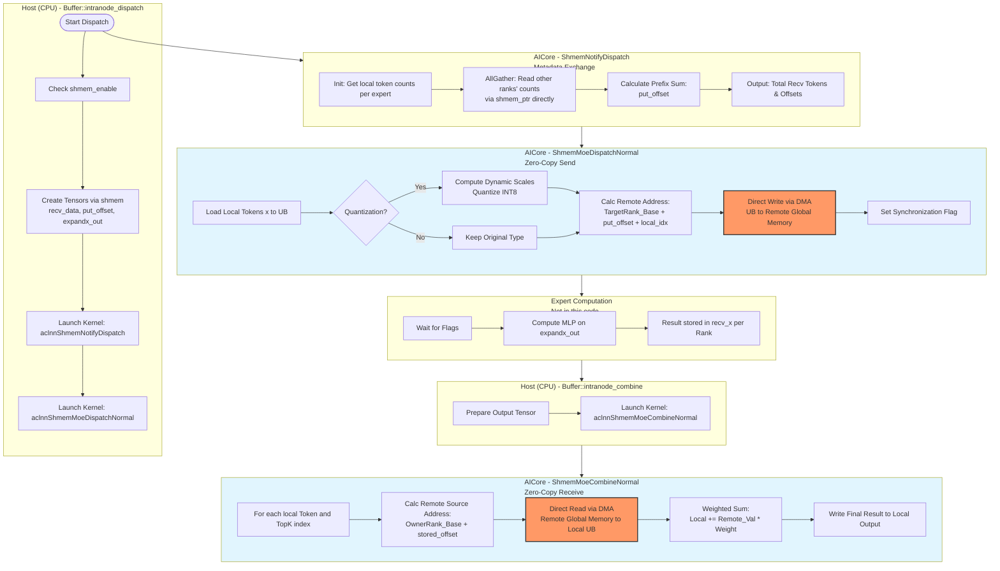
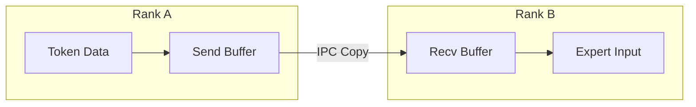
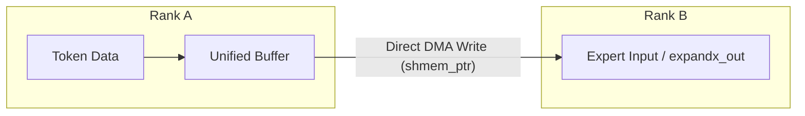
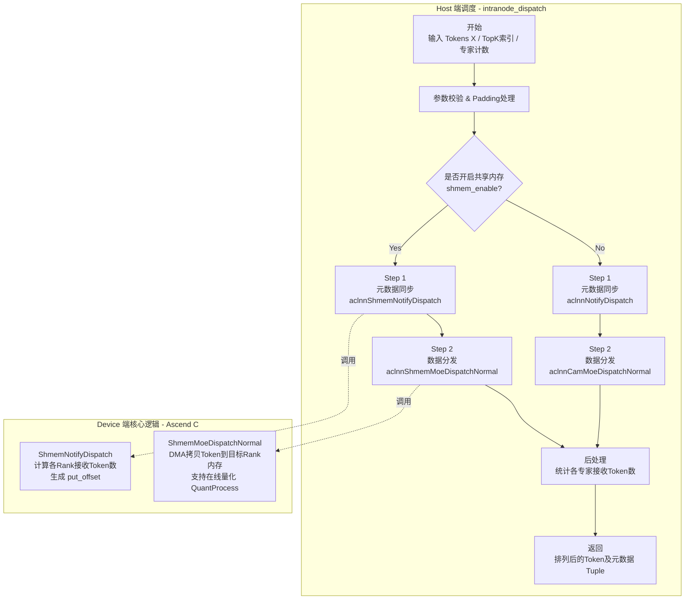

这份代码是基于华为昇腾（Ascend）体系结构，利用 **Shared Memory (SHMEM)** 技术实现的 Mixture-of-Experts (MoE) 模型的 **Intranode Dispatch (分发)** 和 **Combine (聚合)** 算子。

你提到的“去掉了通信缓存 buffer”是其核心优化点。传统的通信（如 HCCL AllToAll）通常需要 `Send Buffer` -> `Network` -> `Recv Buffer` 的过程。而这里通过 NVLink/HCCS 互联，直接将显存映射为共享内存，实现了 **Zero-Copy（零拷贝）** 的直接读写。

下面我将详细分析代码逻辑，并绘制流程图。

### 代码逻辑详细分析

代码主要分为三个部分：
1.  **Host 端调度 (`Buffer` 类方法)**：负责准备 Tensor、计算元数据、调用 AICore 算子。
2.  **AICore 元数据同步 (`ShmemNotifyDispatch`)**：负责计算每个 Rank 需要接收多少 Token，以及写入位置的偏移量。
3.  **AICore 数据传输 (`ShmemMoeDispatchNormal` & `ShmemMoeCombineNormal`)**：核心的无缓存数据搬运。

#### 1. 核心机制：无缓存通信 (No Buffer Communication)

*   **Dispatch 阶段 (Push 模式)**:
    *   传统的 Dispatch：Rank A 将要去往 Rank B 的数据打包到发送缓存 -> 发送 -> Rank B 接收到接收缓存 -> 解包。
    *   **本代码实现**: Rank A 计算出 Token 属于 Rank B 的哪个专家，并且知道 Rank B 的 `expandx_out`（专家输入 Tensor）在内存中的物理地址。Rank A **直接通过 DMA 将数据写入 Rank B 的 `expandx_out` 显存地址**。
    *   **代码证据**: 在 `ShmemMoeDispatchNormal` 中：
        ```cpp
        // 获取目标 Rank 的共享内存指针
        auto ptr = shmem_ptr(expandXOutGM, dstRankId);
        // 计算精确的偏移量 (putOffset + curExpertIdx)
        dstGT.SetGlobalBuffer((__gm__ ExpandXOutType *)(ptr + ...));
        // 直接从本地 xIn 拷贝到远端 dstGT
        DataCopyPad(dstGT, xOutTensor, xOutCopyParams);
        ```

*   **Combine 阶段 (Pull 模式)**:
    *   传统的 Combine：Rank B 计算完结果 -> 发送回 Rank A -> Rank A 接收 -> 加权求和。
    *   **本代码实现**: Rank A 知道自己需要的 Token 结果存储在 Rank B 的哪个位置。Rank A **直接通过 DMA 从 Rank B 的显存地址读取数据**，在本地进行加权求和。
    *   **代码证据**: 在 `ShmemMoeCombineNormal` 中：
        ```cpp
        // 获取源 Rank (dstRankId) 的共享内存指针
        auto ptr = shmem_ptr(recvXGM_, dstRankId);
        // 设置读取源为远端地址
        dstGT.SetGlobalBuffer((__gm__ XType *)(ptr + ...));
        // 从远端 dstGT 拷贝到本地 tmpToken
        DataCopyPad(tmpToken, dstGT, xOutCopyParams, ...);
        ```

#### 2. 代码模块流程拆解

*   **Phase 1: Notify Dispatch (元数据全互换)**
    *   对应类: `ShmemNotifyDispatch`
    *   **目的**: 确定每个 Rank 的每个专家总共要接收多少 Token (`total_recv_token_`)，以及生成全局的偏移量表 (`put_offset_`)。
    *   **逻辑**: 实现了一个基于共享内存的 AllGather。每个核负责一部分 Rank 的数据交换，计算前缀和，从而确定直接写入时的目标地址。

*   **Phase 2: Dispatch Normal (数据分发)**
    *   对应类: `ShmemMoeDispatchNormal`
    *   **输入**: 原始 Token `x`，分发索引 `expert_ids`。
    *   **流程**:
        1.  **分块 (Tiling)**: 按照 BatchSize * TopK 进行分核。
        2.  **计算地址**: 根据 `expert_ids` 找到目标 Rank 和目标专家，结合 Phase 1 计算的 `put_offset`，得到绝对写入地址。
        3.  **量化/类型转换**: 如果开启 `DynamicQuant`，在本地 UB (Unified Buffer) 做量化。
        4.  **跨卡写入**: 调用 `DataCopyPad` 将 UB 数据直接写到目标 Rank 的 Global Memory。
        5.  **同步**: 使用 `SetShmemStatus` 和 `WaitShmemStatus` 确保数据写完后，通知对端可以开始计算。

*   **Phase 3: Combine Normal (结果聚合)**
    *   对应类: `ShmemMoeCombineNormal`
    *   **输入**: 专家计算结果 `recv_x` (分布在各个 Rank 上)，权重 `topk_weights`。
    *   **流程**:
        1.  **定位源数据**: 对于本地的第 `i` 个 Token，根据索引查找它被分发到了哪个 Rank 的哪个位置。
        2.  **跨卡读取**: 直接从该远端地址读取数据到本地 UB。
        3.  **加权求和**: 在本地 UB 执行 `Muls` (乘权重) 和 `Add` (累加)。
        4.  **写回**: 将最终结果写入本地输出 Tensor。

---

### 代码流程图

以下是基于 Mermaid 的详细流程图：



### 关键数据流向对比图

为了更清楚地展示“无 Buffer”的区别，请看下面的对比：

#### 传统方式 (With Buffer)


#### 本代码实现 (No Buffer / Zero-Copy)


### 总结

这段代码通过利用 Ascend 硬件的 **Shared Memory** 特性，在多卡通信中去掉了中间的 Send/Recv 缓冲区。
1.  **Notify 阶段**：通过共享内存快速交换元数据，让发送方知道确切的“物理写入地址”。
2.  **Dispatch 阶段**：发送方直接将数据“推”到接收方的计算内存中。
3.  **Combine 阶段**：接收方（需要结果的一方）直接从计算方的内存中“拉”回数据。

这种设计显著减少了显存占用（不需要额外的通信 Buffer），并减少了内存拷贝次数（从 2-3 次减少到 1 次跨卡 DMA），降低了通信延迟。


这份代码是用于 **华为 Ascend (昇腾) NPU** 上的深度学习分布式训练框架（推测是 PyTorch 适配层），专门针对 **Mixture of Experts (MoE)** 模型中的 **Token 分发 (Dispatch)** 过程。

以下是详细的代码审计与分析报告：

---

## 1. 核心功能摘要 (TL;DR)
这段代码实现了 **MoE 层的节点内（Intranode）Token 分发机制**。它负责根据路由算法的结果（Top-k indices），将输入 Token 重新排列并发送到对应的专家（Expert）所在的计算单元。
**核心亮点**在于针对节点内通信进行了优化：如果开启 `shmem_enable`，它会利用 **NPU 间的共享内存 (Shared Memory)** 直接进行数据拷贝和元数据同步，从而绕过传统的通信库（如 HCCL），显著降低延迟并提升吞吐量。

---

## 2. 逻辑流程图 (Mermaid)



---

## 3. 详细执行流程

该函数以“数据进入系统”的视角，分为准备、元数据交换、数据搬运三个阶段。

### Step 1: 准备阶段 (Host 端)
*   **输入**: 原始 Token 向量 `x`，路由计算出的专家索引 `topk_idx`，以及每张卡、每个专家需要处理的 Token 数量统计。
*   **Padding**: 如果 Token 数量少于 `PADDING_SIZE`，代码会进行填充（Padding），防止小 Batch 导致内核计算异常或性能下降。
*   **检查**: 此时进行了大量的 `EP_HOST_ASSERT` 断言，确保张量形状、连续性、数据类型符合要求（例如必须是 FP16/BF16/FP32，FP8 scales 必须匹配）。

### Step 2: 元数据通告 (Notify Phase)
在将 Token 发送给专家之前，必须先告诉对方“我要给你发多少数据”，以便接收方预留内存。
*   **SHMEM 模式 (`aclnnShmemNotifyDispatch`)**:
    *   代码直接操作共享内存指针 (`shmem_ptr`)。
    *   调用 `ShmemNotifyDispatch` 类。内核中使用 `AllGatherSendData` 逻辑，通过 `CpGM2GMPingPong`（Global Memory 到 Global Memory 的乒乓拷贝）交换各卡需要发送的 Token 数量。
    *   计算全局偏移量：利用 `BuildTotalRecvTokens` 和前缀和算法，计算出每个 Token 在目标 Buffer 中的确切写入位置 (`putOffset`)。
*   **非 SHMEM 模式**:
    *   使用 HCCL 通信库名称 (`hcom_ep_name`) 进行标准的 Notify 操作。

### Step 3: 数据分发 (Dispatch Phase)
这是核心的数据搬运步骤，将 Token 根据路由索引移动到目标位置。
*   **核心动作**: 这是一个 All-to-All 的操作，但针对 MoE 稀疏性进行了优化。
*   **SHMEM 模式 (`aclnnShmemMoeDispatchNormal`)**:
    *   每个 NPU 核心（Block）领取一部分 Token 任务。
    *   **计算目标地址**: 根据 `expertIds` 和 Step 2 计算出的 `putOffset`，直接算出目标 NPU 的内存地址 (`shmem_ptr(expandXOutGM, dstRankId)`)。
    *   **数据拷贝与量化**:
        *   如果是 FP16/32，直接拷贝。
        *   如果 `use_quant` 为真，在内核中的 `QuantProcess` 函数里即时计算动态 Scale，将数据量化为 INT8/FP8，然后写入目标内存。这能减少一半以上的显存带宽占用。
    *   **同步**: 使用 `WaitShmemStatus` 轮询共享内存中的 Flag，确保数据写入完成，防止读写冲突。

### Step 4: 输出
*   返回一个包含 12 个元素的 Tuple。
*   核心产出是 `expandx_out`（重排后的 Token，准备输入 Expert 模型）和 `num_recv_tokens_per_expert_list`（每个专家实际接收了多少 Token，用于后续计算）。

---

## 4. 关键代码/函数解析

| 名称 | 类型 | 作用/含义 |
| :--- | :--- | :--- |
| **`Buffer::intranode_dispatch`** | C++ 函数 | **总指挥**。负责参数预处理、分支选择（是否用共享内存）以及调用具体的 NPU 算子。 |
| **`aclnnShmemNotifyDispatch`** | Kernel 接口 | **元数据同步算子**。利用共享内存，在算子层面实现类似 AllGather 的逻辑，告知所有 Rank 即将接收的数据量。 |
| **`aclnnShmemMoeDispatchNormal`** | Kernel 接口 | **数据搬运算子**。执行真正的 Token 移动。它的特点是“推模式”（Push），发送方直接把数据写到接收方的内存地址。 |
| **`ShmemNotifyDispatch`** | Template Class | **Ascend C 内核实现**。定义了如何在 AICore 上利用 `TPipe`（流水线）和 `GlobalTensor` 进行元数据交换。实现了自定义的原子操作和信号量同步。 |
| **`ShmemMoeDispatchNormal`** | Template Class | **Ascend C 内核实现**。负责具体的 Token 拷贝。包含 `QuantProcess`（在线量化）和 `InputToDstOutput`（计算偏移并拷贝）逻辑。 |
| **`shmem_ptr`** | 宏/函数 | **黑魔法**。基于华为 Ascend 芯片特性，将远端 NPU 的物理地址映射为当前 NPU 可访问的虚拟地址，是实现零拷贝通信的基础。 |
| **`SyncFunc` / `WaitShmemFlag`** | 辅助函数 | **手动同步机制**。由于绕过了 HCCL，代码必须手动管理多卡间的同步，防止数据竞争（Data Race）。 |

---

## 5. 潜在风险与优化建议

作为代码审计专家，我发现以下值得注意的点：

### A. 潜在风险 (Risks)
1.  **死锁风险 (Deadlock in Manual Sync)**:
    *   代码中大量使用了手写的同步逻辑，如 `WaitShmemFlag` 中的 `while` 循环轮询标志位。如果某个 Rank 因为异常挂掉或卡住，其他 Rank 会在 `while` 循环中无限等待，导致整个集群训练卡死。
    *   *建议*: 增加超时机制 (Timeout)，虽然代码中有注释掉的 `TIMEOUT_DETECTION_THRESHOLD`，但似乎未在生产中启用。

2.  **硬编码魔术数 (Magic Numbers)**:
    *   `WIN_MAGIC_OFFSET = 100UL * 1024UL`
    *   `HALF_WIN_STATE_OFFSET = 8 * 1024UL * 1024UL`
    *   这些偏移量硬编码在头文件中。如果共享内存布局发生变化，或者模型规模极大导致元数据超过预留空间，会发生内存踩踏（Memory Corruption），且极难调试。

3.  **返回类型极其复杂**:
    *   函数返回 `std::tuple<at::Tensor, ..., std::optional<EventHandle>>` 共 12 个返回值。
    *   *建议*: 定义一个 `struct MoeDispatchResult`，提高代码可读性和可维护性。

### B. 性能瓶颈 (Bottlenecks)
1.  **Host 端 Padding 开销**:
    *   `if (topk_idx->size(0) < PADDING_SIZE)` 块中使用了 `torch::cat`。这是一个会在 CPU/GPU 间触发同步或内存分配的操作。如果在高频调用的 step 中触发，会造成 Host 端发射 Kernel 的延迟（Kernel Launch Latency）。

2.  **原子操作竞争**:
    *   在 `SetAtomic` 和 `UnsetAtomic` 中使用了原子操作。在 shared memory 并发写入极高的情况下（例如几千个 Token 同时写向同一个 Rank），原子操作可能会成为总线上的热点。

### C. 优化建议
1.  **流水线并行**: 现在的逻辑是 `Notify` -> `Sync` -> `Dispatch`。如果硬件允许，可以尝试将 Notify 的下一轮计算与当前轮的 Dispatch 进行重叠（Overlap）。
2.  **鲁棒性增强**: 在 `WaitShmemFlag` 中必须启用超时检测，一旦超时，应抛出异常并中止训练，而不是挂起。


此代码是针对 **Ascend NPU (华为昇腾)** 架构设计的高性能计算算子，属于 **混合专家模型 (MoE, Mixture of Experts)** 中的 **Token 分发 (Dispatch)** 环节。

特别地，它实现了一个 **节点内 (Intranode) 基于共享内存 (Shared Memory / IPC)** 的 Zero-Copy 数据分发机制。

---

## 1. 核心功能摘要 (TL;DR)
该代码实现了 MoE 层的 **All-to-All Token Dispatch** 操作。
其核心目标是将输入的 Token 根据 `topk_idx`（路由索引）发送到对应的专家（Expert）所在的 Rank（设备）上。
*   **传统做法**：使用 `AllToAll` 通信集合通信原语，需要多次内存拷贝和显式通信。
*   **当前优化**：利用节点内 NPU 间的共享内存地址空间（通过 `shmem_ptr`），直接将数据从源设备的 Global Memory (GM) **DMA 写** 到目标设备的接收 Buffer 中，实现了“逻辑上的通信，物理上的内存直写”，极大地降低了通信延迟并提升了带宽利用率。同时支持在搬运过程中进行 **动态量化 (Dynamic Quantization)**。

---

## 2. 内存布局与 I/O 分析 (核心重点)

此算子涉及复杂的动态形状（Dynamic Shape）处理，因为每个 Rank 接收到的 Token 数量是不确定的（取决于路由负载均衡情况）。

### 关键变量与内存特征

| 变量名 | 数据类型 | 逻辑形状 (Shape) | 内存/大小估算 | 内存布局特性 (Layout/Stride) |
| :--- | :--- | :--- | :--- | :--- |
| **`x` (Input)** | `float/half` | `[N_tokens, Hidden]` | $N \times H \times sizeof(T)$ | **Row-major**, 连续内存。要求 $H$ 维度通常需 32B 对齐以优化 DMA。 |
| **`expert_ids`** | `int32` | `[N_tokens]` | $N \times 4$ Bytes | 扁平化的一维数组，表示每个 Token要去的目标专家 ID。 |
| **`num_tokens_per_expert`** | `int32` | `[Num_Experts]` | $E \times 4$ Bytes | 直方图统计，用于计算偏移量。 |
| **`recv_data` (Notify)** | `int32` | `[Num_Ranks, Num_Experts]` | 小规模元数据 | **Metadata Matrix**。用于各 Rank 交换“我将发给你多少数据”。 |
| **`expandx_out` (Output)** | `float/half/int8` | `[Total_Recv, Hidden]` | **动态大小**。取决于所有 Rank 发给本 Rank 的 Token 总和。 | **Row-major**。通常预分配最大可能的 Buffer 或通过 `shmem_notify` 计算精确大小后分配。 |
| **`put_offset`** | `int32` | `[Num_Experts, Num_Ranks]` | 计算辅助 | **前缀和 (Prefix Sum)** 矩阵，决定写入目标内存时的全局偏移地址。 |

### 内存对齐与 Padding 策略
代码中多次出现 `UB_ALIGN_SIZE = 32` (Ascend Unified Buffer 对齐要求) 和 `Ceil(..., 32) * 32`。
*   **IO 对齐**：输入 `x` 和输出 `expandx_out` 在 Hidden 维度上如果不是 32 字节的倍数，通常需要在 Kernel 内部进行 Padding 处理或利用 stride 机制，但在该代码中，`hUBAlignSize` 显式计算了对齐后的大小，暗示内部搬运按对齐块进行。
*   **Shmem IPC 对齐**：跨设备写操作对地址对齐极其敏感，代码中通过 `DataCopyPad` 处理不对齐的数据尾部。

---

## 3. 逻辑流程图 (Mermaid)

```mermaid
graph TD
    subgraph Host_CPU [Host: Buffer::intranode_dispatch]
        A[输入检查 & Padding] --> B{Shmem Enable?}
        B -- Yes --> C[计算 Shmem 指针 & 偏移]
        B -- No --> D[传统 HCCL 通信路径]
    end

    subgraph Kernel_1 [Kernel: ShmemNotifyDispatch (Metadata Exchange)]
        C --> E[**AllGatherSendData**<br>各Rank读取彼此的Token计数]
        E --> F[**BuildOffsets**<br>计算前缀和: put_offset, max_bs]
        F --> G[**Sync**<br>Barrier 同步确保元数据这就绪]
    end

    subgraph Kernel_2 [Kernel: ShmemMoeDispatchNormal (Data Movement)]
        G --> H[**InputToDstOutput**<br>核心循环]
        H --> I{需量化?}
        I -- Yes --> J[FP32/BF16 -> INT8 <br> 动态计算 Scale]
        I -- No --> K[直接 Copy]
        J --> L[**Direct Memory Write**<br>通过 shmem_ptr 写目标 Rank 内存]
        K --> L
        L --> M[**Set/Wait Status**<br>软件实现的信号量同步]
    end

    D --> N[HCCL AllToAll]
    M --> O[返回 Output Tensor]
    N --> O
```

---

## 4. 详细执行流程 (Step-by-step)

### 第一阶段：元数据同步 (`ShmemNotifyDispatch`)
由于是 Zero-Copy，发送方必须精确知道要写到接收方内存的哪个位置。
1.  **AllGather send_count**：
    *   每个 Rank 维护一个 `token_per_expert` 列表。
    *   利用 `CpGM2GMPingPong`，每个 Rank 遍历读取所有其他 Rank 的 shared memory 中的计数器。
2.  **计算 Offset (前缀和)**：
    *   在本地 UB (Unified Buffer) 中，对收集到的计数矩阵进行转置和前缀和计算 (`ReorderRecvDataOutput` + `BuildTotalRecvCount`)。
    *   生成 `put_offset`：决定了当 Rank A 向 Rank B 的 Expert E 发送数据时，应该写在 Rank B 接收 Buffer 的偏移量 $Offset_{A \to B, E}$。
3.  **计算 Total Receive**：
    *   统计本 Rank 总共将收到多少 Token，用于分配 `expandx_out` 的内存。

### 第二阶段：数据分发 (`ShmemMoeDispatchNormal`)
这是数据搬运的核心，利用 NPU 的 AI Core 并行处理。
1.  **Tiling (分块策略)**：
    *   按 `batch_size * topk` (总 Token 数) 进行切分，分配给不同的 AI Core (`blockIdx`)。
2.  **地址计算 (Address Calculation)**：
    *   对于每个 Token：
        *   读取 `expert_id`。
        *   计算目标 Rank: `dst_rank = expert_id / experts_per_rank`。
        *   读取该 Token 在本地专家内的发送序号 `send_token_idx`。
        *   读取全局偏移 `put_offset`。
        *   **最终地址**：`Dst_Base_Ptr(dst_rank) + (put_offset + send_token_idx) * Hidden_Size_Aligned`。
3.  **核心搬运与量化**：
    *   **Load**: 从 Global Memory (`x`) 加载 Token 到 Local Buffer (`UB`)。
    *   **Quant (Optional)**: 如果 `DynamicQuant` 为真：
        *   计算 `Abs` -> `ReduceMax` -> `Scale`。
        *   `Cast` (Float -> Int8/Half)。
        *   将 Scale 单独写入目标 Rank 的 Scale Buffer。
    *   **Store (Remote Write)**: 将处理后的数据直接 DMA 写到计算出的最终地址（该地址物理上位于另一张卡）。
4.  **同步 (Handshake)**：
    *   使用 `SetShmemStatus` 和 `WaitShmemStatus`。
    *   这是软件实现的 Barrier：写入数据后，更新目标 Rank 的标志位区域；目标 Rank 轮询标志位，直到确认所有数据已到达。

---

## 5. 潜在风险与性能瓶颈

### 5.1 内存风险 (Critical)
*   **Shmem 指针越界 (OOB)**：
    *   代码高度依赖 `shmem_ptr` 计算的正确性。如果 `expert_ids` 包含非法值（如 >= num_experts），会导致写到错误的物理地址，可能导致 Device Hang 甚至系统崩溃。
    *   *Code Audit*: 虽然有 `EP_HOST_ASSERT`，但在 Kernel 内部缺乏对 `dstRankId` 的动态边界检查（为了性能通常不加，但这是风险点）。
*   **Race Condition (竞态)**：
    *   多个 Core 可能同时写同一个目标 Rank。代码通过 `put_offset` (基于 Rank 的前缀和) 和 `send_token_idx` 实现了写入地址的互斥，这要求 Host 端传入的 `send_token_idx` 必须严格正确且无冲突。

### 5.2 性能瓶颈
*   **Bank Conflict / 内存非对齐访问**：
    *   代码中有大量的 `Ceil(..., UB_ALIGN)`。如果 `Hidden Size` 很小且非 32B 倍数（例如 `Hidden=10`），Padding 会导致巨大的带宽浪费（有效数据占比低）。
*   **同步开销 (Spin-lock)**：
    *   `WaitShmemStatus` 中使用了 `while` 循环轮询 Global Memory 的标志位。
    *   如果不同 Rank 负载极度不均衡（Stragglers），某些 Rank 会长时间空转占用 AI Core，浪费算力并阻塞流水线。
*   **TLB Miss / Cache Thrashing**：
    *   `InputToDstOutput` 循环中，如果连续的 Token 被路由到随机的 Rank（完全乱序），会导致频繁切换 `dstGT` 的 Global Buffer 指针。
    *   这对 NPU 的 DMA 引擎不友好，可能导致总线利用率下降。**建议**：在 Host 端预先对 Token 按目标 Expert 进行局部排序（Sort/Permutation），使发送更加连续。

### 5.3 硬件相关限制
*   **原子操作限制**：代码在 Notify 阶段使用了 `SetAtomic`，这在旧版 Ascend 硬件上开销较大。
*   **P2P 带宽限制**：虽然是 Zero-Copy，但总带宽受限于卡间互联（如 HCCS/PCIe）。如果 `All-to-All` 通信量过大，这里依然是物理瓶颈。