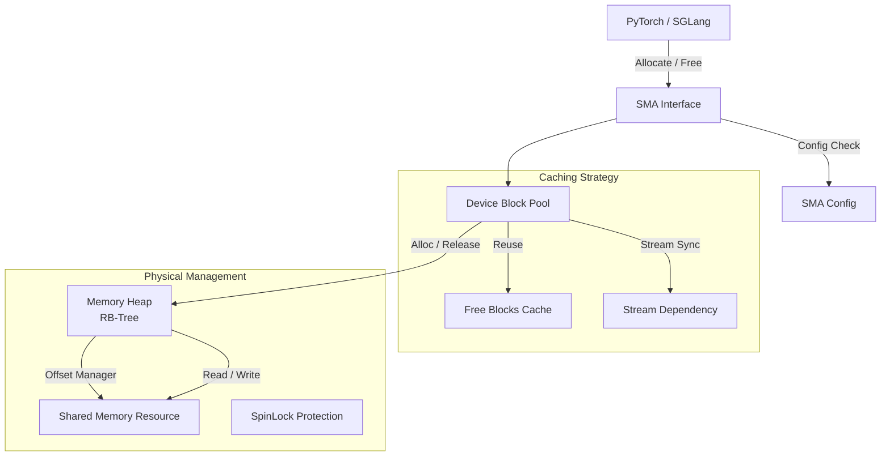

这是一个基于你提供的代码片段和zbccl背景的 **SMA (Secondary Memory Allocator) 模块设计文档**。

该文档详细描述了SMA如何作为PyTorch的插件接管内存管理，如何通过Caching机制管理共享内存（Shared Memory），以及底层的Heap管理逻辑。

---

# SMA (Secondary Memory Allocator) 模块设计文档

## 1. 概述 (Overview)

SMA (Secondary Memory Allocator) 是 zbccl 框架下的核心内存管理组件。其设计目标是**接管 PyTorch NPU 的内存申请与释放请求**，将原本通过 Driver (DMA/HBM) 私有申请的内存，转为在全局 **Shared Memory (shmem)** 资源池中进行管理。

通过 SMA，SGLang 在初始化时注入该分配器，从而实现：
1.  **零拷贝通信基础**：所有 Tensor 底层存储均位于共享内存，天然具备跨进程访问能力。
2.  **高效内存复用**：实现类似 PyTorch Native CachingAllocator 的缓存机制，减少高频 IPC 和系统调用开销。
3.  **非对称内存支持**：支持各 Rank 根据负载动态申请不同大小的内存块。

## 2. 整体架构 (Architecture)

SMA 采用分层架构设计，自上而下分为 **接口层 (Interface)**、**策略层 (Strategy/Caching)** 和 **核心管理层 (Core/Heap)**。



### 2.1 模块划分

1.  **Interface Layer (`SecondaryMemoryAllocator`)**:
    *   继承自 `ZReferable`，作为 PyTorch allocator 的代理。
    *   解析 `PYTORCH_NPU_ALLOC_CONF` 环境变量，初始化配置。
    *   暴露标准的 `Allocate` 和 `Free` 接口。

2.  **Strategy Layer (`DeviceBlockPool`, `DeviceBlock`)**:
    *   **缓存管理**：模仿 PyTorch CachingAllocator，维护已申请但暂时闲置的内存块 (`DeviceBlock`)。
    *   **Stream 感知**：确保内存复用时 Stream 的同步关系，防止读写冲突。
    *   **Block 分裂与合并**：将从 Heap 申请的大块内存切分为小块 (`SmallBuffer`, `LargeBuffer`) 以适应 Tensor 需求。

3.  **Core Layer (`MemoryHeap`)**:
    *   **物理(逻辑)内存管理**：管理一大块连续的 Shared Memory 虚拟地址空间。
    *   **红黑树管理**：使用双树结构 (`address_idle_tree`, `size_idle_tree`) 维护空闲内存段，支持 O(logN) 复杂度的查找与合并。
    *   **线程安全**：使用 `pthread_spinlock_t` 保证多线程下的内存操作原子性。

---

## 3. 核心数据结构 (Key Data Structures)

### 3.1 内存堆管理 (`MemoryHeap`)
位于 `zbccl_sma_mm_heap.h`，负责对共享内存池进行精细化管理。

*   **`address_idle_tree_` (Map<offset, size>)**: 按**地址偏移**排序的空闲块树。主要用于内存释放时，快速查找相邻的前后空闲块进行**合并 (Coalescing)**，减少碎片。
*   **`size_idle_tree_` (Set<MemoryRange>)**: 按**大小**排序的空闲块树。主要用于内存申请时，使用 Best-Fit 策略快速寻找满足大小要求的最小空闲块。
*   **`address_used_tree_` (Map<offset, size>)**: 记录当前正在使用的内存块，用于校验释放操作的合法性及 Resize 操作。

### 3.2 设备块封装 (`DeviceBlock`)
位于 `zbccl_sma_device_block_pool.h`，是 Strategy 层调度的基本单元。

*   **`stream_`**: 记录该内存块分配时的 Stream，复用时需检查 Stream 兼容性或插入 Event 同步。
*   **`pool_`**: 指向所属的 Pool。
*   **`prev_` / `next_`**: 维护物理相邻的 Block 链表，用于在释放回 Heap 前尝试合并相邻的 Block。
*   **`event_count_`**: 记录挂起的 Event 数量，用于垃圾回收时的安全检查。

### 3.3 配置管理 (`SMAConfig`)
位于 `zbccl_sma_config.h`，解析环境变量 `PYTORCH_NPU_ALLOC_CONF`。
*   支持参数：`max_split_size_mb`, `garbage_collection_threshold`, `base_addr_aligned_kb` 等，允许用户微调分配器行为。

---

## 4. 关键流程设计 (Workflows)

### 4.1 初始化流程 (Initialize)
1.  SMA 读取环境变量，配置 `max_split_size` 等参数。
2.  对接底层 Shmem 驱动（CCL模块提供），获取大页内存的基地址 (Base Ptr) 和总大小。
3.  初始化 `MemoryHeap`，将整个 Shmem 空间注册为初始空闲块。

### 4.2 内存申请流程 (Allocate)
对应 `SecondaryMemoryAllocator::Allocate`：

1.  **参数校验与对齐**：根据 `SMAConfig` 将请求 `size` 进行对齐（如 512B 或 PageSize 对齐）。
2.  **缓存查找 (Cache Lookup)**：
    *   在 `DeviceBlockPool` 中查找是否有满足大小且 Stream 兼容的空闲 `DeviceBlock`。
    *   如果找到，直接从 FreeList 移除并返回（无需操作 Heap）。
3.  **堆分配 (Heap Alloc)**：
    *   若缓存未命中，计算需申请的 Block 大小（可能向上取整到 `kSmallBuffer` 或 `kLargeBuffer` 以便后续分割）。
    *   调用 `MemoryHeap::alignedAllocate`。
    *   **Best-Fit 搜索**：在 `size_idle_tree_` 中寻找满足对齐要求且大小足够的最小块。
    *   **切割 (Splitting)**：如果找到的块比需求大，将其切割，剩余部分留回 `size_idle_tree_`。
4.  **Block 封装**：将 Heap 返回的指针封装为 `DeviceBlock`，记录 Stream 信息，返回给 PyTorch。

### 4.3 内存释放流程 (Free)
对应 `SecondaryMemoryAllocator::Free`：

1.  **缓存回收**：
    *   内存并不会立即归还给 `MemoryHeap`。
    *   将 `DeviceBlock` 标记为 Free，放入 `DeviceBlockPool` 的 FreeList 中。
    *   记录释放时的 Event，确保后续复用时的流同步。
2.  **垃圾回收 (GC - 可选触发)**：
    *   当显存压力大或达到 `garbage_collection_threshold` 时触发。
    *   将 FreeList 中的 Block 尝试与 `prev_`/`next_` 邻居合并。
    *   调用 `MemoryHeap::release` 将合并后的大块内存归还给 `idle_tree`。
3.  **堆合并 (Heap Coalescing)**：
    *   `MemoryHeap::release` 接收归还的地址。
    *   查找 `address_idle_tree_` 中该地址的前后邻居。
    *   如果物理连续且空闲，合并成一个大块，更新 `size_idle_tree_`，以此消除碎片。

---

## 5. 接口定义 (Interface Specifications)

### 5.1 对外接口
SMA 必须实现 PyTorch Allocator 约定的接口行为：

```cpp
virtual ZResult Initialize(zbccl_allocator_options *options, int32_t flags) noexcept;
virtual ZResult Allocate(ssize_t size, int32_t device, aclrtStream stream, int32_t flags, void *&out) noexcept;
virtual ZResult Free(void *ptr, ssize_t size, int32_t device, aclrtStream stream, int32_t flags) noexcept;
```

### 5.2 内部 Heap 接口 (`zbccl_sma_mm_heap.h`)

```cpp
// 在 shmem 中分配对齐内存，更新红黑树
void *alignedAllocate(uint64_t alignment, uint64_t size) noexcept;

// 释放内存，执行碎片合并
int32_t release(void *address) noexcept;

// 调整内存块大小（用于Realloc优化）
bool changeSize(void *address, uint64_t size) noexcept;
```

---

## 6. 关键技术点与难点

1.  **锁竞争 (Lock Contention)**:
    *   `MemoryHeap` 使用了 `pthread_spinlock_t`。由于分配和释放操作非常频繁，且涉及树的平衡操作，锁粒度控制至关重要。
    *   *优化策略*：`DeviceBlockPool` 层应尽可能拦截分配请求，只有 Cache Miss 才进入 Heap 层加锁操作。

2.  **碎片化 (Fragmentation)**:
    *   **外部碎片**：通过红黑树的合并逻辑（Coalescing）解决。释放时必须检查物理地址相邻的块是否空闲。
    *   **内部碎片**：通过 `kSmallBuffer` (2MB) 和 `kLargeBuffer` (20MB) 的分级策略，以及 Config 中的 `max_split_size` 限制，防止大块内存被切得过碎无法复原。

3.  **Stream 同步 (Synchronization)**:
    *   SMA 必须感知 NPU Stream。当复用一个刚刚在 Stream A 释放的 Block 给 Stream B 使用时，必须在 Stream B 插入 Wait Event，等待 Stream A 的操作完成，否则会导致数据竞争。

4.  **异常安全性**:
    *   若进程崩溃，Shared Memory 不会自动回收。SMA 需配合 CCL 模块的 Shmem Manager 实现健壮的清理机制（如通过文件锁或心跳机制检测僵尸进程并重置 Heap）。