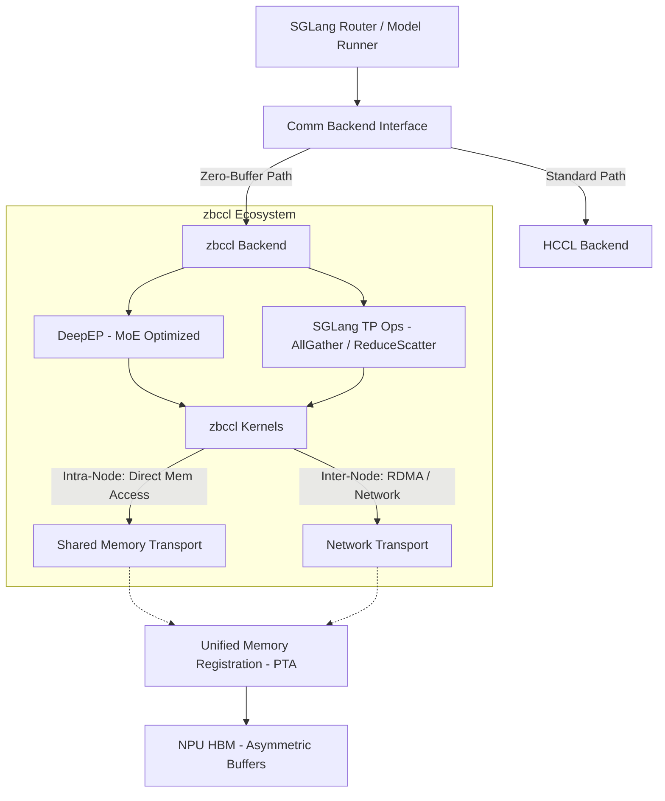

# [RFC] Integration of zbccl: High-Performance Zero-Buffer Collective Communication Library for SGLang

| **Status** | Proposed |
| :--- | :--- |
| **Author** | [Your Name/Team] |
| **Target Hardware** | Huawei Ascend (NPU) |
| **Related Components** | SGLang, DeepEP, Torch NPU (PTA) |

## 1. Summary

本提案建议在 SGLang 中集成 **zbccl (Zero-Buffer Collective Communication Library)**。

zbccl 是一个面向大规模模型推理的高性能通信组件，它不仅通过共享内存（Shared Memory）优化了节点内（Intra-Node）通信，还支持跨节点（Inter-Node）的高效传输。其核心特性是**零拷贝（Zero-Copy）**与**零缓冲（Zero-Buffer）**：通过允许通信 Kernel 直接读写目标 Rank 的内存地址（无论该 Rank 在本节点还是远端节点），消除了传统通信中用于中转的 Send/Recv Buffer，显著降低了显存开销与通信延迟。

本提案旨在利用 zbccl 解决 MoE 模型 Prefill 阶段的 Dispatch/Combine 瓶颈，以及 Tensor Parallel (TP) 中的基础集合通信（AllGather/ReduceScatter）效率问题。

## 2. Motivation

当前 SGLang 在大规模部署（特别是多机多卡环境）时，面临以下通信挑战：

1.  **显存开销（Memory Overhead）**：
    *   传统通信库（如 HCCL）通常需要分配额外的 Send/Recv Buffer。
    *   在 MoE 场景下，由于 Expert 负载不均衡（Load Imbalance），为了对齐最大负载，往往需要申请巨大的 Padding Buffer，造成显存浪费。
2.  **数据拷贝延迟（Copy Latency）**：
    *   标准流程：`Input -> Staging Buffer -> Network/Link -> Staging Buffer -> Output`。
    *   无论是在单机内还是多机间，多次 D2D（Device-to-Device）拷贝增加了端到端延迟。
3.  **统一语义需求**：
    *   上层应用（SGLang）不应感知底层物理拓扑（Intra vs Inter）。zbccl 提供了一套统一的机制来处理非对称内存的直接读写。

**zbccl** 的引入旨在消除中间环节，实现 `Input -> Target Memory` 的直通，同时支持非对称 Tensor，使得通信显存开销与实际负载精确匹配。

## 3. System Architecture

zbccl 位于 PyTorch Adapter (PTA) 与上层框架之间，向下屏蔽了节点内（Shmem）与节点间（RDMA/HCCS）的传输差异。

### 3.1 总体架构图



### 3.2 核心模块

1.  **Unified Memory Management**:
    *   扩展 `torch_npu`，提供统一的内存注册接口。
    *   在超节点内，内存均通过统一句柄（Handle）进行管理。
    *   支持**非对称 Tensor**分配，适应不同 Rank 的不同负载需求。
2.  **MoE Communication Engine**:
    *   支持跨机的 Dispatch/Combine 操作。
    *   通过全局元数据同步（Global Metadata Sync），Kernel 可计算出任意 Expert 在集群内的物理位置偏移，直接写入数据。
3.  **Collective Primitives (TP)**:
    *   提供 `AllGather` 和 `ReduceScatter` 的 Zero-Buffer 实现，支持多机扩展。

## 4. Detailed Design

### 4.1 Memory Management: Asymmetric & Globally Addressable

为了支持零 Buffer 通信，内存必须是“可见的”。

*   **Registration API**:
    *   利用 pytorch的Allocator的plugin机制，将申请到的 shmem 物理地址映射为 PyTorch 的 Tensor，确保存储后端指向共享内存地址。。
    *   实现多进程间的 Handle 传递机制，允许 Rank A 获取 Rank B 申请的内存地址偏移。
*   **Asymmetric Allocation**:
    *   允许 Rank 0 申请 1GB Buffer，而 Rank 1 仅申请 500MB Buffer。zbccl 在通信握手阶段会交换这些 Size 信息，确保数据写入不越界。

### 4.2 MoE Optimization (DeepEP Integration)

DeepEP 的流程将适配 zbccl 的全局通信能力：

*   **Phase 1: Global Handshake**
    *   各 Rank 广播自己的 `num_tokens_per_expert`。
    *   计算全局偏移量（Global Offsets）。此时，每个 Rank 都知道自己发送的 Token 应该落在 Target Node 的 Target Rank 的具体内存地址。
*   **Phase 2: Direct Dispatch**
    *   Kernel 根据路由表，判断目标是在本机还是远端。
    *   **本机目标**：通过 shmem 直接写入。
    *   **远端目标**：通过总线协议（HCCS/UB）直接写入对端 buffer。
    *   **Result**: 彻底消除了中间的**输入->通信buffer**和**通信buffer->输出**的过程。

### 4.3 Tensor Parallel Optimization (AllGather/ReduceScatter)

*   **AllGather**:
    *   每个 Rank 将数据直接“广播”写入到通信组内所有其他 Rank 的对应切片位置。
    *   zbccl 内部自动处理拓扑感知：节点内利用高带宽 Shmem，节点间利用网卡带宽，并行传输。
*   **ReduceScatter**:
    *   **Direct Reduce**: 目标 Rank 直接从源 Rank（无论本地还是远端）读取数据并进行累加，或者源 Rank 将部分结果直接原子累加（Atomic Add）到目标 Rank。
    *   这对于 MLP 层输出的规约尤为重要。

## 5. Implementation Plan & Roadmap

### Phase 1: Foundation & API (Memory)
*   **Goal**: 建立支持节点内和节点间可见的内存管理机制。
*   **Deliverables**:
    *   `torch_npu` 内存注册接口。
    *   zbccl 初始化与通信域（Comm Group）构建逻辑（支持多机环路探测）。

### Phase 2: MoE Acceleration (DeepEP)
*   **Goal**: 端到端打通 MoE Prefill 阶段的零拷贝通信。
*   **Deliverables**:
    *   DeepEP 适配 zbccl 接口。
    *   验证多机多卡场景下的 MoE 精度与性能。
    *   支持 INT8/FP8 量化传输。

### Phase 3: TP Primitives (General Ops)
*   **Goal**: 替换 SGLang 默认的 HCCL TP 算子。
*   **Deliverables**:
    *   封装 `zbccl_all_gather` 和 `zbccl_reduce_scatter`。
    *   SGLang 后端路由策略更新：在初始化时根据配置选择 zbccl 作为 TP 后端。
    *   图模式（CUDA Graph/Torchair）支持。

## 6. Performance Expectations

*   **Memory Efficiency**: 在 MoE 场景下，通信显存占用预期降低 **30%+**（取决于负载不均衡度及中间 Buffer 的消除）。
*   **Latency**:
    *   Intra-node: 接近内存拷贝极限。
    *   Inter-node: 消除了一次显存到网卡 Buffer 的拷贝，预期延时降低。
*   **Throughput**: 提升 Prefill 阶段的 Token 处理吞吐量，特别是在 Batch Size 较大且 Expert 负载动态变化剧烈的场景。

## 7. Interfaces and Configuration

用户接口保持简洁，通过参数开启全局优化：

```bash
python3 -m sglang.launch_server \
    --model deepseek-ai/DeepSeek-V3 \
    --tp-size 8 \
    --enable-zbccl \
```

**Note**: 当检测到多机环境时，`--enable-zbccl` 将自动尝试初始化跨机连接，若失败则回退（Fallback）至标准 HCCL 路径。

---

**Request for Comments**:
Feedback is requested regarding xxx.