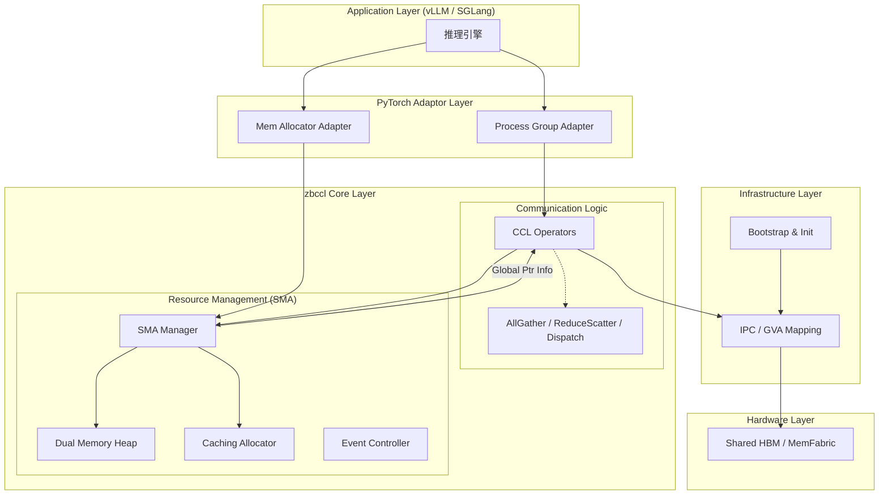
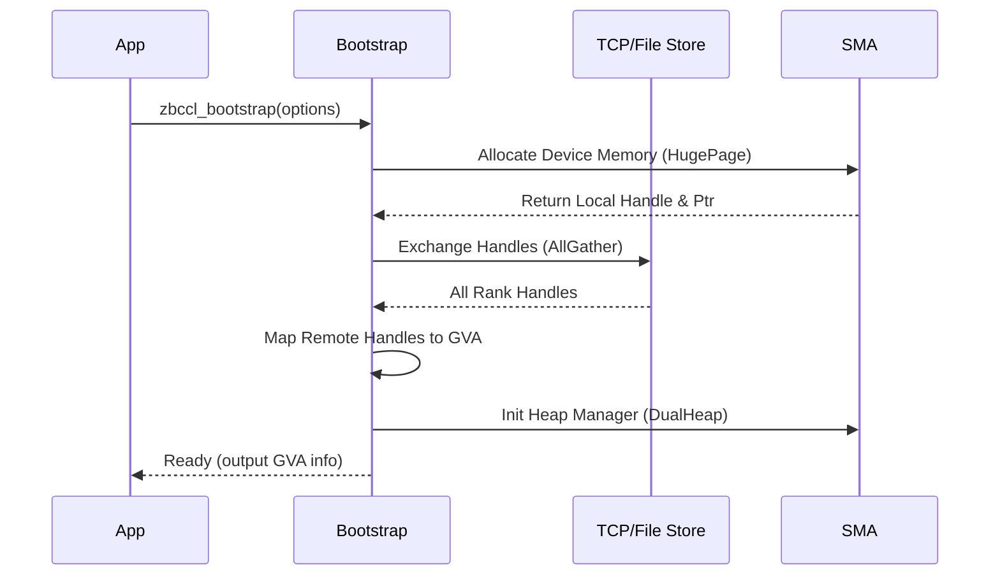

这是一个基于你提供的背景信息和参考代码整理出的《zbccl 高性能通信组件架构设计文档》。

---

# zbccl 高性能通信组件架构设计文档

| 文档版本 | 作者 | 日期 | 状态 |
| :--- | :--- | :--- | :--- |
| v1.0 | 系统架构师 | 2026-01-29 | 待评审 |

---

# 1. 设计背景与目标

## 1.1 业务与技术背景
在大规模模型（LLM）推理场景中（如 SGLang, vLLM），随着模型参数量的增长（70B+ / MoE），**Tensor Parallelism (TP)** 和 **Expert Parallelism (EP)** 成为必选项。
传统的通信库（如 NCCL/HCCL）在处理 TP 通信时，通常采用 `Send/Recv Buffer` 机制，这导致了两个主要问题：
1.  **显存浪费**：需要额外的缓冲区来中转数据，加剧了推理时的显存压力（OOM 风险）。
2.  **通信延迟**：多次内存拷贝（Device -> Buffer -> Network/Link -> Buffer -> Device）增加了关键路径的延迟。

## 1.2 当前痛点
- **Prefill 阶段瓶颈**：在处理长 Context 或 MoE 路由时，Dispatch/Combine 操作产生大量细碎通信，传统机制开销巨大。
- **显存碎片化**：频繁的通信 buffer 分配导致显存碎片严重。
- **TP 通信开销**：AllGather 和 ReduceScatter 是推理热点，任何微小的拷贝延迟都会被层数放大。

## 1.3 核心问题与设计目标
本次架构设计的核心是构建 **zbccl (Zero-Buffer Collective Communication Library)**。

**设计目标：**
1.  **极致性能（Zero-Copy & Zero-Buffer）**：利用超节点（Hyper-node）内的统一编址特性，实现 Kernel 直接读写远端 Rank 内存，消除中间 Buffer 和拷贝。
2.  **透明接入**：向上层框架提供兼容 PyTorch ProcessGroup 和 Allocator 的接口，对 vLLM/SGLang 业务代码侵入最小化。
3.  **内存管理闭环**：通过 SMA（Secondary Mem Allocator）接管全局显存分配，实现全局可见性（Global Visibility）与高效复用。
4.  **高可扩展性**：支持 NPU 图模式（Graph Mode）捕获，支持动态形状（Dynamic Shape）的推理场景。

---

# 2. 需求分析

## 2.1 功能性需求
| 模块 | 功能点 | 说明 |
| :--- | :--- | :--- |
| **通信算子** | AllGather, ReduceScatter, AllReduce, All2All | 基础集合通信，必须支持 Zero-Buffer 模式。 |
| **MoE 特性** | Dispatch, Combine | 兼容 DeepEP 接口，优化 MoE 路由通信。 |
| **内存管理** | Malloc, Free, EmptyCache | 支持跨设备全局寻址的内存分配与回收。 |
| **框架适配** | ProcessGroup Adapter, Allocator Adapter | 适配 PyTorch 分布式接口与 `c10::Allocator`。 |
| **初始化** | Bootstrap | 建立节点内拓扑，交换 IPC 句柄，初始化共享内存段。 |

## 2.2 非功能性需求
- **延迟**：节点内通信延迟需显著低于标准 NCCL/HCCL（目标降低 30%+）。
- **显存开销**：通信过程中的额外显存开销接近于 0。
- **可靠性**：支持多流（Multi-Stream）并发安全，具备基础的死锁检测机制。
- **兼容性**：支持 NPU (Ascend) 硬件架构，兼容 PyTorch 2.x 生态。

---

# 3. 总体架构设计

## 3.1 架构设计思路
采用 **"Bypass & Global Addressing"（旁路与全局编址）** 的架构风格：
1.  **旁路传统通信栈**：不走标准 Send/Recv 协议栈，直接操作内存总线。
2.  **全局内存视图**：所有参与通信的 Rank 将其 HBM 映射到全局虚拟地址空间（GVA），使得 Rank A 可以直接通过指针访问 Rank B 的数据。
3.  **分层治理**：
    - **接口层**：伪装成 PyTorch 标准组件。
    - **资源层**：SMA 负责“修路”（建立内存映射）。
    - **算子层**：CCL Operator 负责“跑车”（执行数据搬运）。

## 3.2 总体架构图

---

# 4. 核心模块设计

## 4.1 PyTorch Adapter Layer
- **职责**：作为粘合层，将 zbccl 的能力暴露给 PyTorch。
- **关键组件**：
    - `zbccl_pytorch_process_group`：继承自 `c10d::ProcessGroup`，拦截集合通信调用，转发给 zbccl kernel。
    - `zbccl_mem_allocator`：继承自 `c10::Allocator`，拦截 `torch.empty` 等显存申请，重定向到 SMA。

## 4.2 SMA (Secondary Memory Allocator)
这是系统的**心脏**，负责管理全局可寻址内存。
- **职责**：
    - 将本地 HBM 映射为 GVA (Global Virtual Address)。
    - 实现类似 PyTorch CachingAllocator 的缓存策略，防止频繁系统调用。
    - 处理跨流（Stream）的内存安全复用。
- **内部架构（基于参考代码）**：
    - **DualMemoryHeap**：
        - `Small Heap` (Default 512MB)：用于存放元数据、通信信号量（Signal），减少小对象造成的碎片。
        - `Large Heap`：用于存放 Tensor 数据，对齐到大页（2MB/20MB）。
    - **DeviceBlockPool**：
        - 管理空闲块（Free Blocks）和活跃块（Active Blocks）。
        - 区分 `BT_SMALL` 和 `BT_BIG` 类型。
    - **EventController**：
        - 解决异步释放问题。当 Python 层释放 Tensor 时，如果计算流还在使用该内存，EventController 会延迟物理释放，直到 Event 完成。
    - **GraphDeferPools**：
        - 专门支持 NPU Graph (Graph Mode)。在图捕获期间，暂时挂起内存释放操作，防止破坏图结构。

## 4.3 CCL Operator
- **职责**：执行具体的通信逻辑。
- **关键逻辑**：
    - **Zero-Copy 实现**：Kernel 获取源 Tensor 的 GVA 和目标 Tensor 的 GVA，直接发起 DMA copy 或 Load/Store 指令。
    - **同步机制**：利用 SMA Small Heap 中的内存区域作为标志位（Flag），实现轻量级的 Device-side Synchronization，避免 CPU 参与。

## 4.4 Bootstrap
- **职责**：系统冷启动与拓扑发现。
- **输入**：`rank_id`, `world_size`, `ip_port`。
- **输出**：`deviceGva` (基地址), `mySMAGva` (本 Rank 内存窗口)。
- **交互**：通过 TCP/Store 交换各 Rank 的 IPC Handle，完成 `mmap` 映射，建立全连接的内存访问网。

---

# 5. 数据流与控制流设计

## 5.1 初始化阶段 (Bootstrap Flow)

## 5.2 内存分配流程 (Allocation Flow)
1.  **Request**: App 请求 `malloc(size, stream)`。
2.  **Cache Search**: SMA 检查 `DeviceBlockPool` 是否有满足大小的空闲块。
3.  **Split/Merge**: 如有大块，切割；如无，触发 `DualMemoryHeap` 划拨新段（Segment）。
4.  **Sync Check**: 如果复用的块曾被其他流使用，SMA 自动插入 `EventWait`，确保写后写（WaW）安全。
5.  **Return**: 返回全局可见的指针 `ptr`。

## 5.3 通信执行流程 (e.g., AllGather)
1.  **Input**: Rank $i$ 拥有 Tensor $T_i$ (在 SMA 内存中)。
2.  **Signal**: CPU 侧准备指令，或 GPU/NPU 侧直接写 Flag 通知。
3.  **Kernel Execution**:
    - Rank $i$ 的 Kernel 计算出 Rank $j$ 的目标地址 $Addr(T_{dest}) = Base_j + Offset$。
    - **Direct Copy**: Rank $i$ 直接将 $T_i$ 写入 $Addr(T_{dest})$。
    - 整个过程**无** Host 侧内存中转，**无** 通信库内部 Buffer 分配。
4.  **Completion**: 刷新 Memory Barrier，更新信号量。

---

# 6. 关键技术点与设计取舍

## 6.1 内存管理策略：Dual Heap vs. Single Heap
- **方案**：采用 **Dual Heap**（双堆）策略。
- **Why**：
    - 通信库不仅传输 Tensor（大块数据），还需要大量的同步信号量和元数据（极小块数据，Bytes 级别）。
    - 如果混用，小对象会导致严重的大页内存碎片，且小对象的分配频率极高。
    - **取舍**：将前 512MB 划分为 Small Heap 专门服务于控制流数据，其余为 Large Heap 服务于 Tensor。

## 6.2 NPU Graph 兼容性：GraphDeferPools
- **问题**：在 Graph Capture 模式下，内存地址必须固定，且中间不能插入 CPU 侧的 `free` 操作。
- **方案**：引入 `GraphDeferPools`。
    - 在 Capture 期间，所有的 `free` 操作不真正执行，而是挂入 `freeable_list`。
    - 为 Graph 建立私有内存池（Private Pool），避免与 Eager 模式下的内存混用导致地址冲突。
- **风险**：图模式下显存峰值可能会暂时升高，直到图执行结束触发 GC。

## 6.3 零拷贝机制：Shared Memory vs. P2P Memcpy
- **方案**：基于 IPC 的 **Load/Store 直连**（或 DMA）。
- **Why**：相比于标准的 send/recv 原语，直接操作地址消除了两次拷贝。
- **对比**：
    - *传统 NCCL*：Device A -> Buffer A -> Link -> Buffer B -> Device B (4次读写)。
    - *zbccl*：Device A -> Device B (直接写，1次写)。

---

# 7. 可扩展性与演进设计

## 7.1 横向扩展（多机支持）
- 当前 zbccl 聚焦于 **Intra-node**（节点内）通信。
- **演进思路**：设计混合后端。
    - 节点内：走 zbccl SMA 通道。
    - 节点间：Fallback 到 TCP/IB 网络，或通过 zbccl 封装上层 socket 通信。
    - 接口层需识别 `group_rank`，自动路由通信后端。

## 7.2 异构计算支持
- 代码中通过 `c10_npu` 和 `aclrtStream` 强绑定了 NPU。
- **演进**：将 `DeviceSMACachingAllocator` 中的硬件调用抽象为 `DeviceInterface`（如 `StreamSynchronize`, `Malloc`, `GetDeviceCount`），适配 GPU (CUDA) 或其他加速卡。

---

# 8. 异常处理与容错设计

## 8.1 进程崩溃与共享内存残留
- **问题**：共享内存是持久化的，如果 Rank 进程 Crash，共享内存段不会自动释放。
- **对策**：
    - **Unbootstrap 钩子**：利用 `atexit` 尽可能执行清理。
    - **Watchdog 进程**：建议部署守护进程，监控 Rank 存活，一旦发现僵尸文件描述符或 IPC 句柄，执行强制 `shm_unlink`。

## 8.2 死锁与超时
- **场景**：Rank A 等待 Rank B 的 Flag，但 Rank B 挂死。
- **设计**：在 Kernel 侧实现 **Timeout 机制**。虽然轮询 Flag 是高效的，但必须设置最大 Cycle 数，超时后通过 Host 侧报错并终止进程组，防止整个集群 hang 住。

## 8.3 OOM (Out Of Memory)
- **策略**：
    1.  优先尝试 `EmptyCache()` 释放所有 Cache Blocks。
    2.  如果 Small Heap 耗尽，尝试从 Large Heap 借用（如代码中 `ENABLE_CROSS` 开关）。
    3.  最终失败则返回标准 OOM 错误，由上层框架捕获。

---

# 9. 总结

本设计文档构建了一个面向高性能推理的 **Zero-Buffer 通信组件 zbccl**。
- **核心价值**：通过 SMA 和全局编址技术，彻底消除了节点内通信的 Buffer 开销，显著降低了 TP/EP 模式下的推理延迟。
- **适用场景**：Ascend/NPU 集群上的 vLLM/SGLang 大模型推理，特别是对显存和延迟敏感的超大规模模型。
- **后续建议**：重点进行长时间运行下的内存碎片化压力测试（Long-running Stability Test），并完善针对图模式（Graph Mode）的内存复用率分析。