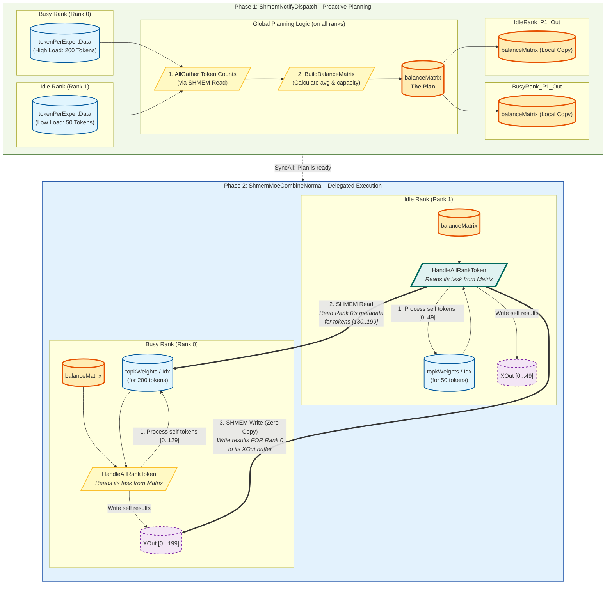

这是一个非常典型的 **MoE (Mixture of Experts)** 分布式通信与计算协同的实现代码，基于华为 **Ascend C** 算子开发框架。

这套代码的核心在于利用 **Shared Memory (SHMEM)** 在卡间（通常是机内通信）实现高效的数据交互，并且引入了 **负载均衡（Rebalance）** 机制来解决 MoE 场景中常见的 Token 分布不均（Workload Imbalance）导致的长尾效应问题。

下面我将详细分析这两部分代码的流程，重点阐述它们如何配合以及如何优化不均衡情况。

---

### 1. 整体架构与协作逻辑

在 MoE 的执行时序中，通常包含 `Dispatch`（分发 Token 到 Expert）和 `Combine`（收集 Expert 结果并加权求和）两个主要阶段。这套代码处于这两个阶段的关键控制点：

1.  **`ShmemNotifyDispatch` (前期规划与握手):**
    *   负责在 `Dispatch` 阶段之前，统计全局的 Token 分布信息。
    *   **核心功能**：计算 **Load Balance Plan（负载均衡计划）**。它不只计算“我要发多少数据”，还计算“在 Combine 阶段，谁来负责处理这些数据的聚合”。
    *   生成 `balanceMatrix`（调度矩阵）。

2.  **`Dispatch` (中间过程 - 代码略去):**
    *   根据 `ShmemNotifyDispatch` 产生的元数据，将 Token 发送给对应的 Expert 进行计算。

3.  **`ShmemMoeCombineNormal` (后期执行与聚合):**
    *   负责将 Expert 计算完的结果（`recvX`）拉取回来，并根据 `topkWeights` 进行加权求和（Weighted Sum）。
    *   **核心功能**：严格执行 `NotifyDispatch` 生成的 `balanceMatrix`。如果开启负载均衡，空闲的 Rank 会帮助繁忙的 Rank 进行加权求和计算，并将结果直接写回繁忙 Rank 的输出地址。

---

### 2. 模块一详细分析：`ShmemNotifyDispatch` (规划者)

这个模块的主要任务是**元数据同步**和**任务分配**。

#### 2.1 初始化与元数据交换 (`Process` 前半部分)
*   **`Init` & `SplitCore`**: 初始化 Buffer，利用多核（Block）并行处理数据。
*   **`PutShareAddr` / `GetShareAddr`**:
    *   MoE 也是 All-to-All 通信模式。每个 Rank 将自己的元数据基地址（如 `tokenPerExpertData`）写入共享内存。
    *   通过 `aclshmem_ptr` 获取远端 Rank 的地址，实现**ZeroBuffer**（零拷贝感知），无需显式的数据搬运指令即可通过 GM 指针访问远端内存。
*   **`AllGatherSendData`**: 这一步实际上是把各卡的 `token_per_expert` 统计信息拉取到本地，让每个 Rank 都拥有全局视角（Global View）。

#### 2.2 核心优化：负载均衡矩阵构建 (`BuildBalanceMatrix`)
这是解决“不均衡情况”的大脑。代码逻辑如下：

1.  **计算负载能力**:
    *   `BuildMaxBs` 统计了每个 Rank 需要处理的 Token 总量 (`bsPerRank`)。
    *   计算全局平均 Token 数 (`avgTokens`)。
    *   根据 `factor_high` (1.3) 和 `factor_low` (1.0) 设定每张卡的**处理能力上限** (`processCapacity`)。这是一种滞后阈值设计，防止为了微小的负载差异进行昂贵的跨卡调度。

2.  **自处理阶段 (Self-Processing)**:
    *   遍历每个 Rank，首先分配它处理**自己**的数据。
    *   如果 `bsPerRank[i]` 超过了 `processCapacity[i]`，则只分配 `processCapacity` 的量，**剩余的 Token 标记为待处理**。
    *   在 `balanceMatrixLt` 中记录：Rank `i` 负责 Rank `i` 的 Token 范围 `[0, processCount-1]`。

3.  **跨卡再平衡 (Rebalance / Offloading)**:
    *   **识别瓶颈**: 再次遍历，找到还有剩余 Token 未处理的 `tarRankId`（繁忙节点）。
    *   **寻找帮手**: 遍历其他 Rank (`helpRank`)，寻找 `processCapacity > 0` 的空闲节点。
    *   **任务指派**:
        *   将 `tarRankId` 的剩余 Token 范围 `[curStart, end]` 分配给 `helpRank`。
        *   更新 `balanceMatrix`：`helpRank` 对应 `tarRankId` 的位置写入 `[start, end]`。
        *   扣除 `helpRank` 的剩余能力。

**输出产物**: `balanceMatrix`。这是一个 `[epWorldSize, epWorldSize*2]` 的矩阵。
*   `Matrix[Row_A][Col_B]` = Rank A 负责处理 Rank B 的 Token 起始索引。
*   `Matrix[Row_A][Col_B+1]` = Rank A 负责处理 Rank B 的 Token 结束索引。

#### 2.3 其他元数据构建
*   `BuildTotalRecvCount`, `BuildRecvTokenPerExp`: 计算后续算子需要的形状信息。

---

### 3. 模块二详细分析：`ShmemMoeCombineNormal` (执行者)

这个模块负责实际的数学运算（加权求和）。在不开启 Balance 时，每个 Rank 只处理属于自己的输出；开启后，则根据矩阵“打工”。

#### 3.1 握手与初始化
同样通过 `PutShareAddr`/`GetShareAddr` 交换关键数据地址：
*   `recvX`: Expert 的输出数据（输入源）。
*   `topkWeights`, `topkIdx`: 权重和索引（计算依据）。
*   `XOut`: 最终输出地址（写入目的地）。

#### 3.2 执行流的分支 (`Process`)
*   **普通模式**: 调用 `ReadTokenFromRemote`。每个 Rank 循环处理自己的 `BatchSize`。
*   **负载均衡模式**: 调用 `HandleAllRankToken`。

#### 3.3 核心执行：`HandleAllRankToken`
这是与 `NotifyDispatch` 配合的关键：

1.  **读取任务单**:
    *   从 GM 读取 `balanceMatrix` 的**本 Rank 对应行** (`balanceMatrixGT_[epRankId * offset]`)。
    *   这行数据告诉当前 Rank：你需要为 Rank 0, Rank 1, ... Rank N 分别处理多少 Token。

2.  **任务循环**:
    *   遍历所有 `tarRankId`。
    *   如果 `Matrix` 指示有任务（`startId != -1`），则调用 `ReadAndWriteForTargetRank`。

3.  **跨卡计算 (`ReadAndWriteForTargetRank` -> `ReadTokenAndWeightedSum`)**:
    *   **上下文切换**: 这是一个非常精彩的设计。
        *   `topkWeightsGT_`, `topkIdxGT_` 等指针被重定向到 **Target Rank** 的共享内存地址。这意味着当前 Rank 是读取 **Target Rank** 的元数据来指导计算。
        *   `xOutGlobal_` 被指向 **Target Rank** 的输出地址。这意味着计算结果直接写回 **Target Rank** 的 GM，Target Rank 不需要再做一次数据搬运。
    *   **读取 Expert 数据**:
        *   根据 `topkIdx` 找到 Expert ID。
        *   根据 Expert 所在的 Rank，计算远程地址 (`shareRecvXAddrs[dstRankId]`)。
        *   将数据拉取到本地 UB (`dstGT` -> `weightedSumQueue_`)。
    *   **计算**:
        *   在本地 Vector Unit 进行 `Muls` (乘权重) 和 `Add` (累加)。
    *   **写回**:
        *   `DataCopyPad` 将结果写回 `xOutGlobal_`（即 Target Rank 的最终输出位置）。

---

### 4. 配合分析：针对不均衡情况的优化机制

这套代码通过 **"Control Plane Shifting" (控制面转移)** 和 **"Compute Offloading" (计算卸载)** 解决了不均衡问题。

#### 场景假设
假设 Rank 0 是热点，有 200 个 Token 需要 Combine；Rank 1 比较空闲，只有 50 个 Token。平均负载是 125。

#### 优化流程：

1.  **NotifyDispatch 阶段**:
    *   Rank 0 计算发现自己超载（200 > 容量 130）。
    *   Rank 1 计算发现自己空闲（50 < 容量 130，剩余 80 能力）。
    *   **生成矩阵**:
        *   `Matrix[0][0] = [0, 129]` (Rank 0 处理自己的前 130 个)。
        *   `Matrix[1][1] = [0, 49]` (Rank 1 处理自己的 50 个)。
        *   `Matrix[1][0] = [130, 199]` (Rank 1 帮助 Rank 0 处理剩下的 70 个)。

2.  **Combine 阶段**:
    *   **Rank 0**:
        *   执行 `HandleAllRankToken`。
        *   看到 `Matrix[0][0]`，处理自己的 [0, 129]。
        *   计算结果直接写入 Rank 0 的 `XOut`。
    *   **Rank 1**:
        *   执行 `HandleAllRankToken`。
        *   看到 `Matrix[1][1]`，处理自己的 [0, 49]，写入 Rank 1 的 `XOut`。
        *   **关键点**: 看到 `Matrix[1][0]`。
        *   读取 Rank 0 的 `Weights/Idx` (Shmem Read)。
        *   读取 Expert 数据 (Shmem Read)。
        *   计算加权和。
        *   **直接写入 Rank 0 的 `XOut` (Shmem Write)**。

#### 优越性分析
1.  **流水线掩盖**: 繁忙 Rank 不需要等待所有数据处理完，因为空闲 Rank 并行帮它处理了一部分。
2.  **ZeroBuffer / 零拷贝**:
    *   如果没有这个机制，Rank 0 可能需要先把部分任务发给 Rank 1，Rank 1 算完再发回来。
    *   这里利用 SHMEM，Rank 1 直接读 Rank 0 的元数据，直接写 Rank 0 的结果，省去了中间的显式 Send/Recv 开销。
3.  **动态性**: `NotifyDispatch` 是在每次 Iteration 运行时动态计算的，能适应动态变化的 Token 分布。

### 总结

这套代码实现了一套**基于共享内存的高性能动态任务调度系统**。
*   `ShmemNotifyDispatch` 充当**调度器**，通过收集全局负载信息，计算出最优的任务切分矩阵 (`balanceMatrix`)。
*   `ShmemMoeCombineNormal` 充当**执行器**，具备“远程上下文执行能力”，能够无缝地切换到其他 Rank 的视角代为计算，并将结果原位写回。

这种设计在 MoE 这种负载高度动态且不均衡的场景下，能显著提升集群的整体吞吐率，减少木桶效应。

当然可以。为这项技术命名并绘制流程图是一件非常有意义的事情。

### 技术命名

**Z-ECO: Zero-buffer Elastic Compute Offloading (基于零拷贝的弹性计算卸载机制)。**
**命名寓意：**
- **Zero-buffer (零拷贝)：**体现了利用共享内存（SHMEM）直接访问远端显存，无需中间转发 Buffer 的特性。
- **Elastic (弹性)：**体现了根据实时的 Token 数量动态调整balanceMatrix (负载矩阵）的自适应能力。
- **Compute Offloading (计算卸载)：**精准描述了"空闲卡替繁忙卡打工"的核心本质。
- **ECO：**缩写朗朗上口，且有"生态/高效"之意，契合 Ascend 高效算子生态的理念。

考虑到这项技术的核心是**提前规划 (Proactive)**、根据负载情况产生**非对称 (Asymmetric)** 的任务分配、通过共享内存进行**调度 (Dispatch)** 并最终实现计算**卸载 (Offloading)**，我建议以下几个名字：

*   **首选:** **PADO (Proactive Asymmetric Dispatch & Offloading)**
    *   **Proactive (主动/前瞻性):** `NotifyDispatch` 阶段提前计算和规划，而不是被动地等待瓶颈出现。
    *   **Asymmetric (非对称):** 打破了传统数据并行中“每卡处理等量任务”的对称性，空闲的卡会承担更多计算。
    *   **Dispatch (调度):** 核心产物是 `balanceMatrix`，这是一个精确的任务调度计划。
    *   **Offloading (卸载):** 核心行为是将繁忙节点的计算任务卸载到空闲节点。
    *   这个名字技术性强，且准确地概括了所有关键特征。

*   **备选 1:** **CLOC (Cooperative Lookahead Offloading for Combine)**
    *   **Cooperative (协同):** 强调了 Rank 之间互相帮助以达成全局最优。
    *   **Lookahead (预见性):** 同 Proactive，指在执行前就规划好。
    *   这个名字更侧重于其“团队协作”的特性。

*   **备选 2:** **Zero-Copy Delegated Combine**
    *   **Zero-Copy:** 强调其底层实现机制，利用共享内存直接读写远端数据，避免了显式的 Send/Recv。
    *   **Delegated (委托):** 清晰地描述了任务被委托给其他 Rank 执行。
    *   这个名字更侧重于实现细节和最终效果。

我将使用 **PADO** 作为这项技术的代称来绘制下面的流程图。

---

### PADO 详细流程图

下面的流程图展示了在一个负载不均衡的场景下（Rank 0 繁忙, Rank 1 空闲），PADO 技术的工作流程。

### 流程图解读

#### 图例
*   **黄色方块 (Logic):** 代表核心的计算逻辑或算法步骤，在 AICore 上执行。
*   **蓝色椭圆 (Memory):** 代表存储在 Global Memory 中的持久化数据，如输入/输出 Tensor。
*   **紫色虚线方块 (Buffer):** 代表临时的输出或中间结果缓冲区。
*   **橙色加粗方块 (Plan):** 特指 PADO 技术的关键产物——`balanceMatrix`，即任务调度计划。
*   **绿色粗箭头 (Network):** 表示通过共享内存 (SHMEM) 发生的跨 Rank 数据交互。
*   **实线箭头 (`-->`):** 表示 Rank 内部的数据流或逻辑依赖。
*   **虚线箭头 (`-.->`):** 表示阶段间的同步点。

#### 流程步骤

1.  **Phase 1: ShmemNotifyDispatch - Proactive Planning (主动规划)**
    *   **输入:** 每个 Rank 都有一个 `tokenPerExpertData` Tensor，记录了需要发往各个 Expert 的 Token 数量。图中 Rank 0 负载高（200 tokens），Rank 1 负载低（50 tokens）。
    *   **全局规划逻辑:**
        1.  **AllGather:** 所有 Rank 通过 SHMEM 读取其他 Rank 的 `tokenPerExpertData`，从而获得全局的负载视图。
        2.  **BuildBalanceMatrix:** 每个 Rank 独立但确定性地执行相同的算法，计算出全局平均负载和各 Rank 的处理能力。基于此，生成一份全局一致的**任务调度计划** (`balanceMatrix`)。
    *   **输出:** `balanceMatrix` 被分发到每个 Rank 的 Global Memory 中。这份计划明确指示了在下一阶段，哪个 Rank 应该为哪个 Rank 计算哪些 Token 的 Combine 结果。

2.  **Phase 2: ShmemMoeCombineNormal - Delegated Execution (委托执行)**
    *   **任务读取:** `HandleAllRankToken` 函数首先从本地 GM 读取 `balanceMatrix` 来确定自己的任务。
    *   **繁忙 Rank (Rank 0):**
        *   根据矩阵，它只需要处理自己的前 130 个 Token。
        *   它读取自己的 `topkWeights/Idx`，计算后将结果写入自己的 `XOut` 缓冲区。
    *   **空闲 Rank (Rank 1):**
        *   **双重任务:** 根据矩阵，它既要处理自己的 50 个 Token，也要**帮助 Rank 0** 处理剩余的 70 个 Token (索引 130 到 199)。
        *   **处理自己:** 和 Rank 0 类似，完成自己的 50 个 Token 的 Combine。
        *   **执行卸载任务 (核心优化点):**
            1.  **远程读取 (SHMEM Read):** Rank 1 的计算逻辑通过 SHMEM 指针，直接读取 Rank 0 Global Memory 中的 `topkWeights/Idx` 中对应 130-199 Token 的部分。
            2.  **远程写入 (SHMEM Write):** 计算完成后，Rank 1 将这 70 个 Token 的结果，通过 SHMEM 指针**直接写入 Rank 0 的 `XOut` 缓冲区**的对应位置。

#### 结论
这个流程清晰地展示了 PADO 技术如何通过**“规划”**和**“执行”**两阶段分离，实现了计算任务的动态迁移。核心优势在于利用共享内存的**零拷贝**特性，使得 Rank 1 能够像操作本地内存一样高效地为 Rank 0 "打工"，从而有效解决了 MoE 中的负载不均衡问题，避免了长尾效应，提升了整体集群的计算效率。